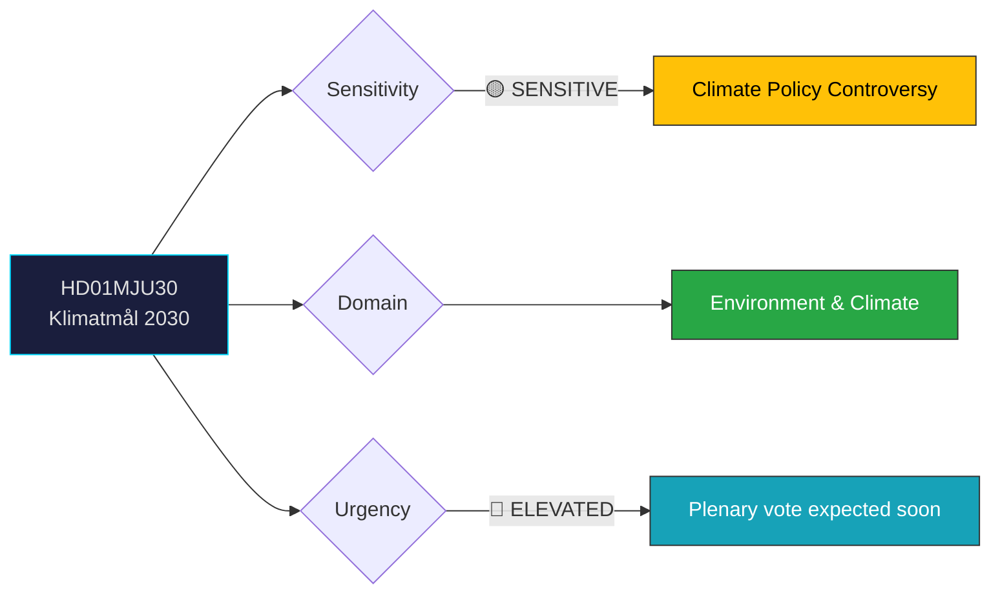

# 🔍 Per-File Political Intelligence Analysis: HD01MJU30

## 📋 Document Identity

| Field | Value |
|-------|-------|
| **Document ID** | `HD01MJU30` |
| **Document Type** | `committeeReports` |
| **Title** | Sveriges klimatmål – EU-anpassade och ändamålsenliga etappmål till 2030 |
| **Date** | 2026-03-30 |
| **Riksmöte** | 2025/26 |
| **Source MCP Tool** | `get_betankanden` |
| **Analysis Timestamp** | 2026-03-31 11:48 UTC |
| **Analyst** | news-realtime-monitor |

---

## 🎯 Executive Summary

Miljö- och jordbruksutskottet (MJU) has released betänkande 2025/26:MJU30 on Sweden's climate goals, proposing EU-adapted interim targets to 2030. This committee report addresses one of the most politically divisive environmental policy areas, with the government having controversially revised Sweden's national climate framework to align with EU-level targets. The report likely reflects the majority position of the government coalition (M, KD, L with SD support), potentially lowering national ambition compared to previous targets set under the S-MP government. **Confidence: MEDIUM**

---

## 📊 Political Classification

---

## 💼 SWOT Analysis

### ✅ Strengths

| # | Statement | Evidence (dok_id) | Confidence | Impact | Entry Date |
|---|-----------|-------------------|:----------:|:------:|:----------:|
| S1 | EU alignment reduces legal compliance risk for Swedish industry | HD01MJU30 | M | H | 2026-03-31 |
| S2 | Government coalition unity on climate framework revision | HD01MJU30 | H | M | 2026-03-31 |

### ⚠️ Weaknesses

| # | Statement | Evidence (dok_id) | Confidence | Impact | Entry Date |
|---|-----------|-------------------|:----------:|:------:|:----------:|
| W1 | Perceived lowering of climate ambition damages Sweden's green brand internationally | HD01MJU30 | H | H | 2026-03-31 |
| W2 | Opposition (MP, V, S) will frame this as environmental regression | HD01MJU30 | H | M | 2026-03-31 |

### 🌟 Opportunities

| # | Statement | Evidence (dok_id) | Confidence | Impact | Entry Date |
|---|-----------|-------------------|:----------:|:------:|:----------:|
| O1 | EU-adapted targets provide regulatory certainty for green industry investment | HD01MJU30 | M | H | 2026-03-31 |

### 🔴 Threats

| # | Statement | Evidence (dok_id) | Confidence | Impact | Entry Date |
|---|-----------|-------------------|:----------:|:------:|:----------:|
| T1 | Climate activists and youth movements may escalate protests | HD01MJU30 | M | M | 2026-03-31 |
| T2 | International reputational damage at upcoming COP and EU summits | HD01MJU30 | M | H | 2026-03-31 |

---

## 👥 Stakeholder Impact

| Stakeholder | Impact | Assessment |
|-------------|:------:|------------|
| **Citizens** | HIGH | Long-term climate impact; air quality, extreme weather exposure |
| **Government** | MEDIUM | Delivers policy coherence but faces green criticism |
| **Opposition (MP, V)** | HIGH | Core campaign issue; environmental parties mobilize |
| **Industry** | HIGH | Regulatory certainty for emission planning |
| **International** | MEDIUM | Sweden's climate leadership reputation at stake |

---

## 📊 MCP Data Files Used

| Tool | Parameters | Data Retrieved |
|------|-----------|----------------|
| `get_betankanden` | rm=2025/26 | HD01MJU30 metadata |
| `get_dokument` | dok_id=HD01MJU30 | Committee report details |
