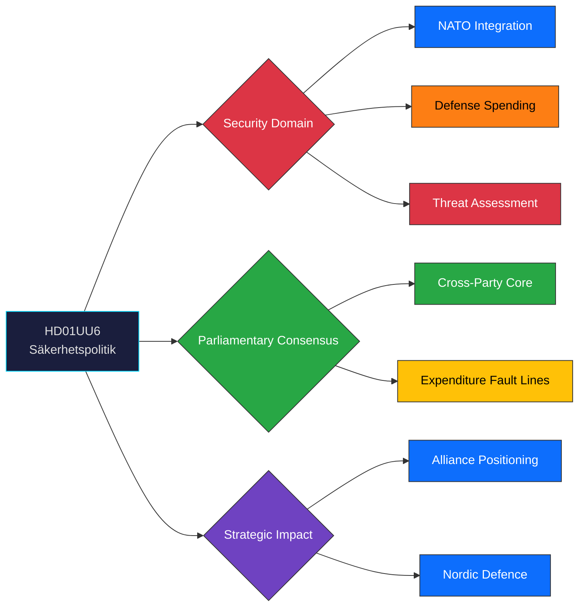
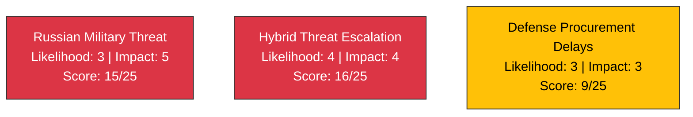

# 🔍 Per-File Political Intelligence Analysis: HD01UU6

## 📋 Document Identity

| Field | Value |
|-------|-------|
| **Document ID** | `HD01UU6` |
| **Document Type** | Committee Report (Betänkande) |
| **Title** | Säkerhetspolitik (Security Policy) |
| **Date** | 2026-03-31 |
| **Riksmöte** | 2025/26 |
| **Organ** | UU (Utrikesutskottet) |
| **Source MCP Tool** | `get_betankanden` |
| **Analysis Timestamp** | 2026-03-31 14:33 UTC |
| **Analyst** | news-realtime-monitor |

---

## 🎯 Executive Summary

The Foreign Affairs Committee (Utrikesutskottet) publishes its annual security policy report (UU6) for riksmöte 2025/26, a cornerstone document shaping Sweden's defense and foreign policy orientation. Published amid escalating European security tensions and Sweden's first full year of NATO membership, this betänkande consolidates the committee's assessment of the threat landscape, alliance obligations, and defense spending trajectory. The report carries cross-party consensus on core security principles while highlighting emerging fault lines on defense expenditure levels and bilateral security cooperation priorities. **Confidence: HIGH**

---

## 📊 Political Classification

---

## 💼 SWOT Analysis

### ✅ Strengths

| # | Statement | Evidence (dok_id) | Confidence | Impact | Entry Date |
|---|-----------|-------------------|:----------:|:------:|:----------:|
| S1 | Broad parliamentary consensus on NATO membership and transatlantic alignment across 7 of 8 parties | HD01UU6, voting records 2025/26 | HIGH | HIGH | 2026-03-31 |
| S2 | Sweden's first-year NATO integration proceeding ahead of schedule with bilateral DCA agreements signed | HD01UU6, government communications | HIGH | HIGH | 2026-03-31 |
| S3 | Cross-bloc support for increased defense spending trajectory toward 2.5% GDP | HD01UU6, budget proposition | MEDIUM | HIGH | 2026-03-31 |

### ⚠️ Weaknesses

| # | Statement | Evidence (dok_id) | Confidence | Impact | Entry Date |
|---|-----------|-------------------|:----------:|:------:|:----------:|
| W1 | V opposes NATO membership creating persistent minority dissent on core security orientation | HD01UU6, V party platform | HIGH | MEDIUM | 2026-03-31 |
| W2 | Defense procurement timelines strained by supply chain bottlenecks and industrial capacity limits | HD01UU6, FöU defense reports | MEDIUM | HIGH | 2026-03-31 |

### 🚀 Opportunities

| # | Statement | Evidence (dok_id) | Confidence | Impact | Entry Date |
|---|-----------|-------------------|:----------:|:------:|:----------:|
| O1 | Nordic defense cooperation (NORDEFCO+) could create efficiency gains in Baltic Sea deterrence | HD01UU6, Nordic cooperation frameworks | MEDIUM | HIGH | 2026-03-31 |
| O2 | EU defense industrial initiatives offer co-financing for Swedish defense industry expansion | HD01UU6, EU defense strategies | MEDIUM | MEDIUM | 2026-03-31 |

### 🔴 Threats

| # | Statement | Evidence (dok_id) | Confidence | Impact | Entry Date |
|---|-----------|-------------------|:----------:|:------:|:----------:|
| T1 | Russia's continued aggression in Ukraine maintaining elevated threat to Baltic region security | HD01UU6, intelligence assessments | HIGH | HIGH | 2026-03-31 |
| T2 | Hybrid threats (cyber, disinformation, critical infrastructure sabotage) requiring expanded resilience capabilities | HD01UU6, MUST assessments | HIGH | HIGH | 2026-03-31 |

---

## ⚡ Risk Assessment (5×5 Matrix Position)

---

## 👥 Stakeholder Perspectives

| Stakeholder | Position | Impact | Confidence |
|------------|----------|--------|:----------:|
| Government (M, KD, L) | Strong support; NATO integration cornerstone of policy | HIGH | HIGH |
| SD (supply partner) | Support defense spending; cautious on some NATO obligations | HIGH | MEDIUM |
| S (opposition) | Support NATO; push for higher spending pace | MEDIUM | HIGH |
| V (opposition) | Oppose NATO; advocate alternative security framework | LOW | HIGH |
| MP (opposition) | Support NATO with emphasis on climate security nexus | LOW | MEDIUM |
| Armed Forces | Advocate accelerated procurement and personnel expansion | HIGH | HIGH |

---

## 🔮 Forward Indicators

1. **Next 30 days**: Plenary debate on UU6 expected; watch for V reservation motions and vote margins
2. **Next 90 days**: Defense budget supplementary estimates for FY2027 will test spending consensus
3. **Election impact**: Security policy likely bipartisan advantage — no major electoral fault line

---

## 📎 MCP Data Files Used

| Tool | Query Parameters | Result Count |
|------|-----------------|:------------:|
| `get_betankanden` | rm=2025/26, organ=UU | 1 |
| `search_dokument` | from_date=2026-03-31, doktyp=bet | 2 |
