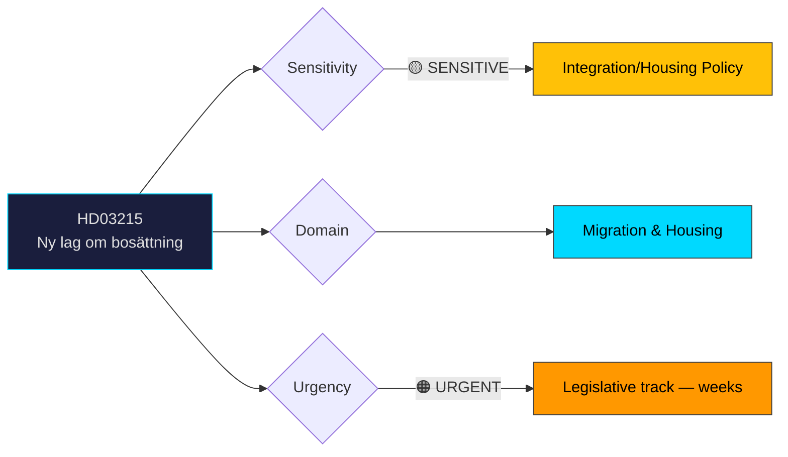

# 🔍 Per-File Political Intelligence Analysis: HD03215

## 📋 Document Identity

| Field | Value |
|-------|-------|
| **Document ID** | `HD03215` |
| **Document Type** | `propositions` |
| **Title** | Tidsbegränsat boende för vissa nyanlända invandrare – en ny lag om bosättning |
| **Date** | 2026-03-31 |
| **Riksmöte** | 2025/26 |
| **Source MCP Tool** | `get_propositioner` |
| **Analysis Timestamp** | 2026-03-31 11:42 UTC |
| **Analyst** | news-realtime-monitor |

---

## 🎯 Executive Summary

Prop. 2025/26:215 introduces a new settlement law (bosättningslag) mandating time-limited housing for certain newly arrived immigrants. Signed by Deputy PM Ebba Busch (KD) and Integration Minister Simona Mohamsson (L), this proposition complements HD03229 (new reception law) as part of a coordinated migration reform package. The law represents a significant shift from voluntary to directed settlement, with municipalities required to accept allocated placements. This addresses housing segregation concerns but raises questions about individual rights, municipal autonomy, and L's internal position on migration restrictions. **Confidence: HIGH**

---

## 📊 Political Classification

---

## 💼 SWOT Analysis

### ✅ Strengths

| # | Statement | Evidence (dok_id) | Confidence | Impact | Entry Date |
|---|-----------|-------------------|:----------:|:------:|:----------:|
| S1 | Addresses segregation by distributing settlement across municipalities | HD03215 | H | H | 2026-03-31 |
| S2 | L's minister signs off, demonstrating party unity within coalition on migration | HD03215 | M | M | 2026-03-31 |
| S3 | Time-limited approach reduces perception of permanent restriction | HD03215 | M | M | 2026-03-31 |

### ⚠️ Weaknesses

| # | Statement | Evidence (dok_id) | Confidence | Impact | Entry Date |
|---|-----------|-------------------|:----------:|:------:|:----------:|
| W1 | Municipal autonomy concerns — forced placement overrides local decision-making | HD03215, HD01CU18 (housing policy report) | H | H | 2026-03-31 |
| W2 | Housing shortage in many municipalities makes compliance physically difficult | HD03215 | H | H | 2026-03-31 |

### 🌟 Opportunities

| # | Statement | Evidence (dok_id) | Confidence | Impact | Entry Date |
|---|-----------|-------------------|:----------:|:------:|:----------:|
| O1 | Potential for more equitable geographic distribution of integration burden | HD03215 | M | H | 2026-03-31 |
| O2 | Combined with HD03229, creates comprehensive migration policy framework | HD03215, HD03229 | H | H | 2026-03-31 |

### 🔴 Threats

| # | Statement | Evidence (dok_id) | Confidence | Impact | Entry Date |
|---|-----------|-------------------|:----------:|:------:|:----------:|
| T1 | Municipal resistance could undermine implementation effectiveness | HD03215 | H | H | 2026-03-31 |
| T2 | L voter base may oppose restrictive measures, creating internal party tension | HD03215 | M | M | 2026-03-31 |

---

## 🎯 Risk Assessment

| Risk ID | Description | Likelihood | Impact | Score | Mitigation |
|---------|-------------|:----------:|:------:|:-----:|------------|
| RSK-004 | Municipal non-compliance or resistance | 3/5 | 4/5 | 12 | Enforcement mechanisms in legislation |
| RSK-005 | Housing shortage prevents physical implementation | 3/5 | 3/5 | 9 | Transition period and federal housing support |
| RSK-006 | L internal dissent weakens coalition | 2/5 | 3/5 | 6 | Mohamsson's co-signing signals party leadership alignment |

---

## 👥 Stakeholder Impact

| Stakeholder | Impact | Assessment |
|-------------|:------:|------------|
| **Newly arrived immigrants** | HIGH | Directly affected; directed settlement limits housing choice |
| **Municipalities** | HIGH | New legal obligation to accept placements; resource implications |
| **Government coalition** | MEDIUM | Delivers Tidö promise but tests coalition cohesion |
| **Opposition (S)** | MEDIUM | S has own settlement proposals; may support elements |
| **Civil Society** | HIGH | Rights organizations will challenge individual freedom aspects |

---

## 🔮 Forward Indicators

1. **SKR (municipalities association) formal response** — key implementation feasibility signal
2. **SfU committee handling timeline** — whether fast-tracked or extended review
3. **V and MP counter-motions** — intensity of humanitarian opposition
4. **Municipal council reactions** — especially from cities with existing housing shortages

---

## 📊 MCP Data Files Used

| Tool | Parameters | Data Retrieved |
|------|-----------|----------------|
| `get_propositioner` | rm=2025/26, limit=20 | HD03215 metadata |
| `get_dokument` | dok_id=HD03215 | Document details |
| `search_dokument` | from_date=2026-03-30, to_date=2026-03-31 | Context documents |
