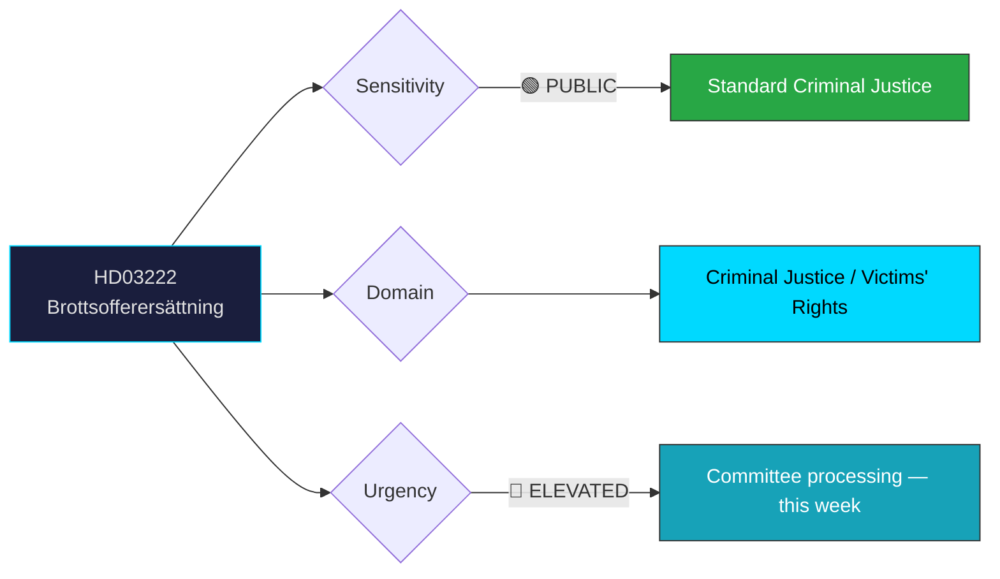

# 🔍 Per-File Political Intelligence Analysis: HD03222

## 📋 Document Identity

| Field | Value |
|-------|-------|
| **Document ID** | `HD03222` |
| **Document Type** | `propositions` |
| **Title** | Ersättningsregler med brottsoffret i fokus |
| **Date** | 2026-03-31 |
| **Riksmöte** | 2025/26 |
| **Source MCP Tool** | `get_propositioner` |
| **Analysis Timestamp** | 2026-03-31 11:44 UTC |
| **Analyst** | news-realtime-monitor |

---

## 🎯 Executive Summary

Prop. 2025/26:222 reforms compensation rules to put crime victims at the center. Justice Minister Gunnar Strömmer (M) advances this as part of the government's broader criminal justice reform agenda. The proposition strengthens victim rights in the compensation system, ensuring society responds effectively when crimes cannot be prevented. This aligns with the government's law-and-order platform and reflects Tidö Agreement priorities on criminal justice. **Confidence: MEDIUM**

---

## 📊 Political Classification

---

## 💼 SWOT Analysis

### ✅ Strengths

| # | Statement | Evidence (dok_id) | Confidence | Impact | Entry Date |
|---|-----------|-------------------|:----------:|:------:|:----------:|
| S1 | Broad cross-party appeal — victim rights is consensus topic | HD03222 | H | M | 2026-03-31 |
| S2 | Strengthens government's law-and-order brand ahead of election | HD03222, HD03227 (youth crime) | M | M | 2026-03-31 |

### ⚠️ Weaknesses

| # | Statement | Evidence (dok_id) | Confidence | Impact | Entry Date |
|---|-----------|-------------------|:----------:|:------:|:----------:|
| W1 | Implementation costs may strain justice system budget | HD03222 | M | M | 2026-03-31 |

### 🌟 Opportunities

| # | Statement | Evidence (dok_id) | Confidence | Impact | Entry Date |
|---|-----------|-------------------|:----------:|:------:|:----------:|
| O1 | Potential for bipartisan passage strengthens democratic legitimacy | HD03222 | M | M | 2026-03-31 |

### 🔴 Threats

| # | Statement | Evidence (dok_id) | Confidence | Impact | Entry Date |
|---|-----------|-------------------|:----------:|:------:|:----------:|
| T1 | Insufficient funding allocation could undermine victim support goals | HD03222 | M | M | 2026-03-31 |

---

## 👥 Stakeholder Impact

| Stakeholder | Impact | Assessment |
|-------------|:------:|------------|
| **Crime victims** | HIGH | Direct beneficiaries of reformed compensation system |
| **Government** | MEDIUM | Delivers on Tidö criminal justice agenda |
| **Opposition** | LOW | Limited grounds for opposition on victim rights |
| **Judiciary** | MEDIUM | Implementation changes to compensation processes |

---

## 📊 MCP Data Files Used

| Tool | Parameters | Data Retrieved |
|------|-----------|----------------|
| `get_propositioner` | rm=2025/26 | HD03222 metadata |
| `get_dokument` | dok_id=HD03222 | Document details |
