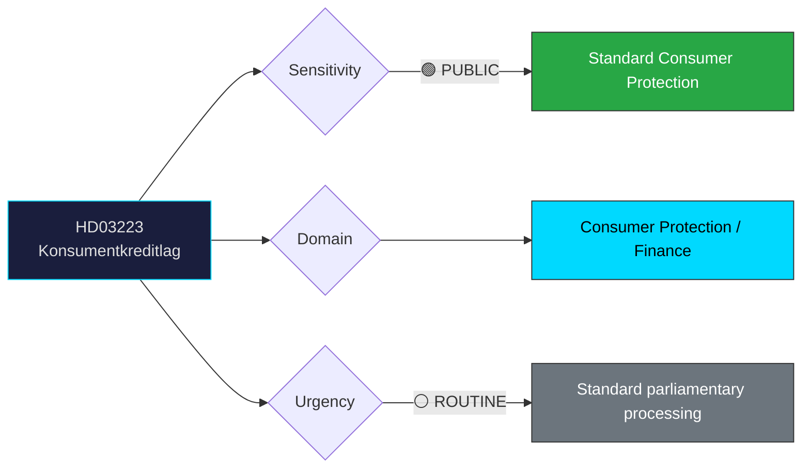

# 🔍 Per-File Political Intelligence Analysis: HD03223

## 📋 Document Identity

| Field | Value |
|-------|-------|
| **Document ID** | `HD03223` |
| **Document Type** | `propositions` |
| **Title** | En ny konsumentkreditlag |
| **Date** | 2026-03-31 |
| **Riksmöte** | 2025/26 |
| **Source MCP Tool** | `get_propositioner` |
| **Analysis Timestamp** | 2026-03-31 11:46 UTC |
| **Analyst** | news-realtime-monitor |

---

## 🎯 Executive Summary

Prop. 2025/26:223 proposes a new consumer credit law with strengthened consumer protections. Justice Minister Gunnar Strömmer (M) presents measures to address predatory lending and over-indebtedness, responding to growing concerns about consumer debt levels. This complements HD03222 (crime victim compensation) as part of a broader justice reform package released on the same day. The proposition aligns with an EU regulatory trend toward stronger consumer financial protection. **Confidence: MEDIUM**

---

## 📊 Political Classification

---

## 💼 SWOT Analysis

### ✅ Strengths

| # | Statement | Evidence (dok_id) | Confidence | Impact | Entry Date |
|---|-----------|-------------------|:----------:|:------:|:----------:|
| S1 | Addresses rising consumer debt concerns with regulatory framework | HD03223, HD01CU17 (consumer rights report) | M | M | 2026-03-31 |
| S2 | EU alignment strengthens Sweden's single market compliance | HD03223 | M | L | 2026-03-31 |

### ⚠️ Weaknesses

| # | Statement | Evidence (dok_id) | Confidence | Impact | Entry Date |
|---|-----------|-------------------|:----------:|:------:|:----------:|
| W1 | Financial industry may resist stricter lending regulations | HD03223 | M | M | 2026-03-31 |

### 🌟 Opportunities

| # | Statement | Evidence (dok_id) | Confidence | Impact | Entry Date |
|---|-----------|-------------------|:----------:|:------:|:----------:|
| O1 | Cross-party support likely — consumer protection has broad appeal | HD03223 | H | M | 2026-03-31 |

### 🔴 Threats

| # | Statement | Evidence (dok_id) | Confidence | Impact | Entry Date |
|---|-----------|-------------------|:----------:|:------:|:----------:|
| T1 | Overly restrictive rules could reduce credit access for low-income households | HD03223 | L | M | 2026-03-31 |

---

## 👥 Stakeholder Impact

| Stakeholder | Impact | Assessment |
|-------------|:------:|------------|
| **Consumers** | HIGH | Strengthened protection against predatory lending |
| **Financial industry** | MEDIUM | New compliance requirements; potential business model changes |
| **Government** | LOW | Standard consumer protection advancement |

---

## 📊 MCP Data Files Used

| Tool | Parameters | Data Retrieved |
|------|-----------|----------------|
| `get_propositioner` | rm=2025/26 | HD03223 metadata |
| `search_regering` | dateFrom=2026-03-30 | Government press release on consumer credit |
