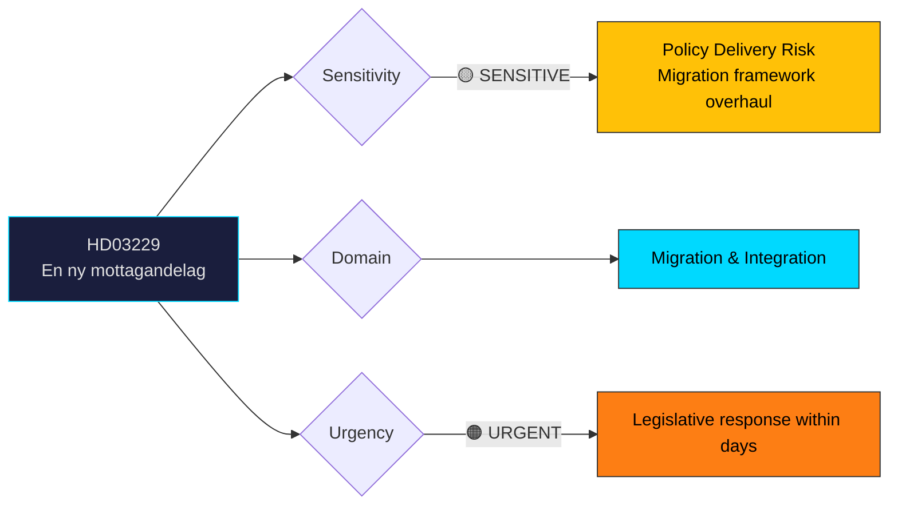
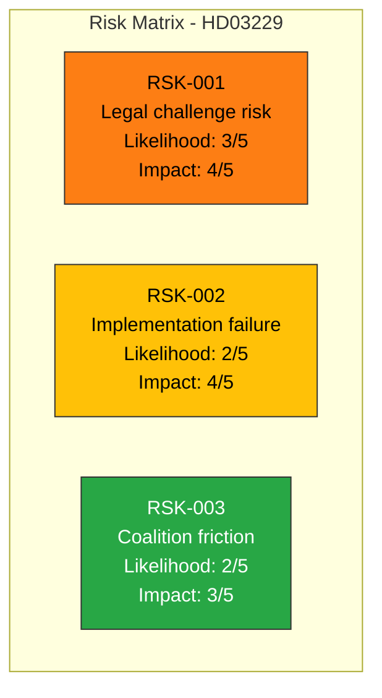

# 🔍 Per-File Political Intelligence Analysis: HD03229

## 📋 Document Identity

| Field | Value |
|-------|-------|
| **Document ID** | `HD03229` |
| **Document Type** | `propositions` |
| **Title** | En ny mottagandelag (A New Reception Law) |
| **Date** | 2026-03-31 |
| **Riksmöte** | 2025/26 |
| **Source MCP Tool** | `get_propositioner` |
| **Analysis Timestamp** | 2026-03-31 11:40 UTC |
| **Analyst** | news-realtime-monitor |

---

## 🎯 Executive Summary

The government has introduced Prop. 2025/26:229 — a comprehensive new reception law (mottagandelag) that replaces the existing framework for asylum seekers and newly arrived immigrants in Sweden. Signed by Deputy PM Ebba Busch (KD) and Migration Minister Johan Forssell (M), this proposition represents one of the most significant migration policy reforms of the current parliamentary term. The law restructures how Sweden receives, houses, and integrates asylum seekers, aligning with the Tidö Agreement's restrictive migration agenda. This marks a coordinated legislative push alongside Prop. 2025/26:215 (settlement law), signaling accelerated implementation of the government's migration overhaul before the 2026 election cycle. **Confidence: HIGH**

---

## 📊 Political Classification

---

## 💼 SWOT Analysis

### ✅ Strengths

| # | Statement | Evidence (dok_id) | Confidence | Impact | Entry Date |
|---|-----------|-------------------|:----------:|:------:|:----------:|
| S1 | Government demonstrates legislative capacity by delivering major migration reform on schedule | HD03229 (Prop. 2025/26:229) | H | H | 2026-03-31 |
| S2 | Coordinated dual-proposition strategy (HD03229 + HD03215) shows coalition policy coherence on migration | HD03229, HD03215 | H | H | 2026-03-31 |
| S3 | Proposition aligns with Tidö Agreement commitments, strengthening SD cooperation | HD03229 | M | H | 2026-03-31 |

### ⚠️ Weaknesses

| # | Statement | Evidence (dok_id) | Confidence | Impact | Entry Date |
|---|-----------|-------------------|:----------:|:------:|:----------:|
| W1 | Potential ECHR/EU law compatibility concerns with restrictive reception conditions | HD03229 | M | H | 2026-03-31 |
| W2 | Implementation burden on municipalities already strained by housing shortages | HD03229, HD03215 | M | M | 2026-03-31 |

### 🌟 Opportunities

| # | Statement | Evidence (dok_id) | Confidence | Impact | Entry Date |
|---|-----------|-------------------|:----------:|:------:|:----------:|
| O1 | Opposition parties (S, V, MP) gain campaign material on humanitarian grounds ahead of 2026 election | HD03229 | H | M | 2026-03-31 |
| O2 | Framework may attract cross-bloc support from C on integration efficiency elements | HD03229 | L | M | 2026-03-31 |

### 🔴 Threats

| # | Statement | Evidence (dok_id) | Confidence | Impact | Entry Date |
|---|-----------|-------------------|:----------:|:------:|:----------:|
| T1 | Legal challenges from civil society organizations could delay implementation | HD03229 | M | H | 2026-03-31 |
| T2 | Rushed dual-proposition strategy risks legislative quality gaps in committee review | HD03229, HD03215 | M | M | 2026-03-31 |

---

## 🎯 Risk Assessment

| Risk ID | Description | Likelihood | Impact | Score | Mitigation |
|---------|-------------|:----------:|:------:|:-----:|------------|
| RSK-001 | ECHR/EU law compatibility challenges | 3/5 | 4/5 | 12 | Government likely pre-assessed via Lagrådet review |
| RSK-002 | Municipal implementation capacity strain | 2/5 | 4/5 | 8 | Transition period provisions expected |
| RSK-003 | L/KD friction on humanitarian exceptions | 2/5 | 3/5 | 6 | Tidö Agreement framework constrains dissent |

---

## 👥 Stakeholder Impact

| Stakeholder | Impact | Assessment |
|-------------|:------:|------------|
| **Citizens (asylum seekers)** | HIGH | Directly affected by new reception framework; conditions likely more restrictive |
| **Government (M, KD, L)** | HIGH | Delivers key Tidö Agreement promise; strengthens pre-election credibility |
| **Opposition (S, V, MP)** | MEDIUM | Gains humanitarian criticism angle; must balance public opinion on migration |
| **SD (support party)** | HIGH | Core demand fulfilled; validates cooperation strategy |
| **Municipalities** | HIGH | Implementation burden shifts; new housing/integration obligations |
| **Civil Society** | MEDIUM | Expected legal challenges and public advocacy campaigns |
| **International** | MEDIUM | EU scrutiny of Swedish reception standards; UNHCR monitoring |

---

## 🔮 Forward Indicators

1. **Committee assignment** — Which committee (SfU likely) and timeline for betänkande
2. **Opposition motions** — Watch for S, V, MP counter-motions within 15 days
3. **SD public response** — Level of enthusiasm indicates future cooperation stability
4. **Municipal association (SKR) reaction** — Implementation feasibility signals
5. **Lagrådet opinion** — Legal quality assessment

---

## 📊 MCP Data Files Used

| Tool | Parameters | Data Retrieved |
|------|-----------|----------------|
| `get_propositioner` | rm=2025/26, limit=20 | HD03229 metadata and summary |
| `get_dokument` | dok_id=HD03229 | Document details |
| `search_regering` | dateFrom=2026-03-30, dateTo=2026-03-31 | Government press releases context |
