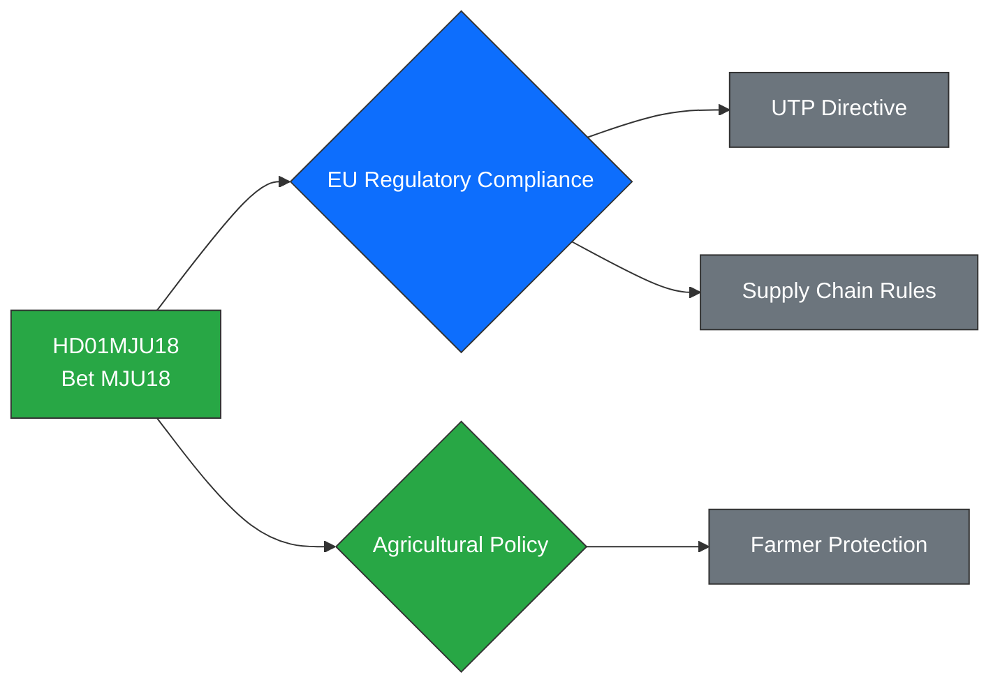

# Political Intelligence Analysis: HD01MJU18

## Document Identity

| Field | Value |
|-------|-------|
| **dok_id** | HD01MJU18 |
| **Type** | Committee Report (Betänkande 2025/26:MJU18) |
| **Title** | Förbättrat genomförande av UTP-direktivets förbud mot sena annulleringar |
| **Date** | 2026-03-31 |
| **Riksmöte** | 2025/26 |
| **Organ** | MJU (Miljö- och jordbruksutskottet) |
| **Source MCP Tool** | get_betankanden, get_dokument |
| **Analysis Timestamp** | 2026-03-31T10:30:00Z |
| **Analyst** | Riksdagsmonitor AI Intelligence Analyst |

---

## Executive Summary

**Confidence: MEDIUM (72%)**

Committee report MJU18 addresses improvements to Sweden's implementation of the EU Unfair Trading Practices (UTP) Directive, specifically targeting late cancellations in agricultural and food supply chains. This is technical EU compliance legislation processed through the Agriculture Committee, with limited political salience. The directive protects smaller food producers and farmers from unfair practices by larger buyers. While low in political drama, the report signals Sweden's ongoing EU regulatory alignment in agricultural policy and provides modest support to the Swedish agricultural sector's competitiveness.

---

## Political Classification

| Attribute | Value |
|-----------|-------|
| **Sensitivity** | 🟢 PUBLIC |
| **Domain** | Economy (ECO) |
| **Urgency** | ⚪ ROUTINE |
| **Significance** | 3/10 |
| **Confidence** | MEDIUM (72%) |

---

## SWOT Impact Assessment

### Strengths

| # | Statement | Evidence dok_id | Confidence | Impact | Entry Date |
|---|-----------|----------------|------------|--------|------------|
| S1 | Strengthens protections for Swedish small-scale food producers against buyer market power | HD01MJU18 | M | L | 2026-03-31 |
| S2 | Demonstrates systematic EU directive transposition — regulatory credibility maintained | HD01MJU18 | H | L | 2026-03-31 |

### Weaknesses

| # | Statement | Evidence dok_id | Confidence | Impact | Entry Date |
|---|-----------|----------------|------------|--------|------------|
| W1 | Additional regulatory burden on food retailers and processors during inflationary period | HD01MJU18 | L | L | 2026-03-31 |

### Opportunities

| # | Statement | Evidence dok_id | Confidence | Impact | Entry Date |
|---|-----------|----------------|------------|--------|------------|
| O1 | EU alignment strengthens Sweden's position in CAP reform negotiations | HD01MJU18 | M | M | 2026-03-31 |
| O2 | LRF (Federation of Swedish Farmers) endorsement provides rural constituency goodwill | HD01MJU18 | M | L | 2026-03-31 |

### Threats

| # | Statement | Evidence dok_id | Confidence | Impact | Entry Date |
|---|-----------|----------------|------------|--------|------------|
| T1 | Retailer lobby (Svensk Dagligvaruhandel) may seek implementation delays | HD01MJU18 | L | L | 2026-03-31 |

---

## Risk Assessment

| Risk Factor | Likelihood (1-5) | Impact (1-5) | Score | Mitigation |
|-------------|:-:|:-:|:-:|------------|
| EU infringement risk if not implemented | 2 | 3 | **6** | Committee report accelerates transposition |
| Retail sector compliance costs | 2 | 1 | **2** | Transition period provisions |

---

## Forward Indicators

- **Parliamentary Calendar**: Chamber vote expected within 2 weeks of report publication
- **Voting Forecast**: Consensus adoption — no reservations anticipated
- **EU Track**: European Commission monitoring of UTP directive implementation across member states
- **Stakeholder Watch**: LRF and Svensk Dagligvaruhandel position statements

---

## Document Control

| Field | Value |
|-------|-------|
| **Classification** | 🟢 PUBLIC |
| **Version** | 1.0 |
| **Generated** | 2026-03-31T10:30:00Z |
| **Method** | MCP-sourced structured intelligence analysis with SWOT extraction |
| **Data Sources** | riksdag-regering MCP: get_betankanden, get_dokument |
| **Next Review** | 2026-04-14 |
