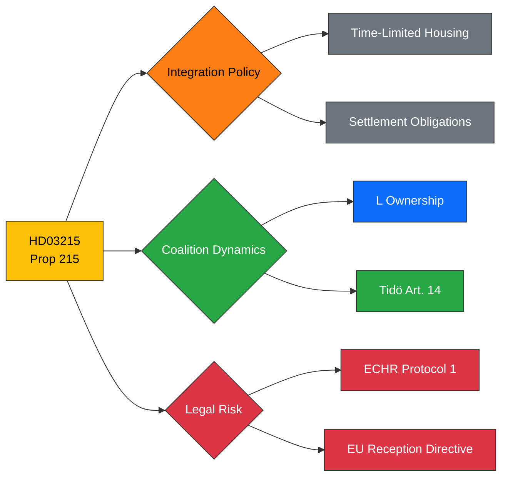

# Political Intelligence Analysis: HD03215

## Document Identity

| Field | Value |
|-------|-------|
| **dok_id** | HD03215 |
| **Type** | Proposition (Prop. 2025/26:215) |
| **Title** | Tidsbegränsat boende för vissa nyanlända invandrare |
| **Date** | 2026-03-31 |
| **Riksmöte** | 2025/26 |
| **Organ** | Arbetsmarknadsdepartementet |
| **Minister** | Simona Mohamsson (L) |
| **Source MCP Tool** | get_propositioner, get_dokument |
| **Analysis Timestamp** | 2026-03-31T10:30:00Z |
| **Analyst** | Riksdagsmonitor AI Intelligence Analyst |

---

## Executive Summary

**Confidence: HIGH (82%)**

Proposition 2025/26:215 introduces time-limited housing for newly arrived immigrants, creating a structured settlement framework with explicit temporal boundaries on state-provided accommodation. Authored by Integration Minister Simona Mohamsson (L), this bill operationalises the Tidö Agreement's integration chapter and directly complements the new Reception Law (Prop 229). The time-limitation mechanism is politically significant: it signals that residence in Sweden carries reciprocal obligations. However, the fixed-duration housing model creates ECHR vulnerability if individuals become street-homeless upon expiry, and Liberals' ownership of this bill tests L's positioning between coalition discipline and its traditional rights-based identity.

---

## Political Classification

| Attribute | Value |
|-----------|-------|
| **Sensitivity** | 🟡 SENSITIVE |
| **Domain** | Migration (MIG) |
| **Urgency** | 🔴 URGENT |
| **Significance** | 7/10 |
| **Confidence** | HIGH (82%) |

---

## SWOT Impact Assessment

### Strengths

| # | Statement | Evidence dok_id | Confidence | Impact | Entry Date |
|---|-----------|----------------|------------|--------|------------|
| S1 | Creates structured integration pathway with clear expectations for new arrivals | HD03215 | H | H | 2026-03-31 |
| S2 | Paired with Prop 229 forms comprehensive migration-integration package — strengthens government narrative | HD03215, HD03229 | H | H | 2026-03-31 |
| S3 | Liberal ownership demonstrates L contributes substantively to coalition policy, not merely enabling partner | HD03215 | M | M | 2026-03-31 |

### Weaknesses

| # | Statement | Evidence dok_id | Confidence | Impact | Entry Date |
|---|-----------|----------------|------------|--------|------------|
| W1 | Time-limited housing may create homelessness cliff if transition support is inadequate | HD03215 | H | H | 2026-03-31 |
| W2 | Potential conflict with EU Reception Conditions Directive provisions on adequate housing | HD03215 | M | H | 2026-03-31 |
| W3 | Internal L party tension — liberal values vs restrictive migration measures | HD03215 | M | M | 2026-03-31 |

### Opportunities

| # | Statement | Evidence dok_id | Confidence | Impact | Entry Date |
|---|-----------|----------------|------------|--------|------------|
| O1 | Establishes obligations-based integration model that could gain broad public acceptance | HD03215 | M | H | 2026-03-31 |
| O2 | Policy package with Prop 229 enables election narrative of comprehensive migration reform | HD03215, HD03229 | H | H | 2026-03-31 |

### Threats

| # | Statement | Evidence dok_id | Confidence | Impact | Entry Date |
|---|-----------|----------------|------------|--------|------------|
| T1 | Legal challenge on housing time limits — rights organisations likely to seek judicial review | HD03215 | H | H | 2026-03-31 |
| T2 | Implementation burden on municipalities already struggling with housing shortages | HD03215 | M | M | 2026-03-31 |
| T3 | Media stories of families losing housing at deadline could politically damage L specifically | HD03215 | M | H | 2026-03-31 |

---

## Risk Assessment

| Risk Factor | Likelihood (1-5) | Impact (1-5) | Score | Mitigation |
|-------------|:-:|:-:|:-:|------------|
| ECHR/EU legal challenge on housing limits | 3 | 4 | **12** | Transition provisions and safety-net clauses |
| Homelessness after time expiry | 3 | 4 | **12** | Municipal coordination and follow-up mechanisms |
| L internal party dissent | 2 | 3 | **6** | Mohamsson's personal ownership provides political cover |
| Municipality implementation capacity | 3 | 3 | **9** | State funding commitments in proposition |

---

## Forward Indicators

- **Parliamentary Calendar**: Expected committee referral to AU (Arbetsmarknadsutskottet) week 15
- **Voting Forecast**: Government + SD majority expected to secure passage
- **Cross-reference**: HD03229 (Prop 229) — paired legislation, joint implementation timeline
- **Legal Watch**: Monitor Lagrådet opinion on time-limitation mechanism
- **Party Watch**: Track L party conference resolutions on migration policy alignment

---

## Document Control

| Field | Value |
|-------|-------|
| **Classification** | 🟡 SENSITIVE |
| **Version** | 1.0 |
| **Generated** | 2026-03-31T10:30:00Z |
| **Method** | MCP-sourced structured intelligence analysis with SWOT extraction |
| **Data Sources** | riksdag-regering MCP: get_propositioner, get_dokument |
| **Next Review** | 2026-04-07 |
