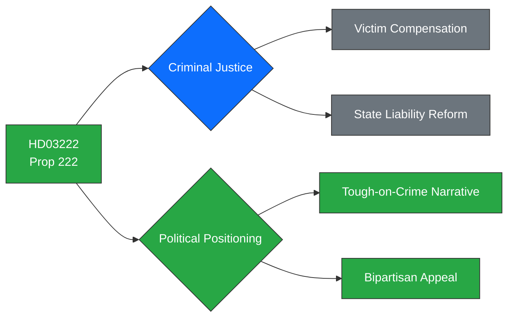

# Political Intelligence Analysis: HD03222

## Document Identity

| Field | Value |
|-------|-------|
| **dok_id** | HD03222 |
| **Type** | Proposition (Prop. 2025/26:222) |
| **Title** | Ersättningsregler med brottsoffret i fokus |
| **Date** | 2026-03-31 |
| **Riksmöte** | 2025/26 |
| **Organ** | Justitiedepartementet |
| **Minister** | Gunnar Strömmer (M) |
| **Source MCP Tool** | get_propositioner, get_dokument |
| **Analysis Timestamp** | 2026-03-31T10:30:00Z |
| **Analyst** | Riksdagsmonitor AI Intelligence Analyst |

---

## Executive Summary

**Confidence: HIGH (80%)**

Justice Minister Gunnar Strömmer (M) presents Prop. 2025/26:222, reforming crime victim compensation rules to strengthen societal responsibility when crimes occur. This proposition shifts the compensation framework to be more victim-centred, increasing state liability when perpetrators cannot pay. The bill reinforces the Tidö coalition's tough-on-crime identity while addressing a policy area with genuine bipartisan appeal. Unlike the contentious migration package, this proposition is likely to attract broad parliamentary support, including from S, making it a legislative quick win ahead of the 2026 election.

---

## Political Classification

| Attribute | Value |
|-----------|-------|
| **Sensitivity** | 🟢 PUBLIC |
| **Domain** | Justice (JUS) |
| **Urgency** | 🟡 ELEVATED |
| **Significance** | 5/10 |
| **Confidence** | HIGH (80%) |

---

## SWOT Impact Assessment

### Strengths

| # | Statement | Evidence dok_id | Confidence | Impact | Entry Date |
|---|-----------|----------------|------------|--------|------------|
| S1 | Reinforces government's core tough-on-crime narrative with concrete victim-focused legislation | HD03222 | H | H | 2026-03-31 |
| S2 | High bipartisan potential — victim rights generate cross-party consensus | HD03222 | H | M | 2026-03-31 |
| S3 | Minister Strömmer builds legislative track record ahead of potential party leadership positioning | HD03222 | M | L | 2026-03-31 |

### Weaknesses

| # | Statement | Evidence dok_id | Confidence | Impact | Entry Date |
|---|-----------|----------------|------------|--------|------------|
| W1 | Increased state compensation costs require budget allocation — Finance Ministry constraint | HD03222 | M | M | 2026-03-31 |
| W2 | May be overshadowed by migration package in media coverage, reducing political dividend | HD03222 | M | L | 2026-03-31 |

### Opportunities

| # | Statement | Evidence dok_id | Confidence | Impact | Entry Date |
|---|-----------|----------------|------------|--------|------------|
| O1 | Bipartisan passage demonstrates government can build broad majorities beyond SD dependency | HD03222 | H | M | 2026-03-31 |
| O2 | Brottsofferjouren and victim advocacy organisations provide positive civil society endorsement | HD03222 | M | M | 2026-03-31 |

### Threats

| # | Statement | Evidence dok_id | Confidence | Impact | Entry Date |
|---|-----------|----------------|------------|--------|------------|
| T1 | Opposition may argue reforms are insufficient — demand higher compensation ceilings | HD03222 | M | L | 2026-03-31 |
| T2 | Implementation cost could become ammunition in budget negotiations with SD | HD03222 | L | M | 2026-03-31 |

---

## Risk Assessment

| Risk Factor | Likelihood (1-5) | Impact (1-5) | Score | Mitigation |
|-------------|:-:|:-:|:-:|------------|
| Budget overrun on compensation | 2 | 3 | **6** | Phased implementation with annual cap review |
| Opposition critique as insufficient | 3 | 2 | **6** | Position as first step in broader victim rights agenda |
| Media underattention | 3 | 1 | **3** | Coordinate announcement with Brottsofferjouren endorsement |

---

## Forward Indicators

- **Parliamentary Calendar**: JuU (Justitieutskottet) committee handling expected
- **Voting Forecast**: Broad majority likely — S may support or abstain
- **Stakeholder Watch**: Brottsofferjouren public position expected within one week
- **Budget Track**: Monitor spring budget amendment bill for compensation funding

---

## Document Control

| Field | Value |
|-------|-------|
| **Classification** | 🟢 PUBLIC |
| **Version** | 1.0 |
| **Generated** | 2026-03-31T10:30:00Z |
| **Method** | MCP-sourced structured intelligence analysis with SWOT extraction |
| **Data Sources** | riksdag-regering MCP: get_propositioner, get_dokument |
| **Next Review** | 2026-04-14 |
