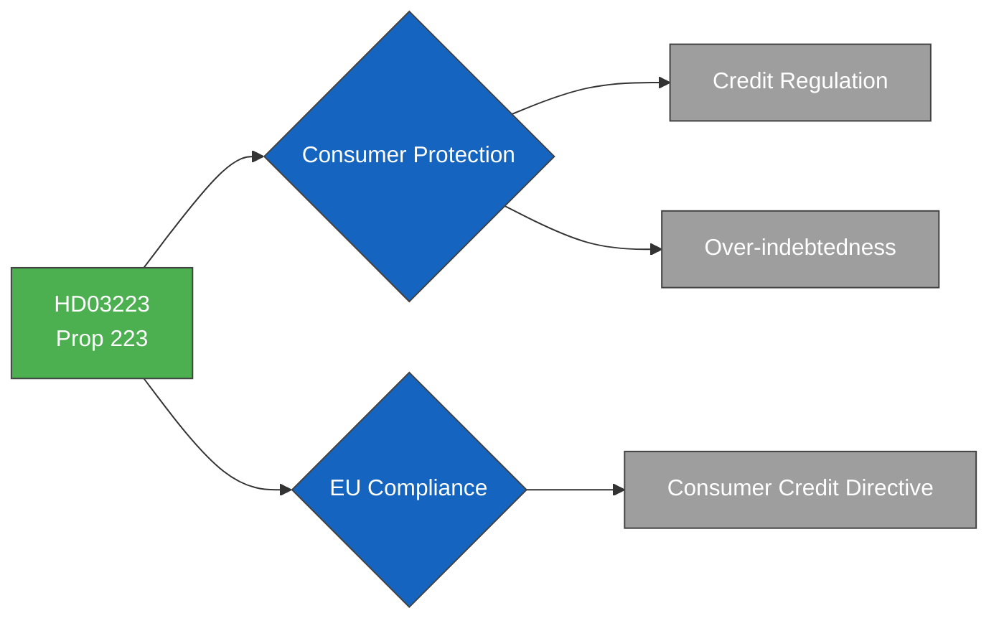

# Political Intelligence Analysis: HD03223

## Document Identity

| Field | Value |
|-------|-------|
| **dok_id** | HD03223 |
| **Type** | Proposition (Prop. 2025/26:223) |
| **Title** | En ny konsumentkreditlag |
| **Date** | 2026-03-31 |
| **Riksmöte** | 2025/26 |
| **Organ** | Justitiedepartementet |
| **Minister** | Gunnar Strömmer (M) |
| **Source MCP Tool** | get_propositioner, get_dokument |
| **Analysis Timestamp** | 2026-03-31T10:30:00Z |
| **Analyst** | Riksdagsmonitor AI Intelligence Analyst |

---

## Executive Summary

**Confidence: MEDIUM (75%)**

Prop. 2025/26:223 introduces a new Consumer Credit Law aimed at addressing Sweden's growing over-indebtedness crisis. The legislation tightens lending requirements, strengthens consumer protections, and implements EU Consumer Credit Directive provisions. As a technical-regulatory proposition under Justice Minister Strömmer (M), this bill carries low political controversy but addresses a genuine social concern affecting hundreds of thousands of Swedish households. The bill is expected to pass with broad parliamentary support and limited debate, providing the government with a low-risk consumer protection achievement.

---

## Political Classification

| Attribute | Value |
|-----------|-------|
| **Sensitivity** | 🟢 PUBLIC |
| **Domain** | Economy (ECO) |
| **Urgency** | ⚪ ROUTINE |
| **Significance** | 4/10 |
| **Confidence** | MEDIUM (75%) |

---

## SWOT Impact Assessment

### Strengths

| # | Statement | Evidence dok_id | Confidence | Impact | Entry Date |
|---|-----------|----------------|------------|--------|------------|
| S1 | Addresses concrete consumer harm — over 400,000 Swedes in Kronofogden debt enforcement registry | HD03223 | H | M | 2026-03-31 |
| S2 | EU directive alignment demonstrates responsible regulatory governance | HD03223 | H | L | 2026-03-31 |
| S3 | Broad public support for curbing aggressive lending practices (SMS-lån, quick credits) | HD03223 | M | M | 2026-03-31 |

### Weaknesses

| # | Statement | Evidence dok_id | Confidence | Impact | Entry Date |
|---|-----------|----------------|------------|--------|------------|
| W1 | Tighter credit access may constrain consumer spending during economic slowdown | HD03223 | M | L | 2026-03-31 |
| W2 | Fintech industry lobby may generate negative media around innovation constraints | HD03223 | L | L | 2026-03-31 |

### Opportunities

| # | Statement | Evidence dok_id | Confidence | Impact | Entry Date |
|---|-----------|----------------|------------|--------|------------|
| O1 | Broad parliamentary support achievable — S and V have long advocated stricter credit regulation | HD03223 | H | M | 2026-03-31 |
| O2 | Konsumentverket enforcement strengthening improves regulatory credibility | HD03223 | M | L | 2026-03-31 |

### Threats

| # | Statement | Evidence dok_id | Confidence | Impact | Entry Date |
|---|-----------|----------------|------------|--------|------------|
| T1 | Financial industry may challenge implementation timeline as too aggressive | HD03223 | L | L | 2026-03-31 |

---

## Risk Assessment

| Risk Factor | Likelihood (1-5) | Impact (1-5) | Score | Mitigation |
|-------------|:-:|:-:|:-:|------------|
| Industry pushback on lending restrictions | 2 | 2 | **4** | Transition period for compliance |
| Credit access reduction during downturn | 2 | 2 | **4** | Exemptions for established credit lines |
| EU implementation timeline pressure | 2 | 1 | **2** | Early transposition strategy |

---

## Forward Indicators

- **Parliamentary Calendar**: CU (Civilutskottet) or JuU committee referral expected
- **Voting Forecast**: Consensus passage likely with minimal opposition
- **Industry Watch**: Svensk Handel and Finansinspektionen statements expected
- **EU Track**: Monitor European Commission transposition assessment

---

## Document Control

| Field | Value |
|-------|-------|
| **Classification** | 🟢 PUBLIC |
| **Version** | 1.0 |
| **Generated** | 2026-03-31T10:30:00Z |
| **Method** | MCP-sourced structured intelligence analysis with SWOT extraction |
| **Data Sources** | riksdag-regering MCP: get_propositioner, get_dokument |
| **Next Review** | 2026-04-14 |
