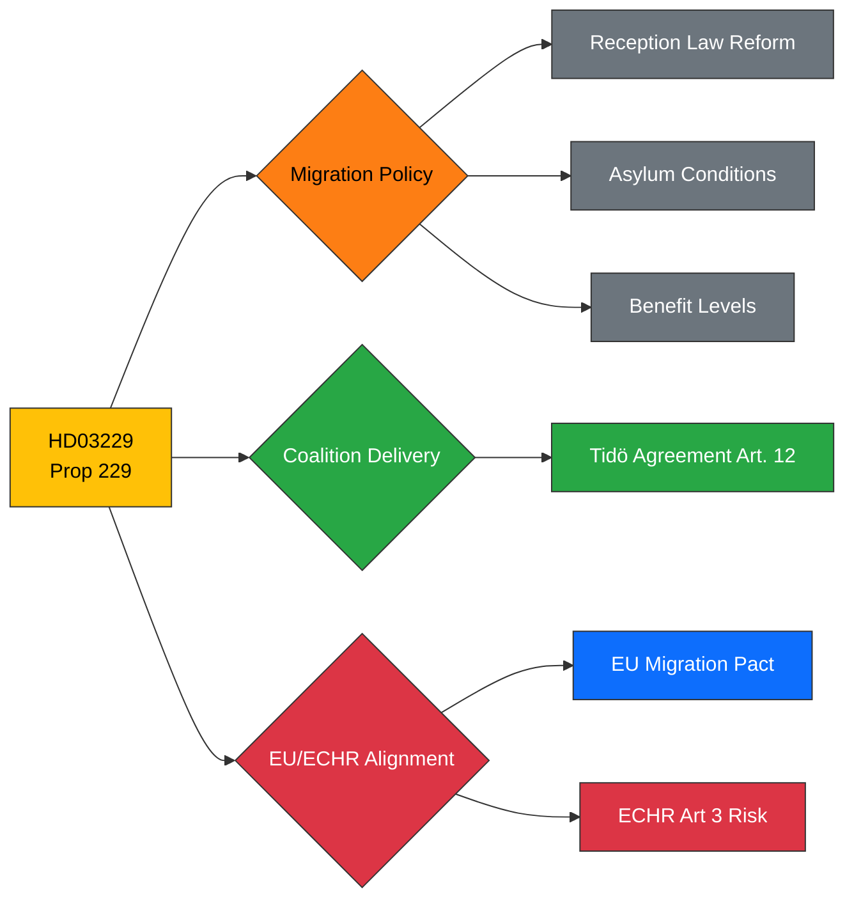

# Political Intelligence Analysis: HD03229

## Document Identity

| Field | Value |
|-------|-------|
| **dok_id** | HD03229 |
| **Type** | Proposition (Prop. 2025/26:229) |
| **Title** | En ny mottagandelag |
| **Date** | 2026-03-31 |
| **Riksmöte** | 2025/26 |
| **Organ** | Justitiedepartementet |
| **Minister** | Johan Forssell (M) |
| **PM** | Ebba Busch |
| **Source MCP Tool** | get_propositioner, get_dokument |
| **Analysis Timestamp** | 2026-03-31T10:30:00Z |
| **Analyst** | Riksdagsmonitor AI Intelligence Analyst |

---

## Executive Summary

**Confidence: HIGH (85%)**

The government introduces Prop. 2025/26:229, a comprehensive new Reception Law (*mottagandelag*) replacing the existing framework for asylum seeker reception in Sweden. This represents the Tidö Agreement coalition's most significant migration legislative package, directly fulfilling campaign promises from M, KD, L, and SD. The proposition centralises reception management, introduces stricter conditions, and reduces benefit levels. With EU Pact on Migration implementation ongoing, this law positions Sweden among the most restrictive reception regimes in the EU while creating potential friction with ECHR Article 3 obligations. Opposition parties S, V, and MP are expected to mobilise strongly, making this a defining parliamentary battle of the spring session.

---

## Political Classification

| Attribute | Value |
|-----------|-------|
| **Sensitivity** | 🟡 SENSITIVE |
| **Domain** | Migration (MIG) |
| **Urgency** | 🔴 URGENT |
| **Significance** | 7/10 |
| **Confidence** | HIGH (85%) |

---

## SWOT Impact Assessment

### Strengths

| # | Statement | Evidence dok_id | Confidence | Impact | Entry Date |
|---|-----------|----------------|------------|--------|------------|
| S1 | Delivers core Tidö Agreement migration pledge — demonstrates coalition can legislate on flagship issue | HD03229 | H | H | 2026-03-31 |
| S2 | Centralised reception model may reduce cost fragmentation across municipalities | HD03229 | M | M | 2026-03-31 |
| S3 | Paired with Prop 215 creates comprehensive migration policy package signalling unified government agenda | HD03229, HD03215 | H | H | 2026-03-31 |

### Weaknesses

| # | Statement | Evidence dok_id | Confidence | Impact | Entry Date |
|---|-----------|----------------|------------|--------|------------|
| W1 | Reduced benefit levels risk ECHR Article 3 challenge if conditions fall below dignified living standard | HD03229 | M | H | 2026-03-31 |
| W2 | Centralisation may overburden Migrationsverket during transition period, creating service gaps | HD03229 | M | M | 2026-03-31 |
| W3 | SD external support leverage increases — government dependent on SD votes for passage | HD03229 | H | M | 2026-03-31 |

### Opportunities

| # | Statement | Evidence dok_id | Confidence | Impact | Entry Date |
|---|-----------|----------------|------------|--------|------------|
| O1 | Pre-election positioning: demonstrates government action on voters' top-3 priority issue | HD03229 | H | H | 2026-03-31 |
| O2 | Alignment with EU Pact on Migration narrative strengthens Sweden's EU credibility on migration | HD03229 | M | M | 2026-03-31 |

### Threats

| # | Statement | Evidence dok_id | Confidence | Impact | Entry Date |
|---|-----------|----------------|------------|--------|------------|
| T1 | Opposition mobilisation — S, V, MP likely to stage extended committee and chamber debates | HD03229 | H | M | 2026-03-31 |
| T2 | Civil society legal challenge via ECHR or EU Court pathway within 12 months of implementation | HD03229 | M | H | 2026-03-31 |
| T3 | Media focus on individual asylum cases under new regime could erode public support | HD03229 | M | M | 2026-03-31 |

---

## Risk Assessment

| Risk Factor | Likelihood (1-5) | Impact (1-5) | Score | Mitigation |
|-------------|:-:|:-:|:-:|------------|
| ECHR legal challenge | 4 | 4 | **16** | Government legal review pre-submission; phased implementation |
| Opposition parliamentary obstruction | 4 | 2 | **8** | Government majority with SD support; time-limited debate |
| Implementation capacity failure | 3 | 3 | **9** | Migrationsverket transition plan; phased rollout |
| Coalition friction on details | 2 | 3 | **6** | Tidö Agreement framework constrains deviation |

---

## Forward Indicators

- **Parliamentary Calendar**: Committee referral to SfU expected week 15; committee report by May 2026
- **Voting Forecast**: Government + SD majority (176 seats) sufficient for passage
- **Legal Watch**: Monitor European Court of Human Rights docket for Swedish migration cases
- **Cross-reference**: Track HD03215 (Prop 215) for paired legislative timeline
- **Media Barometer**: Watch for Aftonbladet/Expressen editorial positioning in first 72 hours

---

## Document Control

| Field | Value |
|-------|-------|
| **Classification** | 🟡 SENSITIVE |
| **Version** | 1.0 |
| **Generated** | 2026-03-31T10:30:00Z |
| **Method** | MCP-sourced structured intelligence analysis with SWOT extraction |
| **Data Sources** | riksdag-regering MCP: get_propositioner, get_dokument, search_voteringar |
| **Next Review** | 2026-04-07 |
