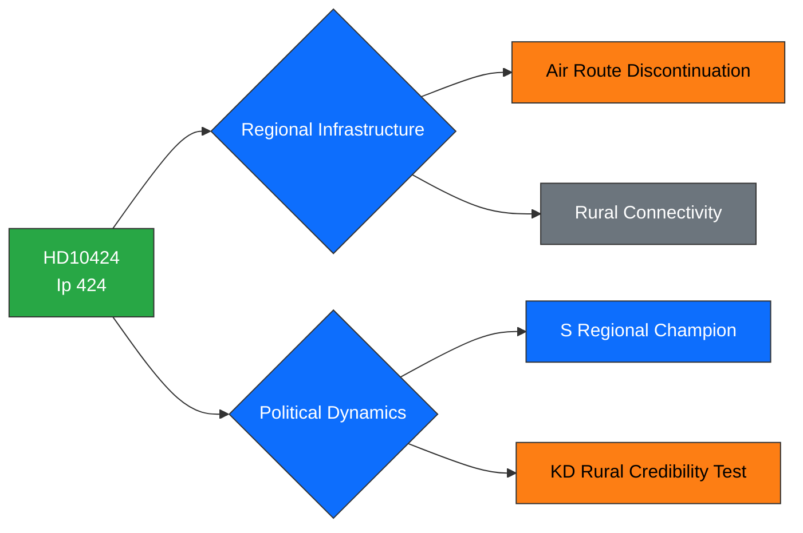

# Political Intelligence Analysis: HD10424

## Document Identity

| Field | Value |
|-------|-------|
| **dok_id** | HD10424 |
| **Type** | Interpellation (Interpellation 2025/26:424) |
| **Title** | Flyglinjen Torsby/Hagfors–Arlanda |
| **Date** | 2026-03-31 |
| **Riksmöte** | 2025/26 |
| **Author** | Mikael Dahlqvist (S) |
| **Recipient** | Infrastrukturminister Andreas Carlson (KD) |
| **Source MCP Tool** | get_interpellationer, get_dokument |
| **Analysis Timestamp** | 2026-03-31T10:30:00Z |
| **Analyst** | Riksdagsmonitor AI Intelligence Analyst |

---

## Executive Summary

**Confidence: MEDIUM (73%)**

Social Democrat MP Mikael Dahlqvist interpellates Infrastructure Minister Andreas Carlson (KD) regarding Trafikverket's proposal to discontinue the Torsby/Hagfors–Arlanda regional flight route. This interpellation frames a classic centre-periphery political conflict: rural Värmland communities risk losing their air connection to Stockholm, threatening healthcare access, business viability, and regional equality. For S, this is a tactical opportunity to champion rural connectivity — a theme resonant in northern and central Sweden constituencies. For the KD minister, the challenge is balancing fiscal responsibility with the government's rural development rhetoric. The debate will likely attract limited national attention but carries weight in Värmland local politics.

---

## Political Classification

| Attribute | Value |
|-----------|-------|
| **Sensitivity** | 🟢 PUBLIC |
| **Domain** | Infrastructure (INF) |
| **Urgency** | ⚪ ROUTINE |
| **Significance** | 3/10 |
| **Confidence** | MEDIUM (73%) |

---

## SWOT Impact Assessment

### Strengths

| # | Statement | Evidence dok_id | Confidence | Impact | Entry Date |
|---|-----------|----------------|------------|--------|------------|
| S1 | S positions as defender of rural Sweden — strengthens party narrative in non-urban constituencies | HD10424 | H | M | 2026-03-31 |
| S2 | Concrete local issue with identifiable affected communities generates constituent engagement | HD10424 | M | L | 2026-03-31 |

### Weaknesses

| # | Statement | Evidence dok_id | Confidence | Impact | Entry Date |
|---|-----------|----------------|------------|--------|------------|
| W1 | Government's "hela Sverige ska leva" rhetoric challenged by Trafikverket route cut proposal | HD10424 | H | M | 2026-03-31 |
| W2 | KD minister must reconcile fiscal discipline with rural constituency expectations | HD10424 | M | M | 2026-03-31 |

### Opportunities

| # | Statement | Evidence dok_id | Confidence | Impact | Entry Date |
|---|-----------|----------------|------------|--------|------------|
| O1 | Government can announce route preservation or alternative transport solution — turn debate into positive story | HD10424 | M | M | 2026-03-31 |

### Threats

| # | Statement | Evidence dok_id | Confidence | Impact | Entry Date |
|---|-----------|----------------|------------|--------|------------|
| T1 | Pattern of rural service cuts could aggregate into broader "government abandons rural Sweden" narrative | HD10424 | M | M | 2026-03-31 |
| T2 | C (Centre Party) may join S in criticising government, broadening opposition pressure | HD10424 | M | L | 2026-03-31 |

---

## Risk Assessment

| Risk Factor | Likelihood (1-5) | Impact (1-5) | Score | Mitigation |
|-------------|:-:|:-:|:-:|------------|
| Rural Sweden narrative damage | 3 | 2 | **6** | Announce alternative connectivity investment |
| C party alignment with S on rural issues | 3 | 2 | **6** | Engage C through informal coalition channels |
| Healthcare access concern amplification | 2 | 3 | **6** | Coordinate with health minister on telemedicine alternatives |

---

## Forward Indicators

- **Chamber Debate**: Interpellation debate in Riksdag chamber — date to be scheduled
- **Minister Response**: Carlson (KD) formal response and debate strategy
- **Trafikverket**: Final route decision timeline and public consultation status
- **Local Media**: NWT (Nya Wermlands-Tidningen) coverage and editorial positioning
- **Regional Council**: Värmland regional council position and potential co-funding offers

---

## Document Control

| Field | Value |
|-------|-------|
| **Classification** | 🟢 PUBLIC |
| **Version** | 1.0 |
| **Generated** | 2026-03-31T10:30:00Z |
| **Method** | MCP-sourced structured intelligence analysis with SWOT extraction |
| **Data Sources** | riksdag-regering MCP: get_interpellationer, get_dokument |
| **Next Review** | 2026-04-14 |
