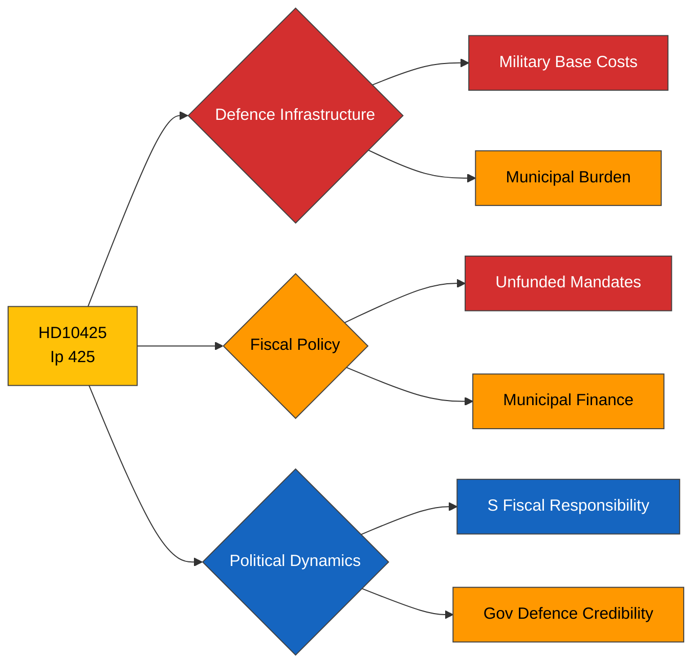

# Political Intelligence Analysis: HD10425

## Document Identity

| Field | Value |
|-------|-------|
| **dok_id** | HD10425 |
| **Type** | Interpellation (Interpellation 2025/26:425) |
| **Title** | Fördelning av ansvar för infrastrukturkostnader vid försvarsetableringar |
| **Date** | 2026-03-31 |
| **Riksmöte** | 2025/26 |
| **Author** | Kalle Olsson (S) |
| **Recipient** | Infrastrukturminister Andreas Carlson (KD) |
| **Source MCP Tool** | get_interpellationer, get_dokument |
| **Analysis Timestamp** | 2026-03-31T10:30:00Z |
| **Analyst** | Riksdagsmonitor AI Intelligence Analyst |

---

## Executive Summary

**Confidence: HIGH (78%)**

Social Democrat defence spokesperson Kalle Olsson raises a strategically significant question about who bears infrastructure costs when new military bases and prisons are established in municipalities. With Sweden's post-NATO accession defence expansion requiring new garrisons, training areas, and support facilities, municipalities face unfunded road, water, and utility infrastructure mandates. This interpellation exposes a genuine governance gap: national security decisions impose local fiscal burdens without compensation mechanisms. The issue resonates beyond Värmland — every municipality hosting new defence installations faces identical challenges. S uses this to construct a fiscal responsibility narrative: the government demands national defence expansion but refuses to fund its local consequences.

---

## Political Classification

| Attribute | Value |
|-----------|-------|
| **Sensitivity** | 🟡 SENSITIVE |
| **Domain** | Defence (DEF) |
| **Urgency** | 🟡 ELEVATED |
| **Significance** | 5/10 |
| **Confidence** | HIGH (78%) |

---

## SWOT Impact Assessment

### Strengths

| # | Statement | Evidence dok_id | Confidence | Impact | Entry Date |
|---|-----------|----------------|------------|--------|------------|
| S1 | S demonstrates fiscal responsibility — defence expansion must be properly funded at all levels | HD10425 | H | H | 2026-03-31 |
| S2 | Issue affects multiple municipalities nationwide — broadens appeal beyond single constituency | HD10425 | H | M | 2026-03-31 |
| S3 | SKR (Swedish Association of Local Authorities) likely to endorse the concern, amplifying pressure | HD10425 | M | M | 2026-03-31 |

### Weaknesses

| # | Statement | Evidence dok_id | Confidence | Impact | Entry Date |
|---|-----------|----------------|------------|--------|------------|
| W1 | Government lacks cost-sharing framework for defence infrastructure — exposed governance gap | HD10425 | H | H | 2026-03-31 |
| W2 | Defence expansion timeline pressure means infrastructure demands cannot be deferred | HD10425 | H | M | 2026-03-31 |
| W3 | KD minister must answer for cross-ministerial issue involving Defence and Finance ministries | HD10425 | M | M | 2026-03-31 |

### Opportunities

| # | Statement | Evidence dok_id | Confidence | Impact | Entry Date |
|---|-----------|----------------|------------|--------|------------|
| O1 | Government can announce municipal infrastructure support package — demonstrating proactive governance | HD10425 | M | H | 2026-03-31 |
| O2 | Cross-party defence consensus provides framework for bipartisan solution on cost-sharing | HD10425 | M | M | 2026-03-31 |

### Threats

| # | Statement | Evidence dok_id | Confidence | Impact | Entry Date |
|---|-----------|----------------|------------|--------|------------|
| T1 | Municipal resistance to defence expansion if costs not addressed — NIMBYism undermines NATO commitments | HD10425 | M | H | 2026-03-31 |
| T2 | Aggregated unfunded mandates narrative (defence + prisons + infrastructure) damages government credibility | HD10425 | H | H | 2026-03-31 |
| T3 | Defence timeline delays if municipalities block construction permits over unresolved cost disputes | HD10425 | M | H | 2026-03-31 |

---

## Risk Assessment

| Risk Factor | Likelihood (1-5) | Impact (1-5) | Score | Mitigation |
|-------------|:-:|:-:|:-:|------------|
| Municipal resistance to defence establishments | 3 | 4 | **12** | Establish cost-sharing framework with SKR |
| Defence timeline delay from permit disputes | 2 | 5 | **10** | National security override mechanism (risk: democratic backlash) |
| Aggregated unfunded mandates narrative | 4 | 3 | **12** | Spring budget amendment addressing municipal compensation |
| Cross-party blame if defence expansion stalls | 2 | 4 | **8** | Bipartisan infrastructure commission |

---

## Forward Indicators

- **Chamber Debate**: Interpellation debate date to be scheduled — likely high attendance given defence relevance
- **Minister Response**: Carlson (KD) response complexity — requires coordination with Defence Minister Jonson
- **SKR Position**: Swedish Association of Local Authorities formal position on infrastructure cost-sharing
- **Defence Commission**: Monitor Försvarsberedningen agenda for municipal cost-sharing discussion
- **Budget Track**: Spring amendment bill (VÅP) for potential municipal infrastructure allocation
- **NATO Integration**: Track NATO force posture decisions that may increase Swedish municipal hosting requirements

---

## Document Control

| Field | Value |
|-------|-------|
| **Classification** | 🟡 SENSITIVE |
| **Version** | 1.0 |
| **Generated** | 2026-03-31T10:30:00Z |
| **Method** | MCP-sourced structured intelligence analysis with SWOT extraction |
| **Data Sources** | riksdag-regering MCP: get_interpellationer, get_dokument |
| **Next Review** | 2026-04-07 |
