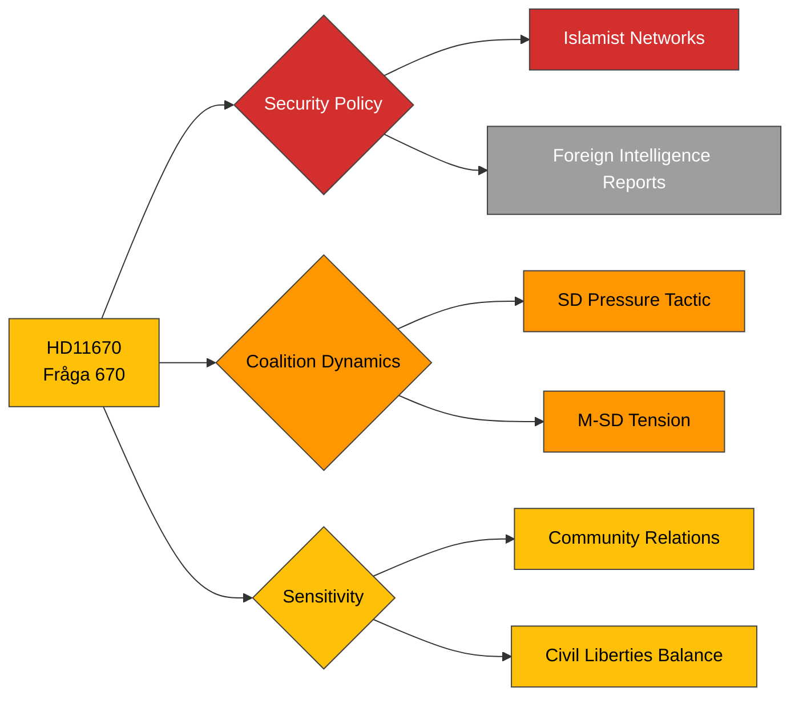

# Political Intelligence Analysis: HD11670

## Document Identity

| Field | Value |
|-------|-------|
| **dok_id** | HD11670 |
| **Type** | Skriftlig fråga (Written Question 2025/26:670) |
| **Title** | Fransk rapport om Muslimska brödraskapet |
| **Date** | 2026-03-31 |
| **Riksmöte** | 2025/26 |
| **Author** | Markus Wiechel (SD) |
| **Recipient** | Kulturminister Parisa Liljestrand (M) |
| **Source MCP Tool** | get_fragor, get_dokument |
| **Analysis Timestamp** | 2026-03-31T10:30:00Z |
| **Analyst** | Riksdagsmonitor AI Intelligence Analyst |

---

## Executive Summary

**Confidence: MEDIUM (76%)**

SD MP Markus Wiechel presses Culture Minister Parisa Liljestrand (M) on the Swedish government's response to a French intelligence report documenting Muslim Brotherhood networks in France and their transnational reach. This question exposes a sensitive coalition fault line: SD pushing government partners to take harder positions on Islamist organisations, while M must balance security concerns against civil liberties and diaspora community relations. Liljestrand, herself of Iranian heritage, faces particular political complexity in responding. The question signals SD's ongoing strategy to establish ownership of the security-Islam policy nexus, testing how far they can pull government policy through parliamentary instruments rather than direct Tidö negotiations.

---

## Political Classification

| Attribute | Value |
|-----------|-------|
| **Sensitivity** | 🟡 SENSITIVE |
| **Domain** | Security (DEF) |
| **Urgency** | 🟡 ELEVATED |
| **Significance** | 5/10 |
| **Confidence** | MEDIUM (76%) |

---

## SWOT Impact Assessment

### Strengths

| # | Statement | Evidence dok_id | Confidence | Impact | Entry Date |
|---|-----------|----------------|------------|--------|------------|
| S1 | SD demonstrates proactive security policy engagement — positions party as intelligence-literate | HD11670 | M | M | 2026-03-31 |
| S2 | References foreign intelligence product (French report) lending factual weight to question | HD11670 | M | M | 2026-03-31 |

### Weaknesses

| # | Statement | Evidence dok_id | Confidence | Impact | Entry Date |
|---|-----------|----------------|------------|--------|------------|
| W1 | M forced to respond on sensitive territory where security stance may alienate moderate voters | HD11670 | H | M | 2026-03-31 |
| W2 | Coalition tension visible — SD using parliamentary instruments to pressure governing party publicly | HD11670 | H | M | 2026-03-31 |
| W3 | Liljestrand's personal background adds media scrutiny dimension to any response | HD11670 | M | M | 2026-03-31 |

### Opportunities

| # | Statement | Evidence dok_id | Confidence | Impact | Entry Date |
|---|-----------|----------------|------------|--------|------------|
| O1 | Government can demonstrate cross-European security cooperation narrative if response is substantive | HD11670 | M | M | 2026-03-31 |

### Threats

| # | Statement | Evidence dok_id | Confidence | Impact | Entry Date |
|---|-----------|----------------|------------|--------|------------|
| T1 | SD-M friction on Islamism policy could escalate into public coalition disagreement | HD11670 | M | H | 2026-03-31 |
| T2 | Media framing as government avoiding security threats damages credibility if response is evasive | HD11670 | M | M | 2026-03-31 |
| T3 | Diaspora community backlash if government appears to endorse broad surveillance of Muslim organisations | HD11670 | M | M | 2026-03-31 |

---

## Risk Assessment

| Risk Factor | Likelihood (1-5) | Impact (1-5) | Score | Mitigation |
|-------------|:-:|:-:|:-:|------------|
| Coalition friction escalation | 3 | 3 | **9** | Coordinate response with SD before publication |
| Media scrutiny of minister's response | 4 | 2 | **8** | Factual, security-focused response avoiding ideological framing |
| Community relations damage | 2 | 3 | **6** | Distinguish between security monitoring and community targeting |

---

## Forward Indicators

- **Minister Response**: Liljestrand written answer expected within 14 days — tone will signal coalition health
- **SD Follow-up**: Monitor for escalation to interpellation if answer deemed insufficient
- **Media Watch**: Expressens ledarsida and SvD editorial positions on Islamist organisations
- **Coalition Barometer**: Tidö Agreement working group meeting agenda for security chapter
- **International**: Track French government actions on Muslim Brotherhood report recommendations

---

## Document Control

| Field | Value |
|-------|-------|
| **Classification** | 🟡 SENSITIVE |
| **Version** | 1.0 |
| **Generated** | 2026-03-31T10:30:00Z |
| **Method** | MCP-sourced structured intelligence analysis with SWOT extraction |
| **Data Sources** | riksdag-regering MCP: get_fragor, get_dokument |
| **Next Review** | 2026-04-07 |
