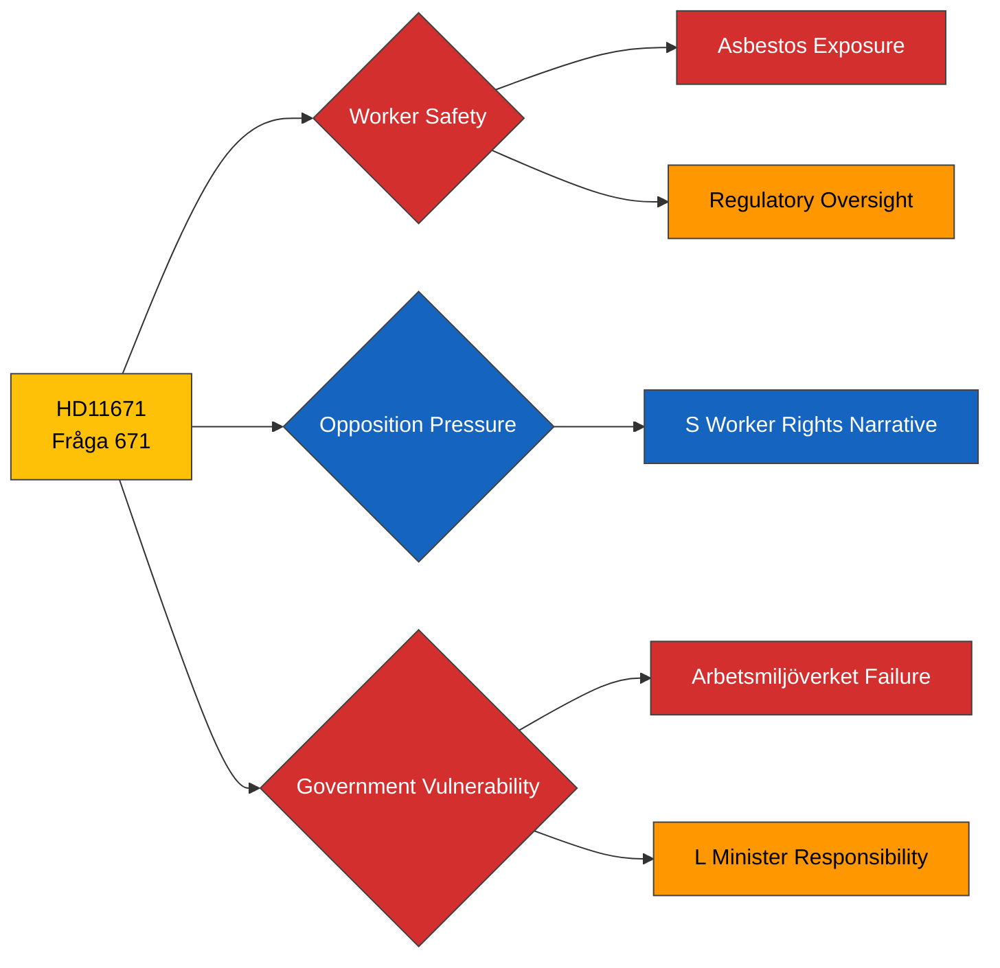

# Political Intelligence Analysis: HD11671

## Document Identity

| Field | Value |
|-------|-------|
| **dok_id** | HD11671 |
| **Type** | Skriftlig fråga (Written Question 2025/26:671) |
| **Title** | Asbestexponering och brister i arbetsmiljöarbetet vid renoveringar |
| **Date** | 2026-03-31 |
| **Riksmöte** | 2025/26 |
| **Author** | Johanna Haraldsson (S) |
| **Recipient** | Arbetsmarknadsminister Johan Britz (L) |
| **Source MCP Tool** | get_fragor, get_dokument |
| **Analysis Timestamp** | 2026-03-31T10:30:00Z |
| **Analyst** | Riksdagsmonitor AI Intelligence Analyst |

---

## Executive Summary

**Confidence: MEDIUM (74%)**

Social Democrat MP Johanna Haraldsson raises alarming worker safety concerns about asbestos exposure during a hotel renovation in Stockholm, where a safety representative was forced to issue a work stoppage order. The written question targets Labour Minister Johan Britz (L), pressing the government on regulatory oversight failures by Arbetsmiljöverket (the Work Environment Authority). This question has elevated significance because it touches on a concrete, documented workplace hazard with potential for media amplification — asbestos incidents reliably generate public concern. It exposes the government to criticism that deregulation ambitions compromise worker safety, a vulnerability S can exploit in its election positioning as defender of workers' rights.

---

## Political Classification

| Attribute | Value |
|-----------|-------|
| **Sensitivity** | 🟢 PUBLIC |
| **Domain** | Health (HEA) |
| **Urgency** | 🟡 ELEVATED |
| **Significance** | 4/10 |
| **Confidence** | MEDIUM (74%) |

---

## SWOT Impact Assessment

### Strengths

| # | Statement | Evidence dok_id | Confidence | Impact | Entry Date |
|---|-----------|----------------|------------|--------|------------|
| S1 | S positions as defender of workers — concrete safety case strengthens credibility on labour issues | HD11671 | H | M | 2026-03-31 |
| S2 | Specific, documented incident (Stockholm hotel) provides factual basis harder to dismiss | HD11671 | H | M | 2026-03-31 |

### Weaknesses

| # | Statement | Evidence dok_id | Confidence | Impact | Entry Date |
|---|-----------|----------------|------------|--------|------------|
| W1 | Government's Arbetsmiljöverket oversight gap exposed — inspection resources questioned | HD11671 | H | M | 2026-03-31 |
| W2 | L minister Britz must defend regulatory performance without appearing dismissive of worker safety | HD11671 | M | M | 2026-03-31 |

### Opportunities

| # | Statement | Evidence dok_id | Confidence | Impact | Entry Date |
|---|-----------|----------------|------------|--------|------------|
| O1 | Government can pivot to announce inspection resource increase — turn weakness into strength | HD11671 | M | M | 2026-03-31 |

### Threats

| # | Statement | Evidence dok_id | Confidence | Impact | Entry Date |
|---|-----------|----------------|------------|--------|------------|
| T1 | Media amplification of asbestos story could expand into broader worker safety scandal narrative | HD11671 | M | H | 2026-03-31 |
| T2 | LO (Swedish Trade Union Confederation) may escalate with public campaign on workplace safety | HD11671 | M | M | 2026-03-31 |
| T3 | Additional asbestos cases could surface following media attention, compounding political damage | HD11671 | L | H | 2026-03-31 |

---

## Risk Assessment

| Risk Factor | Likelihood (1-5) | Impact (1-5) | Score | Mitigation |
|-------------|:-:|:-:|:-:|------------|
| Media escalation into safety scandal | 3 | 4 | **12** | Proactive ministerial statement on inspection resources |
| Additional asbestos incidents reported | 3 | 3 | **9** | Immediate Arbetsmiljöverket audit of renovation projects |
| LO political campaign | 2 | 3 | **6** | Engage social partners in review process |

---

## Forward Indicators

- **Minister Response**: Britz written answer expected within 14 days
- **Media Watch**: SVT Nyheter, Aftonbladet arbete sections for follow-up reporting
- **Union Activity**: LO and Byggnads (construction workers' union) public statements
- **Regulatory Track**: Arbetsmiljöverket inspection statistics and enforcement actions
- **Parliamentary Follow-up**: Potential interpellation if written answer deemed insufficient

---

## Document Control

| Field | Value |
|-------|-------|
| **Classification** | 🟢 PUBLIC |
| **Version** | 1.0 |
| **Generated** | 2026-03-31T10:30:00Z |
| **Method** | MCP-sourced structured intelligence analysis with SWOT extraction |
| **Data Sources** | riksdag-regering MCP: get_fragor, get_dokument |
| **Next Review** | 2026-04-14 |
