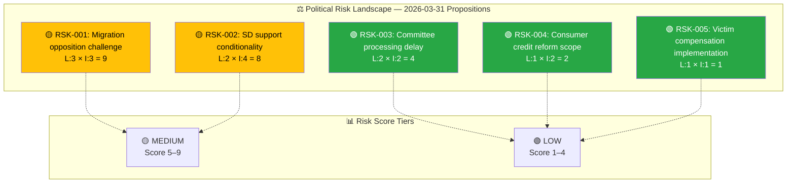
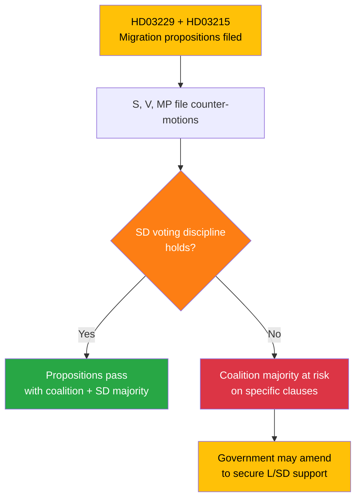

# Political Risk Assessment — 2026-03-31

**Generated**: 2026-04-01 05:43 UTC  
**Data Sources**: riksdag-regering-mcp get_propositioner, get_dokument_innehall  
**Documents Analyzed**: 4  
**Confidence**: MEDIUM

## Risk Context

| Field | Value |
|-------|-------|
| **Risk Assessment ID** | RSK-2026-03-31-001 |
| **Assessment Date** | 2026-04-01 05:43 UTC |
| **Assessment Period** | 2026-03-31 to 2026-04-07 |
| **Produced By** | news-propositions workflow |
| **Political Context** | Tidö Agreement coalition (M, KD, L with SD support) governs with working majority. Four propositions filed 2026-03-31 focusing on migration reform and consumer/victim protection. |
| **Riksmöte** | 2025/26 |
| **Overall Risk Level** | MEDIUM |

## Risk Heat Map

## 5-Dimension Risk Scoring

| Dimension | Score (1–5) | Rationale |
|-----------|:-----------:|-----------|
| **Coalition** | 2 | Strong cohesion: KD-M alignment 88.5%, L-M 87.9%. All propositions within Tidö Agreement scope. |
| **Policy** | 3 | Migration propositions (HD03229, HD03215) likely contested; consumer/victim propositions broadly acceptable. |
| **Budget** | 1 | No significant fiscal implications identified in this batch. |
| **Electoral** | 2 | Migration reform aligns with coalition voter base; unlikely to shift electoral dynamics. |
| **External** | 2 | Migration reception law (HD03229) may intersect with EU migration pact obligations. |

## Cascading Risk Chain — Migration Opposition

## Key Findings

1. **Coalition risk LOW (4/100)**: Strong cross-party voting alignment within the coalition bloc.
2. **Policy risk MEDIUM**: Two migration propositions (HD03229, HD03215) address politically sensitive territory. Opposition parties (S, V, MP) likely to file counter-motions.
3. **5 anomaly flags**: Unusually high cross-party alignment between KD-M (88.5%), L-M (87.9%), KD-L (87.9%) — indicates disciplined coalition on current agenda.
4. **Opposition impact limited**: 96% motion denial rate means opposition counter-motions unlikely to succeed but will generate media attention and debate.

## Forward Indicators

- **SfU committee vote** on HD03229 (reception law) — watch for opposition delay motions
- **AU committee deliberation** on HD03215 (settlement law) — integration policy debate expected
- **SD budget negotiations** — any fiscal implications of migration propositions could affect spring budget amendment
- **EU regulatory alignment** — consumer credit law (HD03223) implements EU directives, low controversy expected

## Data Quality Notes

Risk assessment derived from CIA coalition metrics (stability 83/100), cross-party voting alignment data, and document metadata. Confidence: MEDIUM (limited to metadata analysis, no full-text risk indicators).
