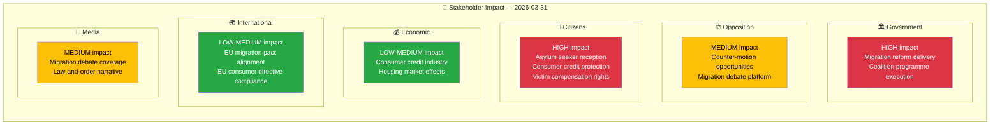

# Stakeholder Perspective Analysis — 2026-03-31

**Generated**: 2026-04-01 05:43 UTC  
**Data Sources**: riksdag-regering-mcp get_propositioner, get_dokument_innehall  
**Documents Analyzed**: 4  
**Confidence**: MEDIUM

## Summary

Applied 6 analysis lenses to 4 propositions. Migration propositions (HD03229, HD03215) have highest stakeholder impact across government, opposition, and citizen perspectives. Consumer/victim propositions (HD03223, HD03222) primarily affect citizens and economic actors.

## Stakeholder Impact Matrix

## Detailed Perspectives

### 🏛️ Government Perspective
- **HD03229** (reception law): Critical for demonstrating migration policy delivery under Tidö Agreement. PM Busch + Minister Forssell signed — signals top priority.
- **HD03215** (settlement law): Addresses integration challenge with time-limited housing approach. Minister Mohamsson (Arbetsmarknadsdepartementet) responsible.
- **HD03223** (consumer credit): EU directive implementation — routine but politically safe legislative win.
- **HD03222** (victim compensation): Aligns with law-and-order messaging; Minister Strömmer's justice reform agenda.

### ⚖️ Opposition Perspective
- Migration propositions provide S, V, MP with debate platform on immigration policy direction.
- Consumer/victim propositions offer limited opposition leverage — broad consensus likely.
- 96% motion denial rate constrains opposition's ability to amend proposals.

### 👥 Citizen Perspective
- **Asylum seekers/immigrants**: Directly affected by HD03229 (reception conditions) and HD03215 (housing restrictions).
- **Consumers**: HD03223 strengthens credit protection; potentially benefits borrowers.
- **Crime victims**: HD03222 improves compensation framework; addresses victim rights gap.

### 💰 Economic Perspective
- Consumer credit industry affected by HD03223 regulatory changes.
- Housing sector may see effects from HD03215 settlement requirements.
- No major fiscal expenditure implications identified.

### 🌍 International Perspective
- HD03229 reception law must align with EU Migration and Asylum Pact.
- HD03223 consumer credit law implements EU consumer credit directive.
- Nordic comparison: Sweden's migration approach continues to diverge from Denmark/Finland.

### 📰 Media Perspective
- Migration propositions (HD03229, HD03215) will dominate news coverage.
- Narrative frames: law-and-order, migration control, integration debate.
- Consumer/victim propositions likely secondary coverage.

## Data Quality Notes

Aggregate confidence: MEDIUM. Stakeholder impact assessments based on document metadata, committee assignments, and political context analysis.
