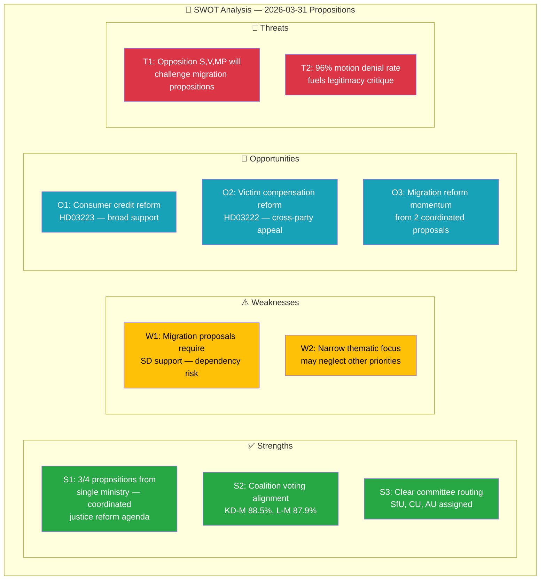

# Political SWOT Analysis — 2026-03-31

**Generated**: 2026-04-01 05:43 UTC  
**Data Sources**: riksdag-regering-mcp get_propositioner, get_dokument_innehall  
**Documents Analyzed**: 4  
**Confidence**: MEDIUM

## SWOT Context

| Field | Value |
|-------|-------|
| **SWOT ID** | SWT-2026-03-31-001 |
| **Analysis Date** | 2026-04-01 05:43 UTC |
| **Analysis Scope** | Government coalition legislative batch (4 propositions) |
| **Reference Period** | 2026-W14 |
| **Produced By** | news-propositions workflow |
| **Primary MCP Sources** | get_propositioner, get_dokument_innehall |
| **Validity Window** | Entries valid until 2026-04-14 |

## SWOT Quadrant Mapping

## Government Coalition SWOT

### ✅ Strengths

| # | Statement | Evidence (dok_id) | Confidence | Impact |
|---|-----------|-------------------|:----------:|:------:|
| S1 | Coordinated justice reform: 3 of 4 propositions from Justitiedepartementet, signed by PM Busch with ministers Forssell and Strömmer | HD03229, HD03223, HD03222 | H | H |
| S2 | Strong coalition voting alignment: KD-M 88.5%, L-M 87.9%, KD-L 87.9% | CIA coalition metrics | H | M |
| S3 | Clear legislative pipeline: propositions immediately assigned to SfU, CU, AU committees | HD03229 (SfU), HD03223 (CU), HD03215 (AU) | H | M |
| S4 | Migration reform dual-track approach: both reception (HD03229) and settlement (HD03215) addressed simultaneously | HD03229, HD03215 | M | H |

### ⚠️ Weaknesses

| # | Statement | Evidence (dok_id) | Confidence | Impact |
|---|-----------|-------------------|:----------:|:------:|
| W1 | Migration propositions require SD support for majority — creates dependency outside formal coalition | HD03229, HD03215 | H | H |
| W2 | Narrow thematic focus on justice/migration may crowd out economic or climate legislative priorities | Batch composition analysis | M | M |
| W3 | Consumer credit law (HD03223) implementation complexity may face industry lobbying resistance | HD03223 | L | L |

### 🔵 Opportunities

| # | Statement | Evidence (dok_id) | Confidence | Impact |
|---|-----------|-------------------|:----------:|:------:|
| O1 | Consumer credit reform (HD03223) implements EU directive — likely broad Riksdag support | HD03223 | H | M |
| O2 | Victim compensation reform (HD03222) addresses public safety concern with cross-party appeal | HD03222 | H | M |
| O3 | Dual migration propositions demonstrate policy coherence ahead of 2026 election cycle | HD03229, HD03215 | M | H |

### 🔴 Threats

| # | Statement | Evidence (dok_id) | Confidence | Impact |
|---|-----------|-------------------|:----------:|:------:|
| T1 | Opposition parties (S, V, MP) will challenge migration propositions, generating media debate | HD03229, HD03215 | H | M |
| T2 | 96% motion denial rate fuels opposition narrative of rubber-stamp parliament | CIA coalition metrics | H | L |
| T3 | EU migration pact alignment uncertainty for reception law (HD03229) | HD03229 | M | M |

## TOWS Strategic Options

| Combination | Strategy |
|-------------|----------|
| S1+O3 (SO) | Leverage coordinated justice agenda and migration momentum to demonstrate governance capacity before 2026 elections |
| W1+T1 (WT) | Secure early SD commitment on migration votes to neutralize opposition challenge narrative |
| S2+T2 (ST) | Use strong voting alignment data to counter opposition claims of democratic deficit |
| W2+O1 (WO) | Use broad support for consumer/victim reforms to diversify legislative portfolio beyond migration |

## Strategic Implications

Government's legislative batch demonstrates disciplined coalition agenda-setting focused on Tidö Agreement core priorities. The dual migration proposition approach (reception + settlement) signals policy comprehensiveness, but creates a concentrated opposition target. Consumer protection and victim rights propositions provide bipartisan legislative ballast.

**Key Watch Items:**
- SfU deliberation on HD03229 — potential opposition delay tactics
- SD public statements on reception law specifics
- Committee report timeline (target: before June 2026 summer recess)

## Data Quality Notes

SWOT confidence: MEDIUM. Evidence based on document metadata, committee assignments, and CIA coalition metrics. Full-text analysis would increase confidence for specific policy impact assessments.
