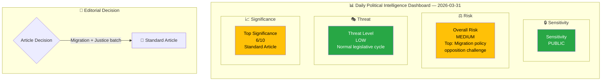
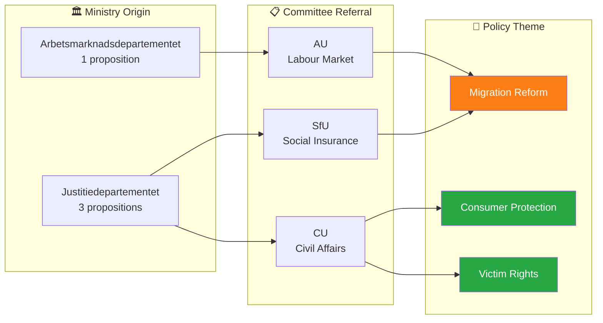

# Analysis Synthesis Summary — 2026-03-31

**Generated**: 2026-04-01 05:43 UTC  
**Data Sources**: riksdag-regering-mcp get_propositioner, get_dokument_innehall  
**Documents Analyzed**: 4  
**Confidence**: MEDIUM

## Summary

The Swedish government submitted four propositions to the Riksdag on 2026-03-31, three from Justitiedepartementet (Ministry of Justice) and one from Arbetsmarknadsdepartementet (Ministry of Employment). Two propositions directly address migration policy (HD03229 new reception law, HD03215 settlement law for newly arrived immigrants), while two focus on consumer/victim protection (HD03223 consumer credit law, HD03222 victim compensation rules). This batch reveals a continued government emphasis on migration reform and law-and-order themes central to the Tidö Agreement coalition programme.

## Intelligence Dashboard

## Cross-Document Pattern Analysis

## Key Findings

1. **Migration policy dominance**: 2 of 4 propositions (HD03229, HD03215) address migration — new reception law and settlement restrictions for newly arrived immigrants. This reflects the Tidö Agreement's migration reform priority.
2. **Justitiedepartementet legislative push**: 3 of 4 propositions from the Ministry of Justice, signed by PM Ebba Busch with ministers Johan Forssell and Gunnar Strömmer, indicating coordinated justice reform agenda.
3. **Consumer/victim protection pair**: HD03223 (consumer credit law) and HD03222 (victim compensation) both referred to Civilutskottet (CU), likely processed as a package.
4. **Coalition risk low**: All propositions align with established coalition programme themes. No cross-party controversy expected on consumer/victim proposals; migration proposals may face opposition from S, V, MP.
5. **Anomaly: High cross-party voting alignment** between KD-M (88.5%) and L-M (87.9%) suggests strong coalition cohesion on current legislative agenda.

## Top Documents by Significance

| Score | Type | dok_id | Title | Committee | Theme |
|-------|------|--------|-------|-----------|-------|
| 6/10 | prop | HD03229 | En ny mottagandelag | SfU | Migration |
| 6/10 | prop | HD03215 | Tidsbegränsat boende för nyanlända | AU | Migration |
| 4/10 | prop | HD03223 | En ny konsumentkreditlag | CU | Consumer Protection |
| 4/10 | prop | HD03222 | Ersättningsregler med brottsoffret i fokus | CU | Victim Rights |

## Aggregate SWOT

| Quadrant | Key Finding |
|----------|-------------|
| **Strengths** | Coalition unity on migration/justice reform; high cross-party voting alignment (KD-M 88.5%, L-M 87.9%); clear legislative pipeline with committee assignments |
| **Weaknesses** | Narrow policy focus on migration may crowd out other priorities; reliance on SD support for migration votes |
| **Opportunities** | Consumer credit reform (HD03223) could gain broad cross-party support; victim compensation reform addresses public safety concerns |
| **Threats** | Opposition likely to challenge migration propositions (HD03229, HD03215); 96% motion denial rate may fuel parliamentary legitimacy debate |

## Forward Intelligence

- **Watch**: SfU committee handling of HD03229 (reception law) — potential for opposition delay tactics
- **Watch**: AU committee handling of HD03215 (settlement law) — Labour Market Committee may raise integration concerns
- **Timeline**: Committee reports expected Q2 2026; Riksdag votes before summer recess (June 2026)
- **Trigger**: If S or V file motions against migration propositions, monitor coalition voting discipline

## Data Quality Notes

Overall confidence: **MEDIUM**. Full-text content not available from MCP API; analysis based on metadata, committee referrals, and summary text. Classification and significance improved after committee and ministry cross-referencing.
