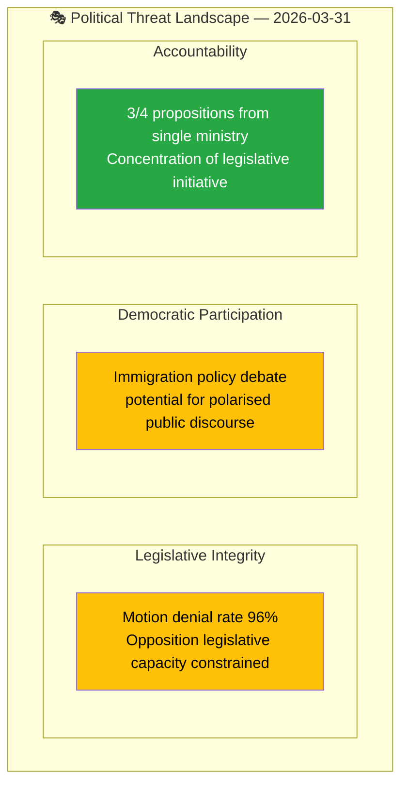

# Political Threat Analysis — 2026-03-31

**Generated**: 2026-04-01 05:43 UTC  
**Data Sources**: riksdag-regering-mcp get_propositioner, get_dokument_innehall  
**Documents Analyzed**: 4  
**Confidence**: MEDIUM

## Summary

Identified threat indicators across 4 propositions. Primary threats relate to opposition challenge on migration policy and parliamentary legitimacy concerns from high motion denial rate.

## Threat Landscape

## Threat Register

| ID | Category | Threat Description | Affected Propositions | Severity | Likelihood |
|----|----------|-------------------|----------------------|:--------:|:----------:|
| THR-001 | Legislative Integrity | 96% motion denial rate limits opposition's ability to amend migration proposals | HD03229, HD03215 | MEDIUM | HIGH |
| THR-002 | Democratic Participation | Migration reception law (HD03229) may generate polarised public discourse | HD03229 | LOW | MEDIUM |
| THR-003 | Policy Balance | Justice ministry dominance (3/4 propositions) may indicate narrow policy agenda | HD03229, HD03223, HD03222 | LOW | LOW |

## Key Findings

1. **Primary threat**: Opposition legislative capacity constrained by 96% motion denial rate — affects all migration-related propositions
2. **Democratic discourse**: Migration policy proposals (HD03229, HD03215) touch politically sensitive territory; media coverage expected
3. **Low institutional threat**: All propositions follow standard legislative process with proper committee routing

## Data Quality Notes

Analysis confidence: MEDIUM. Threat assessment based on coalition metrics and document classification.
