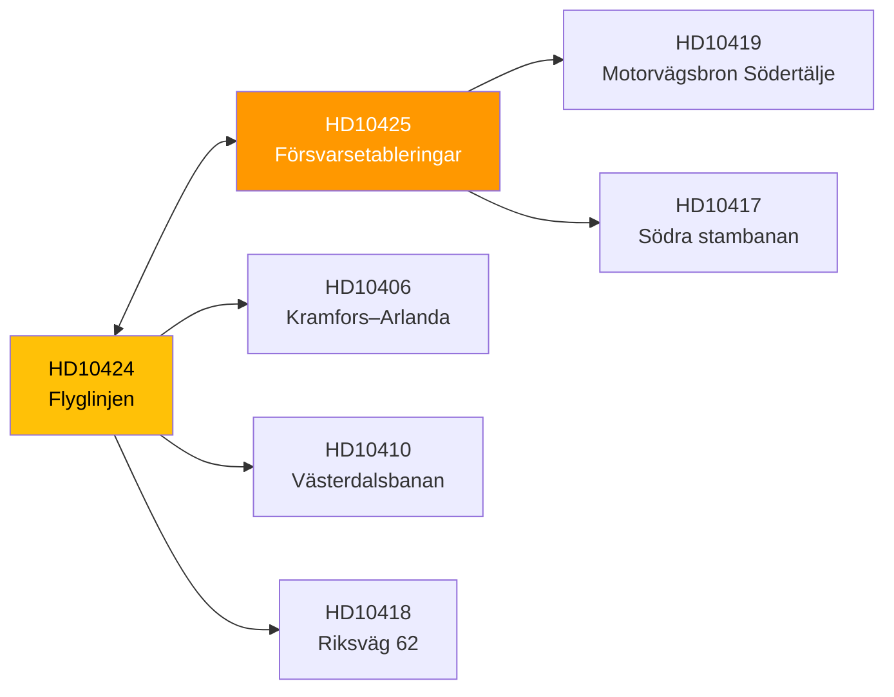

# Cross-Reference Map — 2026-03-31

**Generated**: 2026-03-31 07:42 UTC
**Documents**: 2

---

## Cross-Reference Network

| Source | Target | Relationship |
|--------|--------|--------------|
| HD10424 | HD10425 | Same minister, same day, same party (S) — coordinated accountability pressure |
| HD10424 | HD10406 | Same theme (airline route closure by Trafikverket) — different region |
| HD10424 | HD10410 | Regional transport connectivity — Västerdalsbanan rail closure |
| HD10424 | HD10418 | Värmland regional infrastructure (riksväg 62) — same MP constituency |
| HD10425 | HD10419 | Infrastructure-as-defence theme — Södertälje bridge (to Försvarsminister) |
| HD10425 | HD10417 | Infrastructure investment prioritisation |
