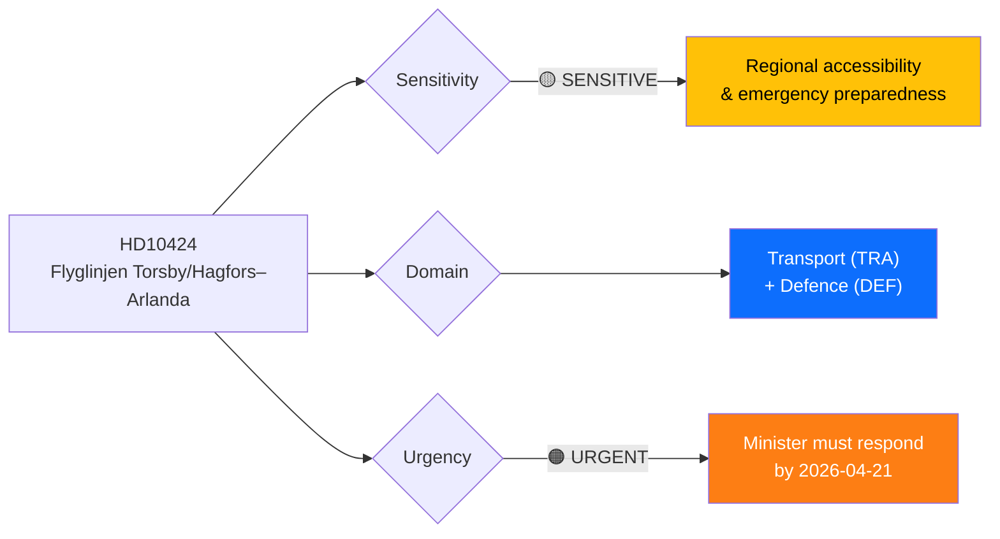
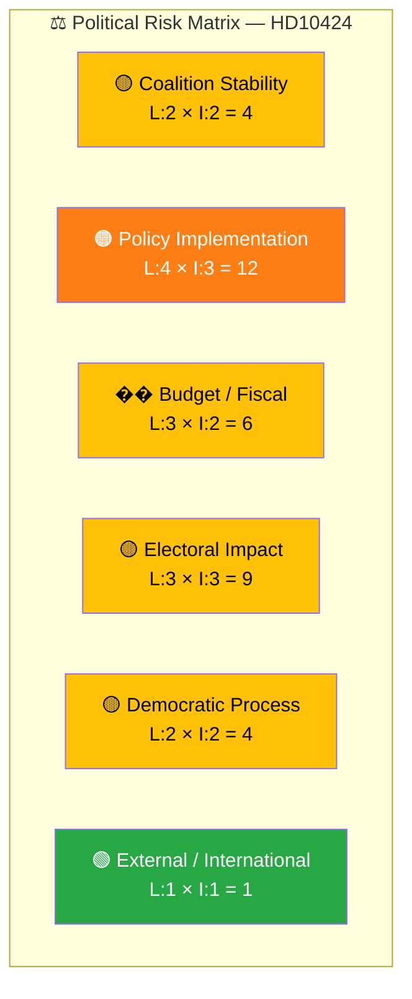

# Document Analysis: Flyglinjen Torsby/Hagfors–Arlanda

**Generated**: 2026-03-31 07:35 UTC
**dok_id**: HD10424
**Document Type**: interpellation (ip)
**Committee**: Trafikutskottet (TU)
**Date**: 2026-03-31
**Author**: Mikael Dahlqvist (S)
**Party**: S
**Target Minister**: Andreas Carlson (KD), Infrastructure & Housing Minister
**Riksmöte**: 2025/26
**Significance**: 🟡 Medium (5/10)
**Confidence**: HIGH (85%)

---

## Executive Summary

Social Democrat MP Mikael Dahlqvist (S) challenges Infrastructure Minister Andreas Carlson (KD) on the threatened closure of the Torsby/Hagfors–Arlanda regional airline route following Trafikverket's recommendation against renewing the public service obligation (trafikplikt). The interpellation raises critical questions about regional accessibility, emergency preparedness (ambulance flights, wildfire response), and the government's "whole of Sweden" policy coherence. This is part of a broader pattern — Carlson faces the highest interpellation volume of any minister, with 8 of the 20 most recent interpellations targeting his portfolio, reflecting systemic opposition pressure on infrastructure policy. **[HIGH]**

---

## 📊 Political Classification

| Field | Assessment |
|-------|-----------|
| **Sensitivity Level** | SENSITIVE — touches emergency preparedness and totalförsvar |
| **Primary Domain** | Transport (TRA), secondary: Defence/Emergency Preparedness (DEF) |
| **Urgency** | URGENT — response deadline 2026-04-21; route closure could occur after 2027 |
| **Significance Score** | 5/10 |
| **Confidence** | HIGH |

---

## 💪 SWOT Impact Assessment

### Government Coalition Impact

| Quadrant | Statement | Evidence | Confidence | Impact |
|----------|-----------|----------|:----------:|:------:|
| ⚠️ Weakness | Government's "hela Sverige ska leva" rhetoric contradicted by Trafikverket route closure proposals | HD10424: "Regeringen har uttalat att hela Sverige ska kunna leva och utvecklas. Samtidigt föreslår Trafikverket..." | H | H |
| ⚠️ Weakness | Carlson is the most interpellated minister — 8 of 20 latest interpellations target his portfolio, indicating systemic accountability pressure | HD10424, HD10425, HD10417, HD10418, HD10413, HD10412, HD10410, HD10406 — all to Carlson | H | M |
| 🔴 Threat | Emergency preparedness gap — closure threatens ambulance flights and wildfire response in northern Värmland/Dalarna | HD10424: "riskerar att försvåra möjligheterna att upprätthålla kapacitet för ambulansflyg och insatser vid exempelvis skogsbränder" | H | H |
| 🚀 Opportunity | Minister can demonstrate policy coherence by intervening to extend trafikplikt beyond 2027 | Response deadline 2026-04-21 provides window for decisive action | M | M |

### Opposition Impact

| Quadrant | Statement | Evidence | Confidence | Impact |
|----------|-----------|----------|:----------:|:------:|
| ✅ Strength | S exploits gap between government rhetoric and Trafikverket's actions — effective accountability tool | HD10424: Dahlqvist (S) highlights direct contradiction | H | H |
| 🚀 Opportunity | Links transport policy to national security (totalförsvar) framing, broadening political appeal | HD10424 Q2: "regionala flygplatsers betydelse för Sveriges beredskap och totalförsvar" | H | M |
| ⚠️ Weakness | Dahlqvist represents a single constituency (Värmland); risk of issue being dismissed as local concern | HD10424 focused specifically on Torsby/Hagfors | M | L |

---

## ⚖️ Risk Assessment

| Risk Type | Likelihood (1–5) | Impact (1–5) | Score | Assessment |
|-----------|:-----------------:|:------------:|:-----:|------------|
| Coalition Stability | 2 | 2 | 4 | Low coalition risk — KD and coalition partners aligned on infrastructure policy |
| Policy Implementation | 4 | 3 | 12 | HIGH — Trafikverket's recommendation directly contradicts government's "hela Sverige" policy, exposing implementation gap |
| Budget / Fiscal | 3 | 2 | 6 | Moderate fiscal cost to maintain trafikplikt subsidies for regional routes |
| Electoral Impact | 3 | 3 | 9 | Regional transport cuts hurt rural/semi-urban voters — key swing demographics for 2026 election |
| Democratic Process | 2 | 2 | 4 | Standard parliamentary accountability mechanism functioning as intended |
| External / International | 1 | 1 | 1 | Minimal international dimension |

**Overall Risk Level:** **MEDIUM** (highest single risk: Policy Implementation at 12/25)

---

## 🎭 Political Threat Taxonomy

| Threat Category | Relevance | Evidence | Severity |
|----------------|-----------|----------|----------|
| institutional-erosion | ⚠️ Moderate | Trafikverket acting against stated government policy suggests agency independence tension | MEDIUM |
| societal-impact | ⚠️ Moderate | Regional populations (Torsby, Hagfors, Munkfors, Sunne, Forshaga + SW Dalarna) face connectivity loss, affecting employment and emergency services | MEDIUM |
| economic-disruption | 🟡 Low-moderate | "negativa konsekvenser för både arbetsmarknaden och näringslivet" — economic impact on rural communities | LOW |

---

## 👥 Stakeholder Impact Matrix

| Stakeholder | Impact | Assessment |
|-------------|:------:|------------|
| 🏛️ Government | Medium | Carlson must reconcile Trafikverket's recommendation with government's regional policy. 8 concurrent interpellations strain ministerial capacity. |
| ⚖️ Opposition (S) | High | Dahlqvist effectively frames transport-as-security argument; pattern of S MPs coordinating infrastructure pressure on Carlson |
| 👥 Citizens (Värmland/Dalarna) | High | ~25 mil to Karlstad without air link; commuters, business travelers, and emergency services directly affected |
| 💰 Business | Medium | Regional businesses lose Stockholm connectivity; potential relocation pressure |
| 🌍 International | Low | Minimal international dimension |
| 📰 Media | Medium | "Hela Sverige" policy vs. route closure contradiction is media-ready framing |

---

## 🔮 Forward Indicators

1. **Minister Response (by 2026-04-21)**: Watch for whether Carlson signals intervention or defers to Trafikverket. Pattern from speeches on ip:398, 401, 406 (other airline routes) may preview response approach.
2. **Anmäld 2026-04-01**: Interpellation officially announced in chamber — debate scheduling follows.
3. **Related interpellations**: HD10406 (Kramfors–Arlanda) and HD10410 (Västerdalsbanan) form a coordinated pattern of S MPs challenging government on regional transport connectivity.
4. **Election 2026**: Regional transport cuts are potent local campaign issues in rural/semi-urban constituencies.

---

## Cross-Document References

| Related dok_id | Connection |
|---------------|------------|
| HD10406 | Flygförbindelsen Kramfors–Arlanda — same minister, same route closure theme |
| HD10410 | Framtiden för Västerdalsbanan — regional transport connectivity theme |
| HD10417 | Södra stambanan — infrastructure investment pattern |
| HD10418 | Riksväg 62 — Värmland regional infrastructure |
| HD10425 | Defence infrastructure costs — same minister, same day, S coordination |

---

## Data Quality Notes

- **Analysis confidence**: HIGH (85%)
- **Full-text content**: Available — deep analysis possible
- **Data sources**: get_interpellationer, get_dokument_innehall, search_anforanden (Carlson speeches)
- **Analysis method**: 6-lens stakeholder analysis with SWOT, risk matrix, threat taxonomy, cross-document referencing
