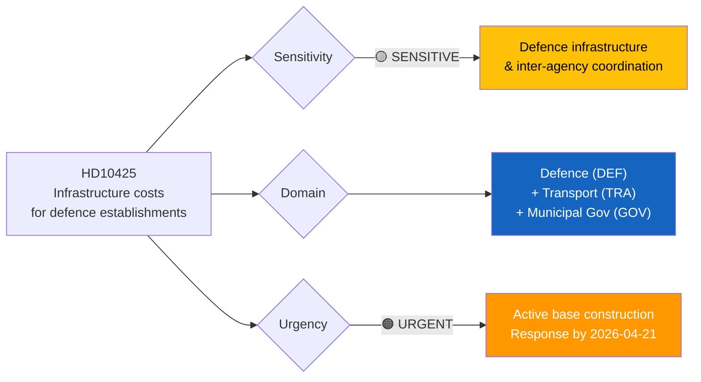
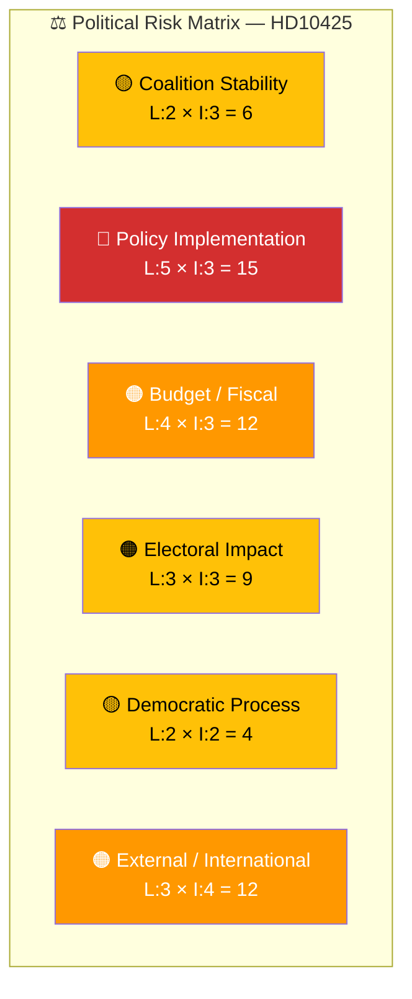

# Document Analysis: Fördelning av ansvar för infrastrukturkostnader vid försvarsetableringar

**Generated**: 2026-03-31 07:35 UTC
**dok_id**: HD10425
**Document Type**: interpellation (ip)
**Committee**: Trafikutskottet (TU) / Försvarsutskottet (FöU)
**Date**: 2026-03-31
**Author**: Kalle Olsson (S)
**Party**: S
**Target Minister**: Andreas Carlson (KD), Infrastructure & Housing Minister
**Riksmöte**: 2025/26
**Significance**: 🟠 Medium-High (6/10)
**Confidence**: HIGH (88%)

---

## Executive Summary

Social Democrat MP Kalle Olsson (S) exposes a governance failure where Trafikverket demands municipalities pay for infrastructure needed by new military bases and prisons — despite these being central government priorities driven by Russia's security threat. The interpellation reveals inter-agency coordination breakdown: the government allocates "enormous sums" for defence expansion while Trafikverket threatens to appeal local plans unless municipalities bear infrastructure costs. Olsson's framing — "a regiment is not a shopping mall" — is politically potent, linking the government's security rhetoric to bureaucratic dysfunction. This intersects national security urgency (Russia threat) with local government capacity, making it higher-significance than typical infrastructure interpellations. **[HIGH]**

---

## 📊 Political Classification

| Field | Assessment |
|-------|-----------|
| **Sensitivity Level** | SENSITIVE — touches defence establishment timelines and inter-agency governance |
| **Primary Domain** | Defence (DEF), secondary: Transport (TRA), Municipal Governance (GOV) |
| **Urgency** | URGENT — active construction timelines; Trafikverket appeals could delay military readiness by years |
| **Significance Score** | 6/10 |
| **Confidence** | HIGH |

---

## 💪 SWOT Impact Assessment

### Government Coalition Impact

| Quadrant | Statement | Evidence | Confidence | Impact |
|----------|-----------|----------|:----------:|:------:|
| ⚠️ Weakness | Inter-agency coordination failure undermines credibility on defence — "drar ett löjets skimmer över svensk statsförvaltning" | HD10425: Trafikverket threatens to appeal Östersund municipal plan over defence base infrastructure costs | H | H |
| ⚠️ Weakness | Government rhetoric on "inre och yttre säkerhet" priority contradicted by inability to resolve infrastructure cost disputes | HD10425: "knappast ett styrkebesked för en regering som säger sig prioritera inre och yttre säkerhet" | H | H |
| 🔴 Threat | Defence establishment delays — Trafikverket appeal of Östersund detaljplan could delay Försvarsmakten's establishment "med flera år" | HD10425: explicit timeline risk cited | H | H |
| 🚀 Opportunity | Minister can demonstrate decisive leadership by clarifying state responsibility for defence-related infrastructure | Straightforward administrative fix that serves government's defence agenda | M | H |

### Opposition Impact

| Quadrant | Statement | Evidence | Confidence | Impact |
|----------|-----------|----------|:----------:|:------:|
| ✅ Strength | Olsson's framing is devastatingly effective — "Ett regemente är inte att jämställa med en handelslada" — quotable media soundbite | HD10425 full text | H | H |
| ✅ Strength | Simultaneously supports defence spending (patriotic framing) while attacking governance competence — hard for government to counter | HD10425: S positions as more competent on defence implementation | H | H |
| 🚀 Opportunity | Links to Russia security threat timeline — "fara i dröjsmål" — adds urgency that transcends normal policy debate | HD10425: references Russia's full-scale invasion and timeline for expanded aggression | H | M |
| ⚠️ Weakness | S supported defence spending increases; limited room to criticise funding levels | Bipartisan defence consensus constrains opposition attack angle | M | L |

---

## ⚖️ Risk Assessment

| Risk Type | Likelihood (1–5) | Impact (1–5) | Score | Assessment |
|-----------|:-----------------:|:------------:|:-----:|------------|
| Coalition Stability | 2 | 3 | 6 | Moderate — defence is cross-party consensus but implementation failures create friction |
| Policy Implementation | 5 | 3 | 15 | CRITICAL — Trafikverket is actively blocking/delaying defence establishments through cost disputes |
| Budget / Fiscal | 4 | 3 | 12 | HIGH — unclear who pays for defence-related municipal infrastructure; systemic budget gap |
| Electoral Impact | 3 | 3 | 9 | Moderate — affects communities hosting new bases (Östersund and others) |
| Democratic Process | 2 | 2 | 4 | Standard parliamentary accountability |
| External / International | 3 | 4 | 12 | HIGH — delays in military readiness have direct security implications given Russia threat timeline |

**Overall Risk Level:** **HIGH** (Policy Implementation at 15/25 = CRITICAL)

---

## 🎭 Political Threat Taxonomy

| Threat Category | Relevance | Evidence | Severity |
|----------------|-----------|----------|----------|
| institutional-erosion | 🔴 High | Trafikverket acting in contradiction to government defence priorities reveals systemic inter-agency coordination failure | HIGH |
| democratic-deficit | ⚠️ Moderate | Municipalities bear costs of national policy decisions without adequate framework — "unfunded mandates" dynamic | MEDIUM |
| economic-disruption | ⚠️ Moderate | Infrastructure cost disputes create uncertainty for communities hosting defence establishments | MEDIUM |

---

## 👥 Stakeholder Impact Matrix

| Stakeholder | Impact | Assessment |
|-------------|:------:|------------|
| 🏛️ Government | High | Exposed governance failure; Carlson must clarify inter-agency responsibilities. Failure to act = delayed defence readiness |
| ⚖️ Opposition (S) | High | Olsson's framing is politically devastating — supports defence while attacking competence. Coordinated with HD10424 (same minister, same day) |
| 👥 Citizens | Medium | Municipalities hosting bases face infrastructure cost burden; local residents affected by construction delays |
| 💰 Defence/Security | High | Försvarsmakten's expansion timeline directly threatened by Trafikverket cost disputes |
| 🌍 International | Medium-High | Sweden's NATO commitment and defence readiness credibility affected by implementation delays |
| 📰 Media | High | "Löjets skimmer" and "handelslada" quotes are highly quotable; connects to ongoing Russia/defence narrative |

---

## 🔮 Forward Indicators

1. **Minister Response (by 2026-04-21)**: Key indicator — will Carlson announce administrative directive to Trafikverket, or defer? His response to ip:398/401/406 on airline routes may signal approach.
2. **Östersund detaljplan**: Watch for Trafikverket appeal outcome — actual defence base delay would be major political event.
3. **Försvarsberedningen**: Defence committee may escalate if Trafikverket continues blocking defence infrastructure.
4. **Budget 2027 preparations**: Whether defence infrastructure costs are explicitly allocated to Trafikverket in next budget.
5. **NATO integration**: Sweden's NATO membership obligations add external pressure for timely base establishment.

---

## Cross-Document References

| Related dok_id | Connection |
|---------------|------------|
| HD10424 | Same minister, same day — S coordination on infrastructure accountability |
| HD10419 | Motorvägsbron Södertälje — infrastructure as defence/security issue (to Försvarsminister Jonson) |
| HD10417 | Södra stambanan — infrastructure investment prioritisation |
| HD10413 | Förköpslag — infrastructure/housing policy to same minister |

---

## Data Quality Notes

- **Analysis confidence**: HIGH (88%)
- **Full-text content**: Available — deep analysis possible
- **Data sources**: get_interpellationer, get_dokument_innehall, search_anforanden (Carlson response patterns)
- **Analysis method**: 6-lens stakeholder analysis with SWOT, risk matrix, threat taxonomy, cross-document referencing
