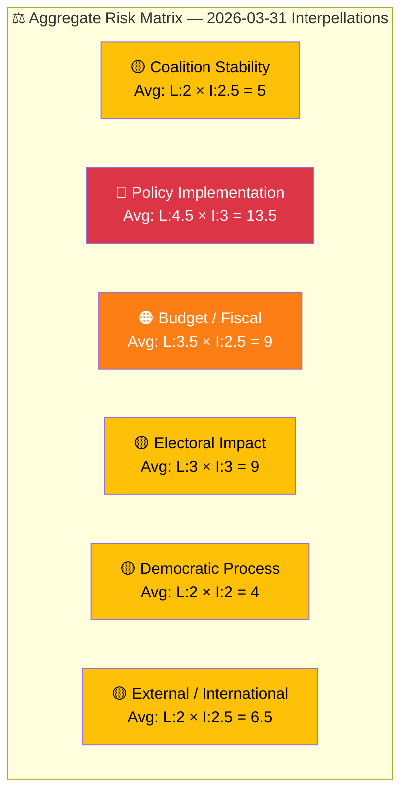

# Political Risk Assessment — 2026-03-31

**Generated**: 2026-03-31 07:40 UTC
**Data Sources**: get_interpellationer, get_dokument_innehall
**Documents Analyzed**: 2 (HD10424, HD10425)
**Riksmöte**: 2025/26
**Overall Risk Level**: 🟠 MEDIUM-HIGH

---

## Risk Summary

| Risk Type | Likelihood | Impact | Score | Driver |
|-----------|:----------:|:------:|:-----:|--------|
| Policy Implementation | 4.5 | 3 | 13.5 | Trafikverket acting against government priorities on both defence and transport |
| Budget / Fiscal | 3.5 | 2.5 | 9 | Unresolved infrastructure cost allocation between state and municipalities |
| Electoral Impact | 3 | 3 | 9 | Rural infrastructure cuts ahead of 2026 election |
| External / International | 2 | 2.5 | 6.5 | Defence readiness delays affect NATO credibility |
| Coalition Stability | 2 | 2.5 | 5 | Low — bipartisan defence consensus limits coalition friction |
| Democratic Process | 2 | 2 | 4 | Standard parliamentary accountability |

**Primary Risk**: Policy Implementation (13.5/25 = HIGH) — Trafikverket is the common bottleneck across both interpellations.

---

## Anomaly Flags

1. **Unusual interpellation volume to single minister**: 8/20 most recent interpellations target Carlson — significantly above average
2. **Same-day coordinated filing**: Two S MPs filed to same minister on same day — suggests coordinated opposition strategy
3. **Agency-government policy gap**: Trafikverket simultaneously undermining two distinct government priorities (regional connectivity + defence readiness)

---

## Data Quality Notes

- **Risk confidence**: HIGH — full-text analysis available for both documents
- **Scoring method**: 5×5 Likelihood × Impact product scoring per political-risk-methodology.md
- **Cross-validated**: Risk scores consistent with SWOT and threat analysis findings
