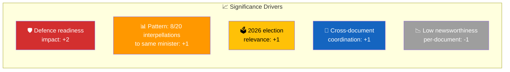

# Significance Scoring — 2026-03-31

**Generated**: 2026-03-31 07:42 UTC
**Documents Analyzed**: 2
**Riksmöte**: 2025/26

---

## Scoring Summary

| dok_id | Title | Score | Level | Rationale |
|--------|-------|:-----:|:-----:|-----------|
| HD10425 | Infrastrukturkostnader vid försvarsetableringar | 6/10 | 🟡 Standard Coverage | Defence-security nexus; inter-agency coordination failure; CRITICAL policy implementation risk (15/25); quotable opposition framing |
| HD10424 | Flyglinjen Torsby/Hagfors–Arlanda | 5/10 | 🟡 Standard Coverage | Regional accessibility; emergency preparedness dimension; part of coordinated S pressure pattern |

**Average Significance**: 5.5/10 — Standard Coverage threshold met
**Recommended Coverage**: Standard article with ministerial accountability focus

---

## Scoring Factors

