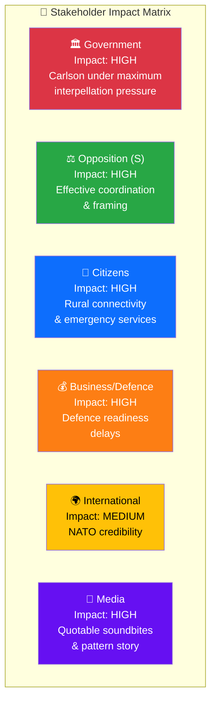

# Stakeholder Perspectives — 2026-03-31

**Generated**: 2026-03-31 07:42 UTC
**Documents Analyzed**: 2 (HD10424, HD10425)
**Riksmöte**: 2025/26
**Perspectives**: 6

---

## Multi-Stakeholder Impact Summary

| Stakeholder | Impact | Key Finding |
|-------------|:------:|-------------|
| 🏛️ Government | HIGH | Carlson faces 8/20 recent interpellations — highest ministerial pressure; must respond to both HD10424 & HD10425 by April 21 |
| ⚖️ Opposition (S) | HIGH | Coordinated same-day filing; pro-defence framing neutralises typical counter-arguments; "handelslada" quote is media-ready |
| 👥 Citizens | HIGH | Värmland/Dalarna residents face air connectivity loss + emergency service degradation; defence host communities face infrastructure uncertainty |
| 💰 Defence/Business | HIGH | Försvarsmakten base construction timeline at risk; regional businesses lose Stockholm connectivity |
| 🌍 International | MEDIUM | Sweden's NATO readiness credibility affected by defence base delays; Russia threat timeline adds urgency |
| 📰 Media | HIGH | Two quotable storylines: "hela Sverige" contradiction + "löjets skimmer" governance failure; pattern of S targeting Carlson |
