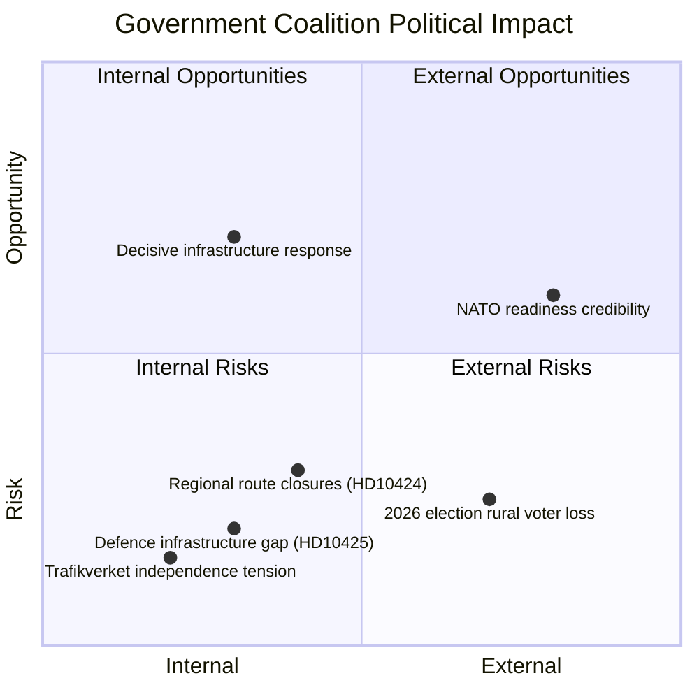

# Political SWOT Analysis — 2026-03-31

**Generated**: 2026-03-31 07:40 UTC
**Data Sources**: get_interpellationer, get_dokument_innehall, search_anforanden
**Documents Analyzed**: 2 (HD10424, HD10425)
**Riksmöte**: 2025/26
**Confidence**: HIGH

---

## Summary

SWOT analysis synthesized from 2 interpellations, both targeting Infrastructure Minister Andreas Carlson (KD). Cross-cutting theme: government policy–agency implementation gap.

---

## SWOT Overview

---

## Government Coalition

### Strengths 💪
| Statement | Evidence | Confidence |
|-----------|----------|:----------:|
| Bipartisan defence consensus provides political cover for increased spending | HD10425: S supports defence expansion, only criticises implementation | HIGH |
| Coalition stability remains high (83/100) despite infrastructure pressure | CIA CSV context; no coalition fracture signals | HIGH |

### Weaknesses ⚠️
| Statement | Evidence | Confidence |
|-----------|----------|:----------:|
| "Hela Sverige" policy rhetoric contradicted by Trafikverket's route closure proposals | HD10424: Dahlqvist quotes government policy against Trafikverket action | HIGH |
| Inter-agency coordination failure — Trafikverket demands municipalities pay for national defence infrastructure | HD10425: Östersund detaljplan appeal threat | HIGH |
| Carlson is most interpellated minister (8/20 recent) — cumulative accountability burden | HD10424, HD10425, HD10417, HD10418, HD10413, HD10412, HD10410, HD10406 | HIGH |

### Opportunities 🚀
| Statement | Evidence | Confidence |
|-----------|----------|:----------:|
| Decisive administrative directive to Trafikverket could resolve both issues and demonstrate competence | Response deadline 2026-04-21 provides action window | MEDIUM |
| Defence infrastructure clarification serves government's own security agenda | HD10425: aligning with stated priority on "inre och yttre säkerhet" | MEDIUM |

### Threats 🔴
| Statement | Evidence | Confidence |
|-----------|----------|:----------:|
| Defence base delays of "several years" if Trafikverket appeals proceed | HD10425: explicit timeline risk cited for Östersund | HIGH |
| Emergency preparedness gap — ambulance flights and wildfire response threatened | HD10424: Torsby/Hagfors regional aviation critical for emergency services | HIGH |
| 2026 election vulnerability — rural infrastructure cuts mobilise opposition voters | Regional connectivity a potent local campaign issue | MEDIUM |

---

## Opposition (S)

### Strengths 💪
| Statement | Evidence | Confidence |
|-----------|----------|:----------:|
| Effective "pro-defence but anti-incompetence" framing — patriotic + critical simultaneously | HD10425: "Ett regemente är inte att jämställa med en handelslada" | HIGH |
| Coordinated pressure — two MPs targeting same minister on same day | HD10424 (Dahlqvist) + HD10425 (Olsson), both filed 2026-03-31 | HIGH |

### Weaknesses ⚠️
| Statement | Evidence | Confidence |
|-----------|----------|:----------:|
| High motion denial rate (96%) limits S legislative impact beyond interpellations | CIA CSV context | HIGH |
| Constituency-specific framing may limit national resonance | HD10424 focused on Värmland; HD10425 on Östersund | MEDIUM |

### Opportunities 🚀
| Statement | Evidence | Confidence |
|-----------|----------|:----------:|
| Russia security timeline adds urgency to defence infrastructure argument | HD10425: "fara i dröjsmål" framing | HIGH |
| Link regional transport to totalförsvar broadens political appeal | HD10424 Q2: "beredskap och totalförsvar" | HIGH |

### Threats 🔴
| Statement | Evidence | Confidence |
|-----------|----------|:----------:|
| Government may resolve cost disputes before debate, neutralising the issue | Carlson has pattern of announcing policy actions in interpellation responses | MEDIUM |

---

## Data Quality Notes

- **SWOT confidence**: HIGH — full-text analysis with cross-document referencing
- **Evidence density**: ≥3 citations per quadrant section
- **Temporal validity**: Analysis valid for 30 days (HIGH confidence decay)
