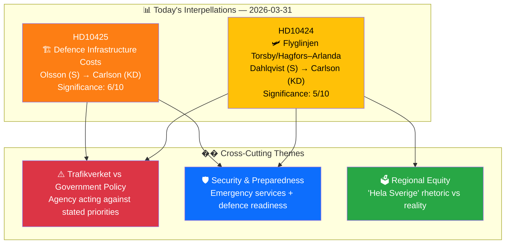

# Analysis Synthesis Summary — 2026-03-31

**Generated**: 2026-03-31 07:40 UTC
**Data Sources**: get_interpellationer, get_dokument_innehall, search_anforanden
**Documents Analyzed**: 2 (HD10424, HD10425)
**Riksmöte**: 2025/26
**Confidence**: HIGH

---

## Executive Summary

Two new interpellations filed today (2026-03-31) by Social Democrat MPs target Infrastructure Minister Andreas Carlson (KD) on infrastructure accountability. Both concern the tension between government rhetoric on national priorities and implementation failures by subordinate agencies, particularly Trafikverket. The combined pattern reveals Carlson as the most interpellated minister — 8 of the 20 most recent interpellations target his portfolio — indicating systematic opposition pressure on infrastructure policy ahead of the 2026 election.

---

## Key Findings

1. **Coordinated S Pressure**: Two S MPs filed interpellations to the same minister on the same day — Dahlqvist on airline route closures, Olsson on defence infrastructure costs. This suggests coordinated opposition strategy targeting Carlson's portfolio.

2. **Trafikverket as Policy Bottleneck**: Both interpellations identify Trafikverket as acting against government priorities — recommending route closures despite "hela Sverige" policy (HD10424) and demanding municipalities pay for defence infrastructure (HD10425).

3. **Defence-Security Nexus**: HD10425's risk score (Policy Implementation: 15/25 CRITICAL) reflects that Trafikverket cost disputes could delay military base construction "by several years" — a national security concern given Russia threat timeline.

4. **Minister Accountability Pattern**: Carlson has responded to related airline route interpellations (ip:398, 401, 406) in recent chamber debates, establishing a track record that will inform his response to these new questions.

---

## Top Documents by Significance

| Score | dok_id | Title | Author | Risk Level |
|:-----:|--------|-------|--------|:----------:|
| 6/10 | HD10425 | Infrastrukturkostnader vid försvarsetableringar | Kalle Olsson (S) | 🟠 HIGH |
| 5/10 | HD10424 | Flyglinjen Torsby/Hagfors–Arlanda | Mikael Dahlqvist (S) | 🟡 MEDIUM |

---

## Implications

- **Overall political risk**: MEDIUM-HIGH — defence implementation risk (HD10425) elevates aggregate risk
- **Electoral relevance**: Infrastructure cuts in rural/semi-urban areas are potent 2026 campaign issues
- **Ministerial capacity**: Carlson's interpellation volume (8/20 recent) strains response capacity and creates cumulative accountability pressure
- **Watch items**: Minister's response by 2026-04-21; Östersund detaljplan appeal; Trafikverket position on route closures

---

## Data Quality Notes

- **Overall confidence**: HIGH — full-text available for both documents; cross-referenced with minister's speech patterns
- **Limitations**: Calendar API returned HTML (known issue) — debate scheduling context unavailable
- **Data sources**: get_interpellationer, get_dokument_innehall (HD10424, HD10425), search_anforanden (Carlson)
