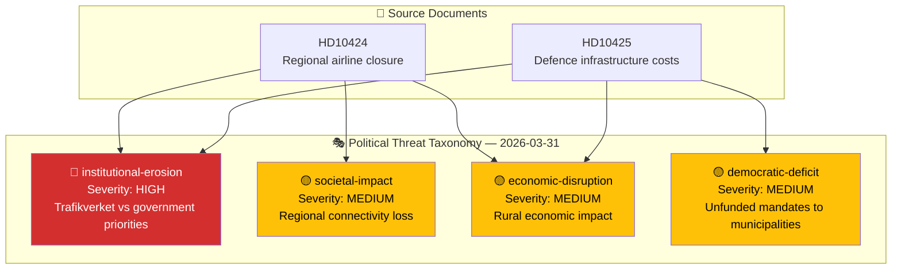

# Threat Analysis — 2026-03-31

**Generated**: 2026-03-31 07:42 UTC
**Documents Analyzed**: 2 (HD10424, HD10425)
**Riksmöte**: 2025/26
**Confidence**: HIGH

---

## Threat Summary

| Threat Category | Severity | Evidence | Affected Function |
|----------------|:--------:|----------|-------------------|
| institutional-erosion | 🔴 HIGH | Trafikverket simultaneously (a) recommends airline route closure against "hela Sverige" policy, (b) threatens municipal plan appeal for defence base infrastructure — systematic agency–government misalignment | Legislative & Executive Integrity |
| societal-impact | 🟡 MEDIUM | Torsby/Hagfors populations (and Munkfors, Sunne, Forshaga, SW Dalarna) face loss of air connectivity affecting commuters, healthcare access (ambulance flights), emergency services | Power Balance |
| economic-disruption | 🟡 MEDIUM | Regional economic impact from route closures (HD10424) and infrastructure cost uncertainty for defence host communities (HD10425) | Democratic Process |
| democratic-deficit | 🟡 MEDIUM | Municipalities bear costs of national policy decisions without consent or adequate funding framework — "unfunded mandates" | Democratic Process |

---

## Data Quality Notes

- **Threat categories**: Mapped to canonical ThreatCategory slugs per political-threat-framework.md
- **Only applicable categories included** — polarization and regulatory-overreach not relevant to these documents
