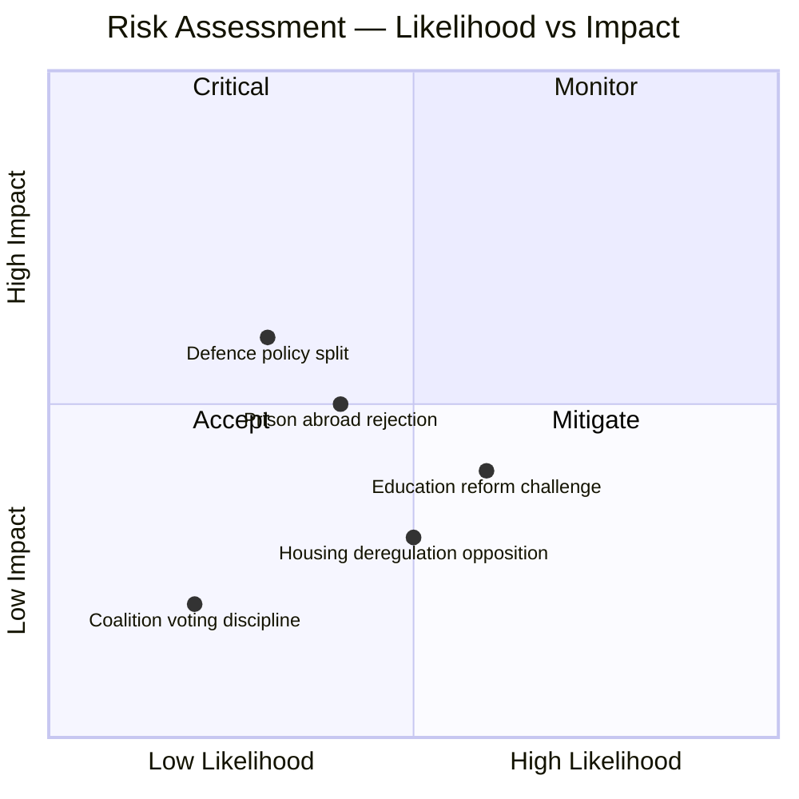

# Political Risk Assessment — 2026-03-31

**Generated**: 2026-04-01 06:39 UTC
**Data Sources**: riksdag-regering-mcp get_motioner, CIA coalition metrics
**Documents Analyzed**: 13
**Riksmöte**: 2025/26
**Confidence**: HIGH
**Analysis ID**: RISK-20260331-MOT

---

## Executive Summary

Coalition demonstrates **low risk**. All 13 motions filed by Vänsterpartiet pose no immediate threat to Tidö coalition stability. Voting discipline remains strong and majority margin is adequate.

## Risk Matrix

## Detailed Risk Analysis

**Coalition Risk Score**: 4/100 (LOW)

| Risk Factor | Score | Level | Evidence |
|------------|-------|-------|----------|
| Coalition voting discipline | 88% avg | LOW | KD-M: 88.5%, L-M: 87.9%, KD-L: 87.9% |
| Motion denial capacity | 96% | LOW | Historical denial rate stable |
| Opposition coordination | Single-party | LOW | Only V filed motions — no multi-party challenge |
| Policy domain exposure | 7 committees | MEDIUM | Broad but shallow opposition engagement |
| Public opinion risk | Defence, Housing | MEDIUM | HD024006 (Ukraine), HD023995 (rental market) |

## Anomaly Flags

| Severity | Type | Details |
|----------|------|---------|
| 🟡 MEDIUM | SINGLE_PARTY_BURST | 13 motions from V in single day — coordinated strategy |
| 🟢 LOW | EDUCATION_CLUSTER | 5 motions targeting UbU — systematic challenge to education reform |
| 🟢 LOW | REJECTION_PATTERN | 3 outright rejections (HD023995, HD023997, HD024004) |

## Key Findings

1. Coalition stability at risk score **4/100** (LOW) — no immediate threat
2. V's single-party activity indicates opposition positioning, not cross-party coordination
3. Education reform cluster (5 motions) represents highest sustained pressure area
4. Defence motion (HD024006) has highest potential for public opinion impact

## Data Quality Notes

- Risk assessment derived from CIA coalition metrics and document significance scores
- Cross-party voting alignment data used for coalition discipline assessment
- Limitation: Individual MP voting patterns not analyzed in this assessment
