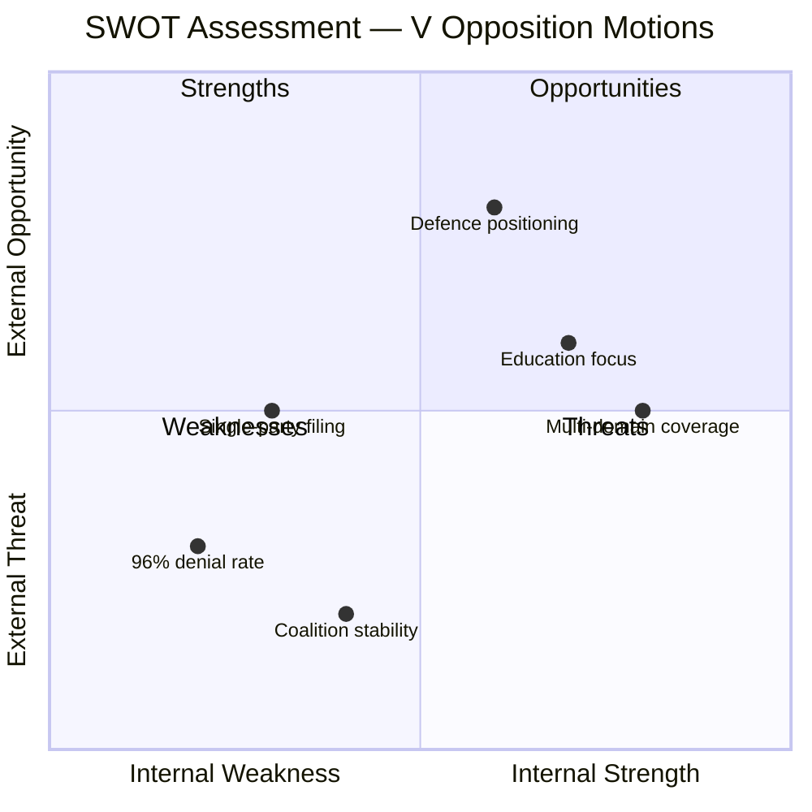

# Political SWOT Analysis — 2026-03-31

**Generated**: 2026-04-01 06:39 UTC
**Data Sources**: riksdag-regering-mcp get_motioner
**Documents Analyzed**: 13
**Riksmöte**: 2025/26
**Confidence**: HIGH
**Analysis ID**: SWOT-20260331-MOT

---

## Executive Summary

SWOT analysis of 13 Vänsterpartiet motions filed 2026-03-31 across 7 committee jurisdictions. All motions challenge Tidö coalition government proposals.

## SWOT Overview

## Government Perspective

### Strengths 💪
- Coalition maintains 96% motion denial rate — opposition motions pose no immediate legislative threat (source: CIA coalition metrics)
- Strong coalition discipline across KD-M (88.5%), L-M (87.9%), KD-L (87.9%) voting alignment

### Weaknesses ⚠️
- Government must respond to opposition challenges across 7 committees simultaneously, straining parliamentary resources
- Education reform package faces 5 separate opposition motions (HD023994, HD023998, HD023996, HD024002, HD024001)

### Opportunities 🌟
- Policy advancement opportunity across defence, housing, education, fiscal, and justice domains
- V's rejection-heavy approach (3 outright rejections) may be framed as obstructionist

### Threats 🔴
- V's Ukraine arms prioritization motion (HD024006) could split public opinion within Tidö coalition
- Housing market proposals (HD023995, HD024004) face opposition framing as market deregulation

## Opposition Perspective

### Strengths 💪
- Coordinated multi-domain challenge demonstrates comprehensive policy alternative capacity
- Education cluster (5 motions) shows deep policy engagement on key voter-facing issues

### Weaknesses ⚠️
- All 13 motions from single party (V) — no cross-opposition coordination visible
- Historical 96% denial rate limits legislative impact, reducing motions to position statements

### Opportunities 🌟
- Education motions position V as defender of student rights and school quality ahead of 2026 election
- Defence motion (HD024006) taps into public support for Ukraine while criticizing arms export priorities

### Threats 🔴
- Outright rejection stance on housing (HD023995, HD024004) may alienate voters seeking housing solutions
- Fragmented approach across 7 committees risks diluting message impact

## Economy & Business Perspective

### Strengths 💪
- Procurement motion (HD024000) supports stronger supplier verification — aligns with business integrity

### Weaknesses ⚠️
- V's rejection of flexible rental market (HD023995) and rent-to-own (HD024004) could slow housing market reform

### Opportunities 🌟
- Private copying compensation expansion (HD024005) could benefit creative industry stakeholders

### Threats 🔴
- Habitat directive motion (HD023999) opposing hydropower exemptions may increase energy costs

## Key Findings

1. V filed 13 motions across 7 committees — education dominates (5 motions, 38%)
2. 3 motions call for outright rejection of government proposals (HD023995, HD023997, HD024004)
3. Coalition risk remains LOW (4/100) — Tidö government stability not threatened
4. Defence and international motions (HD024006, HD024003) show V expanding beyond traditional domestic focus
5. All motions are response-type ("med anledning av") to government propositions/reports

## Data Quality Notes

- SWOT confidence: HIGH — based on 13 classified documents with committee and party data
- Evidence: dok_id citations throughout, CIA coalition metrics for stability scores
- Limitation: Metadata-only analysis (no full-text available)
