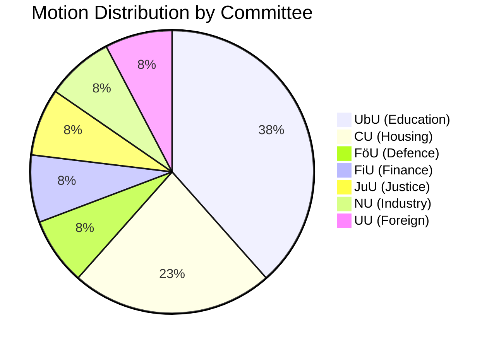
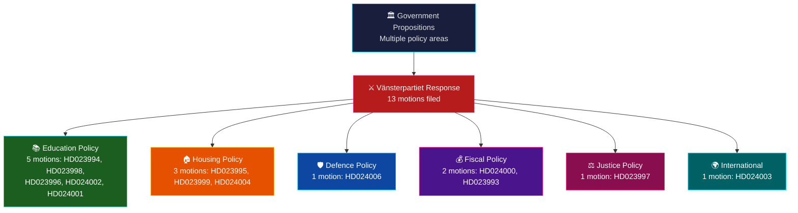

# Analysis Synthesis Summary — 2026-03-31

**Generated**: 2026-04-01 06:39 UTC
**Data Sources**: riksdag-regering-mcp get_motioner
**Documents Analyzed**: 13
**Riksmöte**: 2025/26
**Confidence**: MEDIUM
**Analysis ID**: SYNTH-20260331-MOT

---

## Executive Summary

On 2026-03-31, **13 opposition motions** were filed in the Riksdag — all by **Vänsterpartiet (V)**. This concentrated activity reflects V's systematic response to a wave of government propositions across education (UbU), housing (CU), justice (JuU), defence (FöU), and fiscal policy (FiU). The motions represent a coordinated opposition strategy challenging the Tidö coalition across multiple policy fronts simultaneously.

## Policy Domain Distribution

## Opposition Activity Flow

## Top Documents by Significance

| Score | dok_id | Committee | Title | Key Issue |
|-------|--------|-----------|-------|-----------|
| 🟡 4/10 | HD024006 | FöU | Sveriges militära stöd till Ukraina | V wants arms exports to Ukraine prioritized over other states |
| 🟡 4/10 | HD024000 | FiU | Förenklad leverantörskontroll | V wants expanded procurement register checks |
| 🟡 4/10 | HD023997 | JuU | Tillfällig verkställighet av fängelsestraff utomlands | V opposes proposal to execute Swedish prison sentences abroad |
| 🟡 4/10 | HD024003 | UU | Nordiskt samarbete 2025 | V wants Nordic double taxation agreement review |
| 🟢 3/10 | HD023995 | CU | En mer flexibel hyresmarknad | V rejects proposed private rental and co-op law changes |
| 🟢 3/10 | HD023994 | UbU | Förbättrat stöd i skolan | V wants stronger school support regulation |
| 🟢 3/10 | HD023999 | CU | Undantag art- och habitatdirektivet | V rejects habitat directive exemptions for hydropower |
| 🟢 3/10 | HD023998 | UbU | Nya läroplaner – kunskapsskola | V wants to keep student influence provisions |
| 🟢 3/10 | HD023996 | UbU | Offentlighetsprincipen i skolväsendet | V supports transparency with modifications |
| 🟢 3/10 | HD024005 | NU | Privatkopieringsersättning | V wants photographers included in compensation |
| 🟢 3/10 | HD024004 | CU | Hyrköp av bostad | V rejects rent-to-own housing proposal |
| 🟢 3/10 | HD024002 | UbU | Trygghet och studiero i skolan | V wants student involvement in safety |
| 🟢 3/10 | HD024001 | UbU | Ett likvärdigt betygssystem | V wants implementation study for new grading system |

## Key Findings

1. **Vänsterpartiet dominance**: All 13 motions from V — no other opposition party filed motions this date
2. **Education focus**: 5/13 motions target UbU (Education Committee), reflecting V's strategy to challenge the government's education reform package
3. **Systematic rejection**: V rejects multiple government proposals outright (housing, justice, environment)
4. **Coalition stability**: Risk score 4/100 (LOW) — Tidö coalition remains stable despite opposition pressure
5. **Motion denial rate**: 96% historical denial rate means these motions serve primarily as political positioning

## Implications

V's concentrated filing reflects a strategic opposition approach: challenging the Tidö government across all major policy domains simultaneously. With the 96% motion denial rate, these motions function primarily as political markers for the 2026 election campaign rather than legislative instruments likely to succeed.

## Data Quality Notes

- **Analysis confidence**: MEDIUM — metadata-only analysis (no full-text content available)
- **Data sources**: riksdag-regering-mcp get_motioner (rm: 2025/26, limit: 50)
- **Coverage**: 13 of 50 downloaded documents matched the target date
