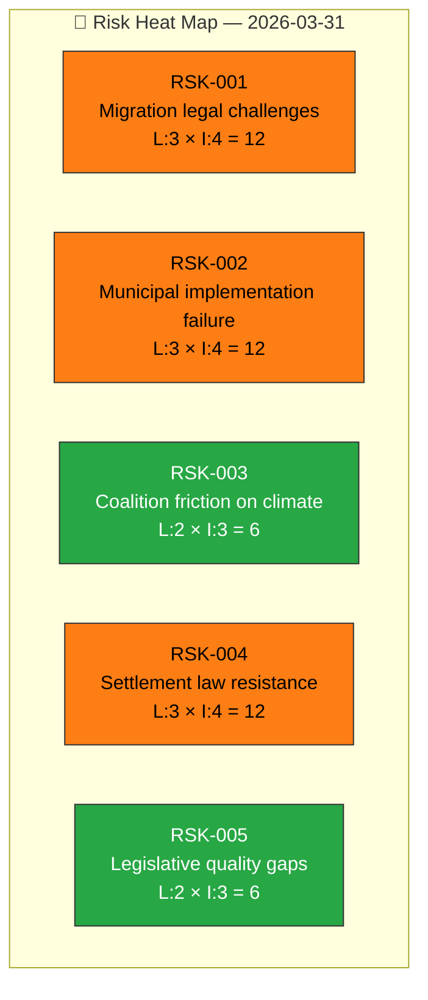

# ⚖️ Political Risk Assessment

## 📋 Risk Context

| Field | Value |
|-------|-------|
| **Risk ID** | `RSK-2026-03-31-001` |
| **Analysis Date** | 2026-03-31 11:56 UTC |
| **Scope** | Government legislative package — migration, justice, climate, security |
| **Produced By** | news-realtime-monitor |
| **Overall Risk Level** | HIGH |

---

## 📊 Risk Heat Map

## 📋 Risk Register

| Risk ID | Category | Description | Likelihood | Impact | Score | Trend | Mitigation |
|---------|----------|-------------|:----------:|:------:|:-----:|:-----:|------------|
| RSK-001 | regulatory-overreach | ECHR/EU legal challenges to new reception law | 3/5 | 4/5 | 12 | ↗️ | Lagrådet pre-review; EU directive alignment |
| RSK-002 | institutional-erosion | Municipal capacity strain prevents implementation | 3/5 | 4/5 | 12 | → | Transition periods; SKR consultation |
| RSK-003 | democratic-deficit | Climate target revision perceived as democratic backslide | 2/5 | 3/5 | 6 | ↗️ | EU alignment framing |
| RSK-004 | societal-impact | Settlement law forces housing on unprepared municipalities | 3/5 | 4/5 | 12 | ↗️ | Federal housing support; phased rollout |
| RSK-005 | institutional-erosion | Rushed 4-proposition week creates legislative quality gaps | 2/5 | 3/5 | 6 | → | Committee review process |

---

## 📊 MCP Data Files Used

| Tool | Parameters | Data Retrieved |
|------|-----------|----------------|
| `get_propositioner` | rm=2025/26 | Risk source documents |
| `get_betankanden` | rm=2025/26 | Committee risk context |
| `search_regering` | dateFrom=2026-03-30 | Government position data |
