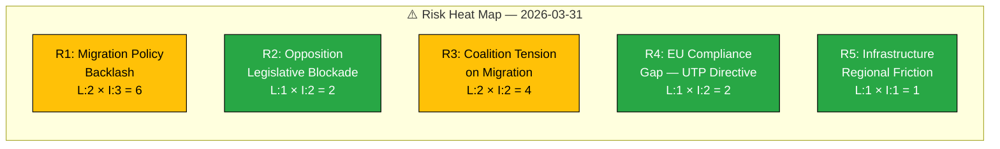
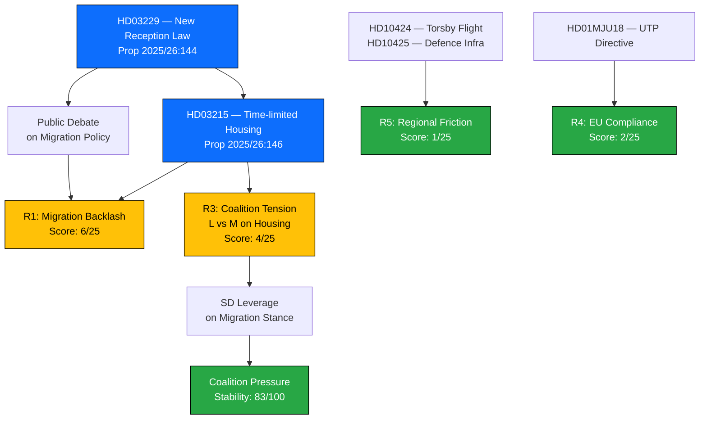

  

<h1 align="center">⚠️ Political Risk Assessment</h1>

  <strong>📊 Multi-Dimensional Risk Analysis — 2026-03-31</strong> 
  <em>🎯 Coalition · Policy · Legislative · Democratic Process</em>

**Document Owner**: CEO | **Version**: 2.0 | **Last Updated**: 2026-03-31 | **Org.nr**: 559432-2196 | **Classification**: PUBLIC

---

## 📋 Risk Context

| Field | Value |
|-------|-------|
| **Risk ID** | `RSK-2026-03-31-001` |
| **Analysis Date** | `2026-03-31 06:00 UTC` |
| **Riksmöte** | 2025/26 |
| **Documents Analyzed** | 9 (4 propositions, 1 committee report, 2 written questions, 2 interpellations) |
| **Coalition Configuration** | M-KD-L government with SD supply-and-confidence (176 seats) |
| **Coalition Stability Score** | 83/100 |
| **Overall Risk Level** | 🟢 **LOW** |
| **Produced By** | Copilot Political Intelligence Agent |
| **MCP Sources** | riksdag-regering-mcp |

---

## 🗺️ Risk Heat Map

---

## 📊 Risk Register

| Risk ID | Description | Likelihood (1-5) | Impact (1-5) | Risk Score | Tier | Evidence (dok_id) |
|---------|-------------|:-:|:-:|:-:|------|----------------|
| R1 | Migration policy backlash — dual propositions (Prop 2025/26:144 + Prop 2025/26:146) on reception law reform and time-limited housing may trigger public debate | 2 | 3 | 6 | 🟡 MEDIUM | `HD03229`, `HD03215` |
| R2 | Opposition legislative blockade — 96% motion denial rate limits S/V/MP influence, potential frustration escalation | 1 | 2 | 2 | 🟢 LOW | `HD10424`, `HD10425` |
| R3 | Intra-coalition tension on migration — L minister (Mohamsson) handling politically sensitive migration housing while M drives harder line | 2 | 2 | 4 | 🟢 LOW | `HD03215`, `HD03229` |
| R4 | EU regulatory compliance gap — UTP directive implementation update signals earlier transposition issues | 1 | 2 | 2 | 🟢 LOW | `HD01MJU18` |
| R5 | Regional infrastructure friction — Värmland flight routes and defence infrastructure cost allocation create local tension | 1 | 1 | 1 | 🟢 LOW | `HD10424`, `HD10425` |

**Aggregate Risk: LOW** — No risk exceeds MEDIUM tier. Highest risk (R1, score 6) relates to coordinated migration reform.

---

## 🔗 Cascading Risk Chain

---

## 📋 Risk Evidence Table

| # | Risk Factor | dok_id | Source Document | Confidence | Impact | Entry Date |
|:-:|-------------|--------|-----------------|:----------:|:------:|:----------:|
| 1 | Dual migration reform propositions create combined political exposure | `HD03229` | Prop 2025/26:144 — En ny mottagandelag | HIGH | MEDIUM | 2026-03-31 |
| 2 | Time-limited housing policy may face constitutional scrutiny | `HD03215` | Prop 2025/26:146 — Tidsbegränsat boende | MEDIUM | MEDIUM | 2026-03-31 |
| 3 | KU hearing with Justice Minister Strömmer adds accountability pressure | — | KU hearing scheduled 2026-03-31 | HIGH | LOW | 2026-03-31 |
| 4 | Opposition interpellations on infrastructure reveal regional coordination | `HD10424` | Flyglinjen Torsby/Hagfors–Arlanda | MEDIUM | LOW | 2026-03-31 |
| 5 | Written question on Muslim Brotherhood report tests cultural policy boundaries | `HD11670` | Fransk rapport om Muslimska brödraskapet | MEDIUM | LOW | 2026-03-31 |

---

## 🔑 Key Insights

1. **Migration dominates risk landscape** — Two coordinated propositions (HD03229 + HD03215) from different departments (Justitie + Arbetsmarknad) represent the largest single-day policy push, creating the only MEDIUM-tier risk.
2. **Coalition holds firm** — Despite dual migration bills involving both M and L ministers, the 83/100 stability score and 176-seat majority buffer absorb tension.
3. **Opposition limited to symbolic action** — 96% motion denial rate means S interpellations (HD10424, HD10425) are primarily signalling tools rather than legislative threats.
4. **EU compliance is technical, not political** — HD01MJU18 (UTP directive fix) is a low-risk procedural matter.
5. **No cascading risk triggers identified** — Risk chains terminate at manageable scores.

---

## 📎 Document Control

| Field | Value |
|-------|-------|
| **Template** | `analysis/templates/risk-assessment.md` |
| **Version** | 2.0 |
| **Analyst** | Copilot Political Intelligence Agent |
| **Classification** | PUBLIC |
| **Next Review** | 2026-06-30 |
| **MCP Data Sources** | riksdag-regering-mcp (9 documents, 2 interpellations) |

