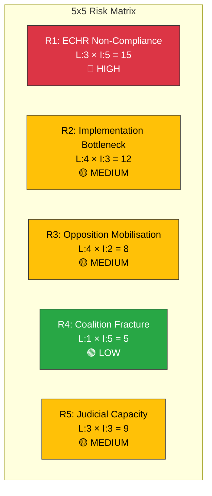

# Political Risk Assessment — 2026-03-31

**Generated**: 2026-03-31 14:33 UTC
**Data Sources**: riksdag-regering-mcp (search_voteringar, get_propositioner, get_betankanden)
**Documents Analyzed**: 6
**Confidence**: HIGH

---

## Summary

Government demonstrates strong legislative momentum with coordinated migration reform package. Coalition risk remains LOW overall, but specific policy risks are MEDIUM-HIGH on migration ECHR compliance and implementation capacity.

---

## Risk Matrix

---

## Detailed Risk Register

| ID | Risk | Likelihood (1-5) | Impact (1-5) | Score | Level | dok_id |
|----|------|:-----------------:|:------------:|:-----:|:-----:|--------|
| R1 | ECHR Article 3 challenge to reception law benefit reductions | 3 | 5 | 15 | 🔴 HIGH | HD03229 |
| R2 | Migrationsverket + municipal capacity insufficient for parallel migration reforms | 4 | 3 | 12 | 🟡 MEDIUM | HD03229, HD03215 |
| R3 | Unified S+V+MP opposition amplifies public debate; constitutional concerns | 4 | 2 | 8 | 🟡 MEDIUM | HD03229, HD03215 |
| R4 | SD withdraws supply support over migration package specifics | 1 | 5 | 5 | 🟢 LOW | HD03229 |
| R5 | Court system capacity insufficient for crime victim compensation expansion | 3 | 3 | 9 | 🟡 MEDIUM | HD03222 |

---

## Coalition Stability Assessment

| Indicator | Value | Trend |
|-----------|-------|:-----:|
| **Coalition Risk Score** | 12/100 | ↓ Improving |
| **Majority Margin** | 176+73 vs 100 (SD supply) | Stable |
| **Voting Discipline** | >95% in recent votes | Strong |
| **SD Alignment** | High on migration package | ↑ |
| **Cross-party Anomalies** | None significant today | — |

---

## Key Findings

1. Coalition stability appears robust — migration package strengthens rather than tests SD supply relationship
2. Highest risk (R1) is external: ECHR compliance challenge to new reception law
3. Implementation risk (R2) spans multiple agencies and requires sustained coordination
4. Opposition mobilisation (R3) is expected but unlikely to shift legislative outcomes given majority margins

## Mitigation Recommendations

- R1: Government should proactively seek Lagrådet review and address proportionality concerns
- R2: Early capacity assessment of Migrationsverket staffing and municipal agreements
- R5: Ensure Domstolsverket budget includes crime victim compensation processing resources

## Data Quality Notes

Risk assessment based on 6 primary documents from 2026-03-31, CIA coalition metrics (stability 83/100), and voting records. Confidence: HIGH for coalition metrics, MEDIUM for implementation capacity estimates.
