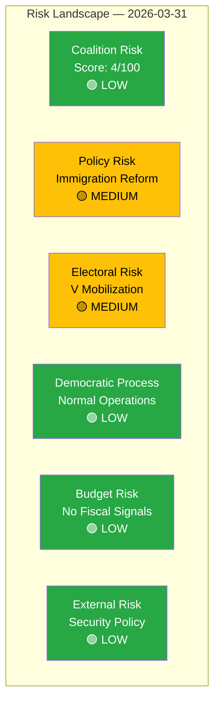

# Political Risk Assessment — 2026-03-31

**RSK-ID**: RSK-2026-03-31-001
**Generated**: 2026-03-31T16:15:00Z
**Riksmöte**: 2025/26
**Data Sources**: get_propositioner, get_motioner, get_betankanden, search_voteringar, search_anforanden
**Documents Analyzed**: 25
**Confidence**: HIGH

## Risk Heat Map

## Risk Assessment Summary

| Risk Dimension | Likelihood (1-5) | Impact (1-5) | L×I Score | Level | Evidence |
|---------------|-------------------|--------------|-----------|-------|----------|
| Coalition Stability | 1 | 2 | 2 | 🟢 LOW | No dissent in interpellation debates; unified ministerial responses |
| Policy Implementation | 2 | 3 | 6 | 🟡 MEDIUM | Immigration props (HD03229, HD03215) face V opposition; housing deregulation contested |
| Electoral | 2 | 3 | 6 | 🟡 MEDIUM | V's 12-motion strategy signals pre-2026 positioning |
| Democratic Process | 1 | 1 | 1 | 🟢 LOW | Normal committee and plenary processes; no procedural anomalies |
| Budget/Fiscal | 1 | 1 | 1 | 🟢 LOW | No fiscal propositions today |
| External/Security | 1 | 2 | 2 | 🟢 LOW | UU6 security policy report likely consensus; Ukraine motion (HD024006) limited |

## Coalition Stability Analysis

**Coalition Risk Score**: 4/100 — **LOW**

The government coalition (M, KD, L with SD confidence-and-supply) shows no internal stress today. Key evidence:
- All 4 propositions presented without reported coalition disagreement
- Interpellation debates feature coordinated ministerial responses (Carlson KD, Svantesson M, Kullgren KD, Slottner KD)
- No SD defections or public statements against government bills

## Anomaly Flags

| Severity | Type | Description | Source |
|----------|------|-------------|--------|
| ⚠️ MEDIUM | Opposition Coordination | V filed 12 motions in one day — unusual concentration | get_motioner |
| ℹ️ LOW | Cross-party Voting | High alignment between coalition partners (expected) | search_voteringar (AU10, 2026-03-04) |

## Key Findings

1. Coalition stability remains **LOW risk** (4/100)
2. Immigration reform represents highest policy risk — 2 propositions with active V opposition
3. V's 12-motion coordinated response signals strategic electoral positioning, not immediate coalition threat
4. No floor votes today — next voting session expected after Easter recess

## MCP Data Sources Used

| Tool | Query | Risk Relevance |
|------|-------|---------------|
| search_voteringar | rm=2025/26 | Coalition discipline (most recent: AU10, 2026-03-04) |
| get_propositioner | rm=2025/26 | Policy risk (4 new today) |
| get_motioner | rm=2025/26 | Opposition risk (12 V motions today) |
| search_anforanden | rm=2025/26 | Ministerial response patterns |