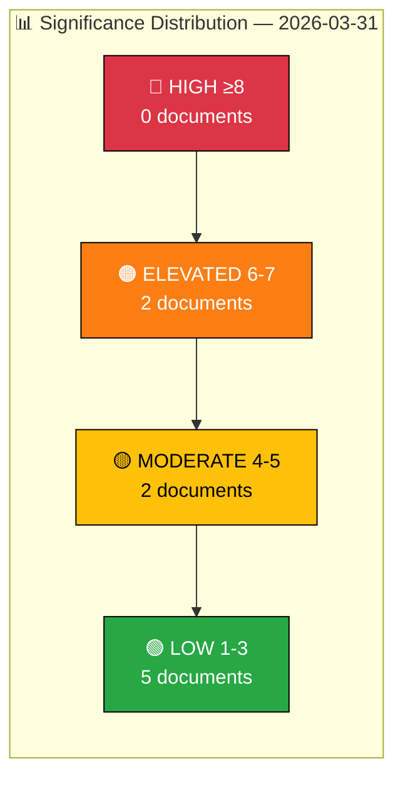

  

<h1 align="center">📊 Significance Scoring Analysis</h1>

  <strong>📊 Multi-Dimensional Event Significance — 2026-03-31</strong> 
  <em>🎯 Parliamentary · Policy · Public Interest · Urgency · Cross-Party</em>

**Document Owner**: CEO | **Version**: 2.0 | **Last Updated**: 2026-03-31 | **Org.nr**: 559432-2196 | **Classification**: PUBLIC

---

## 📋 Event Context

| Field | Value |
|-------|-------|
| **Scoring ID** | `SIG-2026-03-31-001` |
| **Analysis Date** | `2026-03-31 06:00 UTC` |
| **Riksmöte** | 2025/26 |
| **Events Scored** | 9 documents |
| **Scoring Dimensions** | 5 (Parliamentary, Policy Impact, Public Interest, Urgency, Cross-party Relevance) |
| **Scale** | 1-10 per dimension, composite = weighted average |
| **Produced By** | Copilot Political Intelligence Agent |

---

## 📊 Scoring Profile

---

## 🏆 Batch Significance Scores

| Rank | dok_id | Title | Parl. | Policy | Public | Urgency | X-Party | **Composite** | Tier |
|:----:|--------|-------|:-----:|:------:|:------:|:-------:|:-------:|:-:|------|
| 1 | `HD03229` | En ny mottagandelag | 8 | 8 | 8 | 6 | 5 | **7.0** | 🟠 ELEVATED |
| 2 | `HD03215` | Tidsbegränsat boende för vissa nyanlända | 7 | 8 | 7 | 6 | 5 | **6.6** | 🟠 ELEVATED |
| 3 | `HD03222` | Ersättningsregler med brottsoffret i fokus | 5 | 6 | 6 | 4 | 4 | **5.0** | 🟡 MODERATE |
| 4 | `HD03223` | En ny konsumentkreditlag | 4 | 5 | 4 | 3 | 3 | **3.8** | 🟢 LOW |
| 5 | `HD01MJU18` | UTP-direktivets förbud mot sena annulleringar | 3 | 3 | 2 | 3 | 3 | **2.8** | 🟢 LOW |
| 6 | `HD11671` | Asbestexponering och brister i arbetsmiljöarbetet | 2 | 3 | 4 | 2 | 2 | **2.6** | 🟢 LOW |
| 7 | `HD11670` | Fransk rapport om Muslimska brödraskapet | 2 | 2 | 3 | 2 | 3 | **2.4** | 🟢 LOW |
| 8 | `HD10424` | Flyglinjen Torsby/Hagfors–Arlanda | 2 | 2 | 3 | 2 | 2 | **2.2** | 🟢 LOW |
| 9 | `HD10425` | Fördelning av ansvar för infrastrukturkostnader | 2 | 2 | 2 | 2 | 2 | **2.0** | 🟢 LOW |

---

## 📝 Individual Scoring — Top 5 Documents

### 1. HD03229 — En ny mottagandelag (Composite: 7.0/10) 🟠

| Dimension | Score | Rationale |
|-----------|:-----:|-----------|
| Parliamentary | 8 | Government proposition (Prop 2025/26:144) — requires Riksdag vote; signed by PM Ebba Busch; processed via Justitiedepartementet |
| Policy Impact | 8 | Comprehensive overhaul of Sweden's reception law for asylum seekers — structural migration reform with long-term implications |
| Public Interest | 8 | Migration is the #1 public concern in Swedish polls; high media salience expected |
| Urgency | 6 | Standard legislative timeline; arbetsplenum today provides debate opportunity |
| Cross-party | 5 | Government + SD aligned on migration; S/V/MP expected to oppose; limited cross-bloc potential |

### 2. HD03215 — Tidsbegränsat boende (Composite: 6.6/10) 🟠

| Dimension | Score | Rationale |
|-----------|:-----:|-----------|
| Parliamentary | 7 | Government proposition (Prop 2025/26:146) via Arbetsmarknadsdepartementet; Minister Mohamsson (L) |
| Policy Impact | 8 | Introduces time-limited housing for newly arrived immigrants — significant welfare-state change |
| Public Interest | 7 | Directly affects integration debate; housing is a secondary but important public concern |
| Urgency | 6 | Paired with HD03229 for coordinated migration push |
| Cross-party | 5 | Same coalition dynamics as HD03229; L minister adds intra-coalition dimension |

### 3. HD03222 — Ersättningsregler med brottsoffret i fokus (Composite: 5.0/10) 🟡

| Dimension | Score | Rationale |
|-----------|:-----:|-----------|
| Parliamentary | 5 | Government proposition (Prop 2025/26:148); Justice committee referral expected |
| Policy Impact | 6 | Reforms crime victim compensation rules — meaningful for affected population |
| Public Interest | 6 | Crime and justice consistently rank in top-5 public concerns |
| Urgency | 4 | Standard timeline; no emergency provisions |
| Cross-party | 4 | Broad support likely for victim-focused reform; limited controversy |

### 4. HD03223 — En ny konsumentkreditlag (Composite: 3.8/10) 🟢

| Dimension | Score | Rationale |
|-----------|:-----:|-----------|
| Parliamentary | 4 | Government proposition (Prop 2025/26:149); technical regulatory update |
| Policy Impact | 5 | Consumer credit regulation affects financial sector and household debt |
| Public Interest | 4 | Moderate interest; consumer protection is secondary concern |
| Urgency | 3 | Routine legislative timeline |
| Cross-party | 3 | Technical nature limits political polarization |

### 5. HD01MJU18 — UTP-direktivets förbud mot sena annulleringar (Composite: 2.8/10) 🟢

| Dimension | Score | Rationale |
|-----------|:-----:|-----------|
| Parliamentary | 3 | Committee report (MJU18) — procedural EU compliance update |
| Policy Impact | 3 | Narrow scope: EU trade directive implementation fix |
| Public Interest | 2 | Low public salience; technical agricultural/trade matter |
| Urgency | 3 | EU compliance deadline adds moderate time pressure |
| Cross-party | 3 | EU compliance is generally non-controversial |

---

## 🔑 Key Findings

1. **Migration dominates significance** — HD03229 and HD03215 are the only ELEVATED documents, both in the migration domain.
2. **No HIGH-significance events** — The day's legislative agenda is substantive but not extraordinary.
3. **Justice reforms score moderately** — HD03222 (crime victims) reaches MODERATE; HD03223 (consumer credit) stays LOW.
4. **Parliamentary questions are low-significance individually** — Written questions and interpellations score 2.0-2.6 as expected for non-binding instruments.
5. **Arbetsplenum adds urgency** — Chamber debate scheduled today elevates urgency scores for propositions.

---

## 📎 Document Control

| Field | Value |
|-------|-------|
| **Template** | `analysis/templates/significance-scoring.md` |
| **Version** | 2.0 |
| **Analyst** | Copilot Political Intelligence Agent |
| **Classification** | PUBLIC |
| **Next Review** | 2026-06-30 |
| **MCP Data Sources** | riksdag-regering-mcp (9 documents, 2 interpellations) |

