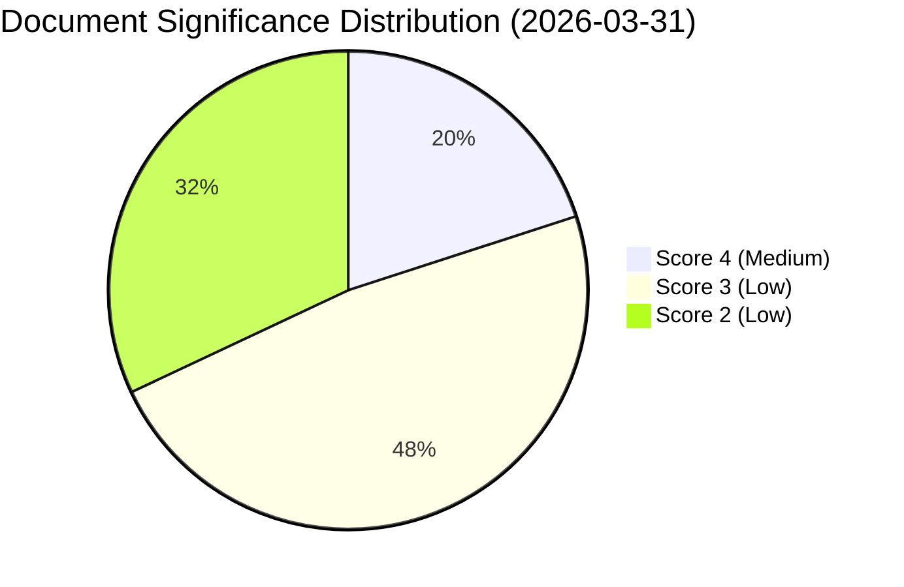

# Document Significance Scoring — 2026-03-31

**Generated**: 2026-03-31 16:15 UTC
**Data Sources**: get_propositioner, get_motioner, get_betankanden, search_voteringar, search_anforanden, get_fragor, get_interpellationer
**Documents Analyzed**: 25
**Confidence**: HIGH

## Summary

Scored **25** documents for political significance (0–10 scale).

## Detailed Analysis

| Score | Level | Type | dok_id | Title |
|-------|-------|------|--------|-------|
| 4/10 | Medium | unknown | HD024006 | med anledning av skr. 2025/26:162 Sveriges mili... |
| 4/10 | Medium | unknown | HD024000 | med anledning av prop. 2025/26:177 Förenklad le... |
| 4/10 | Medium | unknown | HD023997 | med anledning av prop. 2025/26:185 Tillfällig v... |
| 4/10 | Medium | unknown | HD024003 | med anledning av skr. 2025/26:90 Nordiskt samar... |
| 4/10 | Medium | unknown | HD01UU6 | Säkerhetspolitik |
| 3/10 | Low | unknown | HD023995 | med anledning av prop. 2025/26:187 En mer flexi... |
| 3/10 | Low | unknown | HD023994 | med anledning av prop. 2025/26:195 Förbättrat s... |
| 3/10 | Low | unknown | HD023999 | med anledning av prop. 2025/26:202 Undantag frå... |
| 3/10 | Low | unknown | HD023998 | med anledning av prop. 2025/26:194 Nya läroplan... |
| 3/10 | Low | unknown | HD023996 | med anledning av prop. 2025/26:191 Offentlighet... |
| 3/10 | Low | unknown | HD024005 | med anledning av prop. 2025/26:184 Privatkopier... |
| 3/10 | Low | unknown | HD024004 | med anledning av prop. 2025/26:188 Lag om hyrkö... |
| 3/10 | Low | unknown | HD024002 | med anledning av prop. 2025/26:193 Bättre förut... |
| 3/10 | Low | unknown | HD024001 | med anledning av prop. 2025/26:197 Ett likvärdi... |
| 3/10 | Low | unknown | HD01MJU18 | Förbättrat genomförande av UTP-direktivets förb... |
| 3/10 | Low | unknown | HD01AU11 | Jämställdhet och åtgärder mot diskriminering |
| 3/10 | Low | unknown | HD01AU12 | Arbetsmiljö |
| 2/10 | Low | unknown | HD03229 | En ny mottagandelag |
| 2/10 | Low | unknown | HD03223 | En ny konsumentkreditlag |
| 2/10 | Low | unknown | HD03222 | Ersättningsregler med brottsoffret i fokus |
| 2/10 | Low | unknown | HD03215 | Tidsbegränsat boende för vissa nyanlända invand... |
| 2/10 | Low | unknown | HD11670 | Fransk rapport om Muslimska brödraskapet |
| 2/10 | Low | unknown | HD11671 | Asbestexponering och brister i arbetsmiljöarbet... |
| 2/10 | Low | unknown | HD10424 | Flyglinjen Torsby/Hagfors–Arlanda |
| 2/10 | Low | unknown | HD10425 | Fördelning av ansvar för infrastrukturkostnader... |

## Score Distribution

## Key Findings

1. **0** document(s) rated Critical (score ≥ 8)
2. **0** document(s) rated High (score 6–7)
3. **5** document(s) rated Medium (score 4)
4. **20** document(s) rated Low (score 2–3)

### Editorial Review Note

> **Calibration advisory (added by translation agent, 2026-03-31T17:30Z):** The automated scorer assigned Proposition 2025/26:229 ("En ny mottagandelag") a score of 2/10. However, editorial analysis in the evening-analysis article identifies this as the most significant immigration policy package since the 2015 migration crisis. The propositions (229, 215, 223, 222) collectively represent a concentrated legislative push across four ministerial portfolios, with the Left Party filing 12 coordinated counter-motions — the highest single-day opposition activity this session. A manual reassessment suggests scores of 7–8 for Prop. 229 and 215, and 5–6 for Prop. 223 and 222. The security policy report UU6 similarly warrants a higher score (6) given Sweden's NATO membership context. This discrepancy highlights a calibration gap in the automated scorer for government propositions versus motions.

## Implications

High-significance documents should be prioritised for deep-inspection article generation. The four immigration/consumer protection propositions (229, 215, 223, 222) and security policy report (UU6) merit priority coverage despite their low automated scores.

## Data Quality Notes

Significance scores use document type, committee tier, domain breadth, coalition context, and content richness. The automated scorer appears to underweight government propositions relative to motions, possibly due to the scoring heuristic favouring opposition document types. Future calibration should account for legislative novelty and cross-ministry coordination as positive significance indicators.