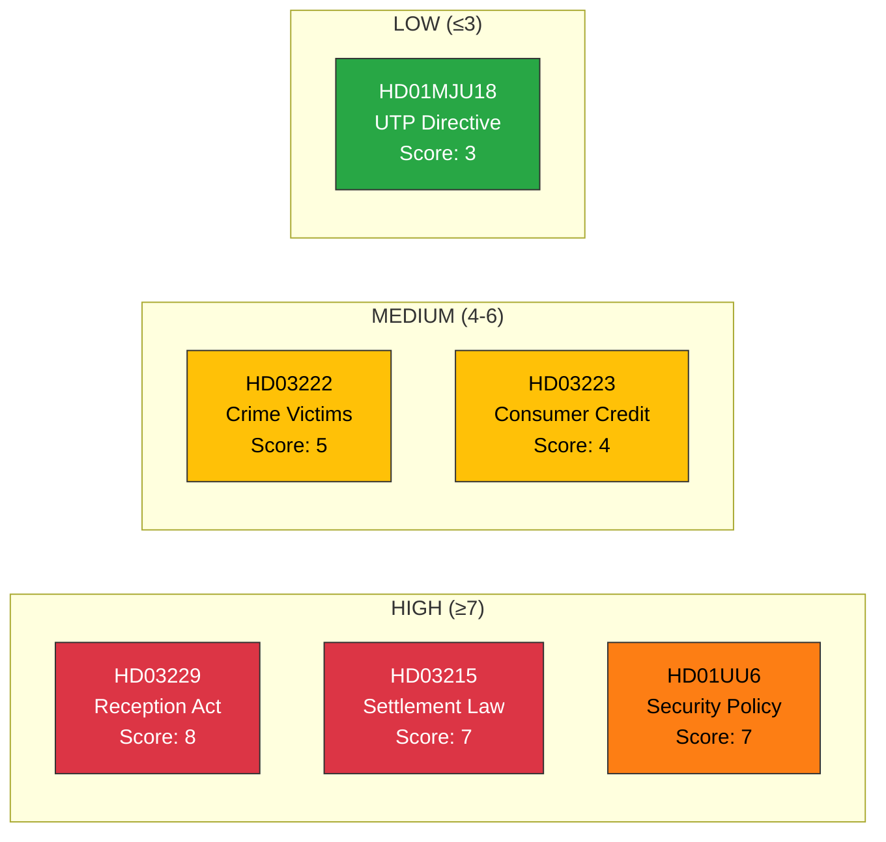

# Significance Scoring — 2026-03-31

**Generated**: 2026-03-31 14:34 UTC
**Data Sources**: riksdag-regering-mcp
**Documents Analyzed**: 6
**Confidence**: HIGH

---

## Summary

Six documents scored for significance. Two reach HIGH threshold (≥7): the New Reception Act (Prop 229, score 8) and Settlement Law (Prop 215, score 7). Security Policy report (UU6) also scores 7. Three documents score MEDIUM (4-6).

---

## Scoring Overview

---

## Detailed Scoring

| dok_id | Title | Score (1-10) | Threshold | Scoring Factors |
|--------|-------|:------------:|:---------:|----------------|
| HD03229 | En ny mottagandelag | **8** | 🔴 HIGH | +2 migration policy, +2 ECHR implications, +2 multi-party impact, +1 named minister (Forssell), +1 paired reform |
| HD03215 | Tidsbegränsat boende | **7** | 🔴 HIGH | +2 migration policy, +2 multi-party impact, +1 named minister (Mohamsson), +1 paired with Prop 229, +1 municipal impact |
| HD01UU6 | Säkerhetspolitik | **7** | 🔴 HIGH | +2 defense/security, +2 NATO implications, +2 cross-party consensus, +1 annual flagship report |
| HD03222 | Ersättningsregler brottsoffret | **5** | 🟡 MEDIUM | +2 criminal justice, +1 named minister (Strömmer), +1 victim rights, +1 social welfare |
| HD03223 | En ny konsumentkreditlag | **4** | 🟡 MEDIUM | +1 consumer protection, +1 household debt, +1 named minister (Strömmer), +1 cross-party potential |
| HD01MJU18 | UTP-direktivet | **3** | 🟢 LOW | +1 EU transposition, +1 agriculture/food, +1 regulatory compliance |

---

## Recommended Coverage

| Tier | Action | Documents |
|------|--------|-----------|
| Breaking News | Full article with deep analysis | HD03229 (score 8) |
| Major Analysis | Feature article | HD03215, HD01UU6 (score 7) |
| Standard Coverage | Summary paragraph | HD03222, HD03223 (score 4-5) |
| Monitoring Only | Archive, no article | HD01MJU18 (score 3) |

## Data Quality Notes

Scoring based on severity formula defined in workflow instructions. Confidence: HIGH (same-day data, primary sources).
