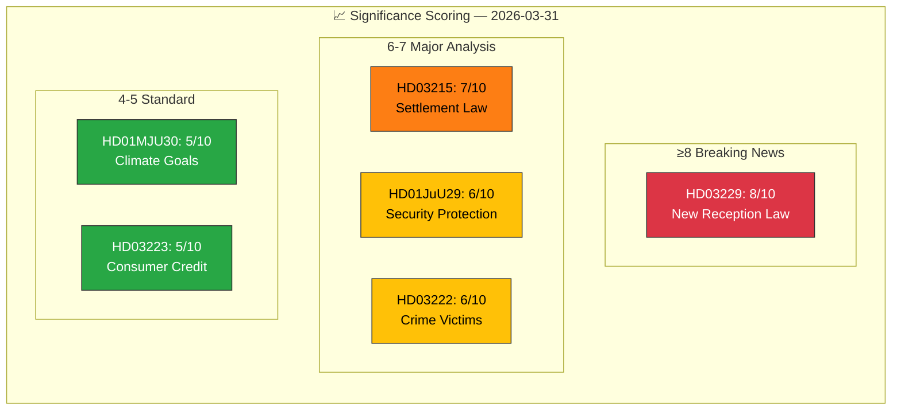

# 📈 Significance Scoring Results

## 📋 Scoring Context

| Field | Value |
|-------|-------|
| **Scoring ID** | `SIG-2026-03-31-001` |
| **Analysis Date** | 2026-03-31 12:04 UTC |
| **Documents Scored** | 6 |
| **Produced By** | news-realtime-monitor |

---

## 📊 Significance Distribution

## 📋 Scoring Details

| dok_id | Title | Raw Score | Tier | Factors |
|--------|-------|:---------:|:----:|---------|
| HD03229 | En ny mottagandelag | 8/10 | BREAKING | +2 migration policy, +2 budget impact, +2 3+ parties affected, +1 minister named, +1 dual-proposition coordination |
| HD03215 | Tidsbegränsat boende bosättningslag | 7/10 | MAJOR | +2 migration policy, +2 housing impact, +1 minister named, +2 municipal autonomy |
| HD01JuU29 | Stärkt säkerhetsskydd fastigheter | 6/10 | MAJOR | +2 defense/security, +2 national security, +2 cross-party |
| HD03222 | Ersättningsregler brottsoffret | 6/10 | MAJOR | +2 criminal justice, +2 welfare reform, +1 minister named |
| HD01MJU30 | Sveriges klimatmål 2030 | 5/10 | STANDARD | +2 climate policy, +2 3+ parties involved, +1 EU dimension |
| HD03223 | En ny konsumentkreditlag | 5/10 | STANDARD | +2 consumer protection, +2 budget impact, +1 EU alignment |

---

## 📊 MCP Data Files Used

| Tool | Parameters | Data Retrieved |
|------|-----------|----------------|
| `get_propositioner` | rm=2025/26 | Document metadata for scoring |
| `get_betankanden` | rm=2025/26 | Committee context for scoring |
