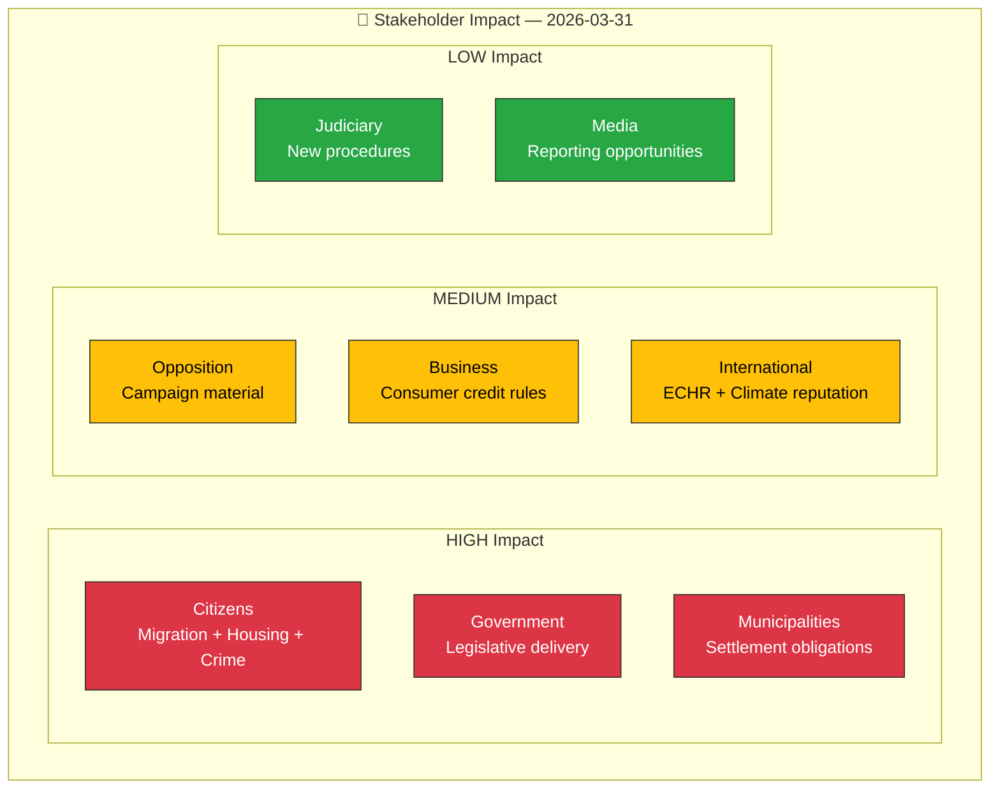

# 👥 Stakeholder Impact Analysis

## 📋 Stakeholder Context

| Field | Value |
|-------|-------|
| **Analysis ID** | `STK-2026-03-31-001` |
| **Analysis Date** | 2026-03-31 12:02 UTC |
| **Documents Assessed** | 6 |
| **Stakeholder Groups** | 8 |
| **Produced By** | news-realtime-monitor |

---

## 📊 Stakeholder Impact Matrix

## 📋 Detailed Impact Assessment

| Stakeholder Group | Impact Level | Key Concerns | Primary Documents |
|-------------------|:------------:|--------------|-------------------|
| **Citizens** | HIGH | Migration reception changes, housing allocation, crime victim rights | HD03229, HD03215, HD03222 |
| **Government (M, KD, L)** | HIGH | Legislative delivery before election, Tidö Agreement fulfillment | HD03229, HD03215, HD03222, HD03223 |
| **Opposition (S, V, MP, C)** | MEDIUM | Humanitarian criticism, climate goals, election positioning | HD03229, HD01MJU30 |
| **Business/Industry** | MEDIUM | Consumer credit regulation, property security compliance | HD03223, HD01JuU29 |
| **Civil Society** | MEDIUM | Rights challenges to migration law, climate advocacy | HD03229, HD01MJU30 |
| **International** | MEDIUM | ECHR compatibility, climate reputation, NATO alignment | HD03229, HD01MJU30, HD01JuU29 |
| **Judiciary** | LOW | New compensation procedures, security assessment processes | HD03222, HD01JuU29 |
| **Media** | LOW | Major news cycle — multiple significant legislative stories | All documents |

---

## 📊 MCP Data Files Used

| Tool | Parameters | Data Retrieved |
|------|-----------|----------------|
| `get_propositioner` | rm=2025/26 | Stakeholder-relevant propositions |
| `get_betankanden` | rm=2025/26 | Committee perspective data |
| `search_regering` | dateFrom=2026-03-30 | Government stakeholder positions |
