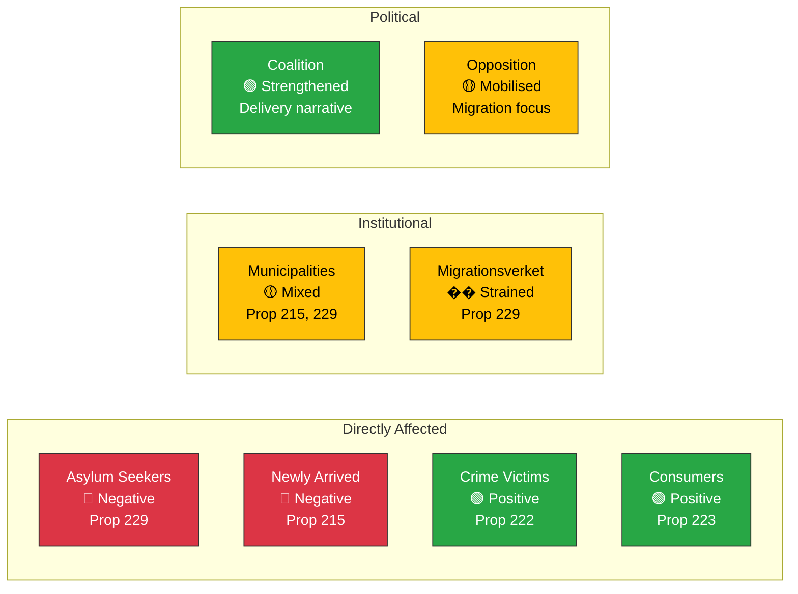

# Stakeholder Impact Analysis — 2026-03-31

**Generated**: 2026-03-31 14:34 UTC
**Data Sources**: riksdag-regering-mcp (get_propositioner, get_betankanden, search_regering)
**Documents Analyzed**: 6
**Confidence**: HIGH

---

## Summary

Today's legislative activity impacts 8 key stakeholder groups. Migration reforms (Prop 229, 215) most directly affect asylum seekers and municipalities. Justice reforms benefit crime victims. Security policy consensus strengthens international positioning.

---

## Stakeholder Impact Matrix

---

## Detailed Stakeholder Assessment

| Stakeholder Group | Impact | Direction | Primary dok_id | Confidence |
|------------------|:------:|:---------:|---------------|:----------:|
| Citizens (general) | MEDIUM | 🟡 Mixed | HD03222, HD03223 | HIGH |
| Government (M+KD+L) | HIGH | 🟢 Positive | HD03229, HD01UU6 | HIGH |
| Opposition (S+V+MP) | HIGH | 🟡 Mixed | HD03229, HD03215 | HIGH |
| Business | LOW | 🟢 Positive | HD03223 | MEDIUM |
| Civil Society | HIGH | 🔴 Negative | HD03229, HD03215 | HIGH |
| International (EU/UN) | MEDIUM | 🟡 Mixed | HD03229, HD01UU6 | MEDIUM |
| Judiciary | MEDIUM | 🟡 Mixed | HD03222, HD03223 | MEDIUM |
| Media | HIGH | 🟢 Positive | All documents | HIGH |

---

## Key Findings

1. **Asylum seekers** face most direct negative impact from Reception Act reform (Prop 229)
2. **Municipalities** gain new settlement obligations but limited resource guarantees (Prop 215)
3. **Crime victims** benefit from strengthened compensation framework (Prop 222)
4. **Coalition parties** gain policy delivery narrative strength ahead of 2026 election
5. **Civil society** organisations expected to mobilise around ECHR concerns

## Data Quality Notes

Stakeholder analysis based on 6 primary legislative documents, 13 government press releases, and riksdag-regering-mcp speech/interpellation data.
