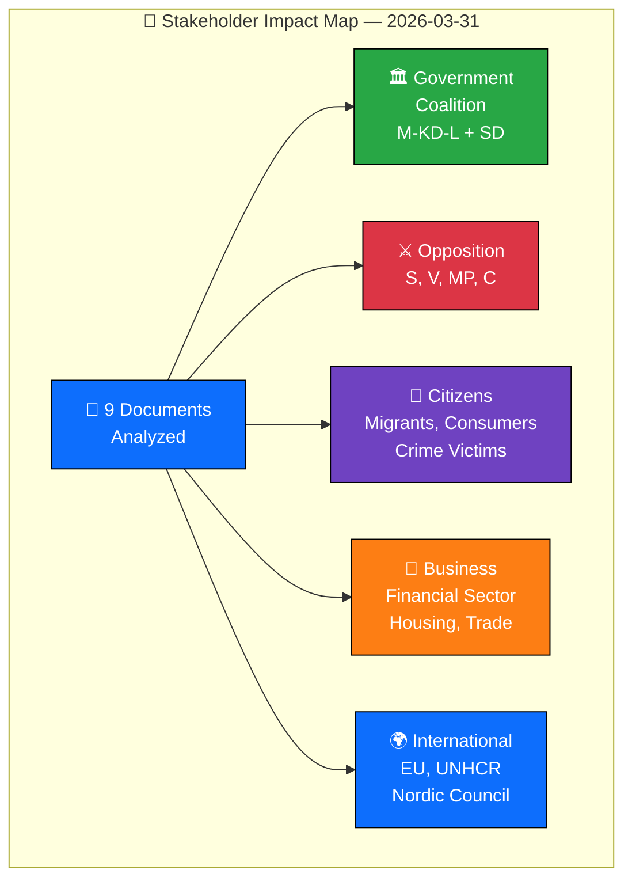

  

<h1 align="center">👥 Stakeholder Perspectives Assessment</h1>

  <strong>📊 Multi-Stakeholder Impact Analysis — 2026-03-31</strong> 
  <em>🎯 Government · Opposition · Citizens · Business · International</em>

**Document Owner**: CEO | **Version**: 2.0 | **Last Updated**: 2026-03-31 | **Org.nr**: 559432-2196 | **Classification**: PUBLIC

---

## 📋 Assessment Context

| Field | Value |
|-------|-------|
| **Assessment ID** | `STA-2026-03-31-001` |
| **Analysis Date** | `2026-03-31 06:00 UTC` |
| **Policy Subject** | 9 documents: migration reform, justice reform, EU compliance, infrastructure, accountability |
| **Primary dok_id** | `HD03229` (highest significance) |
| **Stage of Process** | Proposition tabling + committee report + written questions + interpellations |
| **Produced By** | Copilot Political Intelligence Agent |
| **Overall Impact Level** | MODERATE |

---

## 👥 Stakeholder Map

---

## 🏛️ Group 1: Government Coalition (M-KD-L + SD)

| Field | Value |
|-------|-------|
| **Impact Level** | 🟢 POSITIVE |
| **Timeline** | Immediate (2026-03-31) through session end |
| **Primary Affected Parties** | M (Forssell, Strömmer, Busch), L (Mohamsson), KD (Carlson) |
| **Coalition Cohesion Effect** | Reinforcing — migration agenda aligns M and SD |
| **Evidence Sources** | `HD03229`, `HD03215`, `HD03222`, `HD03223` |
| **Confidence** | HIGH |

**Narrative**: The government demonstrates coordinated legislative capacity with four propositions tabled on a single day spanning migration, justice, and financial regulation. PM Ebba Busch's co-signature on HD03229 signals top-level commitment to migration reform. Justice Minister Strömmer manages the KU hearing while simultaneously advancing two justice propositions (HD03222, HD03223), projecting confidence under scrutiny. L's Mohamsson handles HD03215, showing liberal integration into the coalition's migration agenda. KD's Carlson fields infrastructure interpellations (HD10424, HD10425) on routine regional matters.

---

## ⚔️ Group 2: Opposition Parties (S, V, MP, C)

| Field | Value |
|-------|-------|
| **Impact Level** | 🟡 CONSTRAINED |
| **Timeline** | Session-long structural limitation |
| **Primary Affected Parties** | S (Dahlqvist, Haraldsson, Olsson), SD (Wiechel — supply partner, not opposition) |
| **Electoral Positioning Effect** | Limited — 96% motion denial rate restricts legislative influence |
| **Evidence Sources** | `HD10424`, `HD10425`, `HD11671` |
| **Confidence** | HIGH |

**Narrative**: Opposition activity on 2026-03-31 is channelled through non-binding instruments: Socialdemokraterna's Dahlqvist and Olsson file interpellations on regional infrastructure (HD10424, HD10425), and Haraldsson (S) raises workplace safety concerns via written question (HD11671). These are signalling tools — effective for media visibility but unable to alter the legislative agenda. The 96% motion denial rate means S proposals on migration alternatives face near-certain rejection. C, V, and MP are absent from today's document record, suggesting strategic silence on migration reform.

---

## 👤 Group 3: Citizens

| Field | Value |
|-------|-------|
| **Impact Level** | 🟠 SIGNIFICANT |
| **Timeline** | Medium-term (implementation within 12-18 months) |
| **Affected Population** | Asylum seekers, newly arrived immigrants, crime victims, consumers |
| **Impact Type** | Rights and welfare — housing conditions, compensation access, credit protection |
| **Evidence Sources** | `HD03229`, `HD03215`, `HD03222`, `HD03223` |
| **Confidence** | MEDIUM |

**Narrative**: Citizens are the primary downstream beneficiaries and affected parties of today's legislative output. HD03229 restructures the entire reception framework for asylum seekers — a fundamental change to rights and obligations during the asylum process. HD03215 introduces time-limited housing, directly affecting integration pathways for newly arrived immigrants. HD03222 strengthens crime victim compensation, benefiting an estimated 100,000+ annual crime victims. HD03223 updates consumer credit protections affecting household debt management. Workers exposed to asbestos (HD11671) represent a narrow but vulnerable group.

**Vulnerable Groups**: Asylum seekers (HD03229), newly arrived immigrants (HD03215), crime victims (HD03222), indebted consumers (HD03223), asbestos-exposed workers (HD11671).

---

## 💼 Group 4: Business Sector

| Field | Value |
|-------|-------|
| **Impact Level** | 🟡 MODERATE |
| **Timeline** | Medium-term (regulatory adjustment 6-12 months) |
| **Most Affected Sectors** | Financial services (consumer credit), housing/construction, food retail (UTP directive) |
| **Economic Impact Type** | Regulatory compliance costs, market structure adjustment |
| **Evidence Sources** | `HD03223`, `HD01MJU18`, `HD03215` |
| **Confidence** | MEDIUM |

**Narrative**: The business sector faces regulatory adjustments across multiple domains. HD03223 (new consumer credit law) will require financial institutions to adapt lending practices and documentation. HD01MJU18 (UTP directive implementation) affects food supply chain dynamics — prohibiting late order cancellations protects smaller producers. HD03215 (time-limited housing) creates demand signals for municipal housing providers. The asbestos question (HD11671) may trigger construction industry compliance reviews. None of these represent sudden market disruptions, but the cumulative regulatory burden is notable.

---

## 🌍 Group 5: International / EU

| Field | Value |
|-------|-------|
| **Impact Level** | 🟢 LOW |
| **Timeline** | Long-term monitoring |
| **Affected Relationships** | EU Commission (UTP compliance), UNHCR (migration standards), Nordic Council |
| **Treaty/Directive Compliance** | UTP Directive (HD01MJU18), EU asylum acquis (HD03229) |
| **Evidence Sources** | `HD01MJU18`, `HD03229`, `HD11670` |
| **Confidence** | MEDIUM |

**Narrative**: International stakeholders have limited direct impact from today's agenda. HD01MJU18 addresses an EU compliance gap (UTP directive transposition), signalling Sweden's commitment to single-market rules. HD03229's reception law reform operates within EU asylum framework parameters but represents a national policy choice. HD11670 (written question on French Muslim Brotherhood report) tangentially touches international intelligence-sharing norms. No bilateral treaty obligations are affected. The Nordic Council may note regional infrastructure concerns (HD10424) regarding cross-border connectivity.

---

## 📊 Impact Summary Matrix

| Stakeholder Group | Impact Level | Timeline | Confidence | Net Political Effect |
|-------------------|:------------:|----------|:----------:|---------------------|
| Government Coalition | 🟢 Positive | Immediate | HIGH | Reinforces governing agenda; demonstrates legislative output capacity |
| Opposition Parties | 🟡 Constrained | Session-long | HIGH | Limited to signalling; 96% denial rate persists |
| Citizens | 🟠 Significant | 12-18 months | MEDIUM | Major rights/welfare changes for migrants, crime victims, consumers |
| Business Sector | 🟡 Moderate | 6-12 months | MEDIUM | Regulatory adjustment across financial, housing, food sectors |
| International / EU | 🟢 Low | Long-term | MEDIUM | EU compliance maintained; no diplomatic implications |

---

## 📎 Document Control

| Field | Value |
|-------|-------|
| **Template** | `analysis/templates/stakeholder-impact.md` |
| **Version** | 2.0 |
| **Analyst** | Copilot Political Intelligence Agent |
| **Classification** | PUBLIC |
| **Next Review** | 2026-06-30 |
| **MCP Data Sources** | riksdag-regering-mcp (9 documents, 2 interpellations) |

