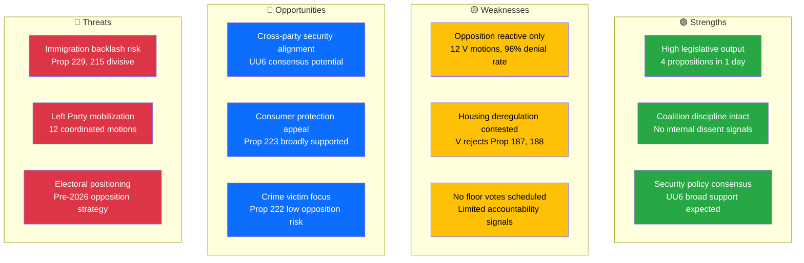

# Political SWOT Analysis — 2026-03-31

**SWT-ID**: SWT-2026-03-31-001
**Generated**: 2026-03-31T16:15:00Z
**Riksmöte**: 2025/26
**Data Sources**: get_propositioner, get_motioner, get_betankanden, search_anforanden
**Documents Analyzed**: 25
**Confidence**: HIGH

## SWOT Quadrant Map

## Detailed SWOT Analysis

### Government Coalition (M, KD, L + SD support)

| Quadrant | Entry | Evidence | Confidence |
|----------|-------|----------|------------|
| **Strength** | Legislative productivity — 4 propositions presented in a single day across justice and immigration | dok_id: HD03229, HD03223, HD03222, HD03215 | HIGH |
| **Strength** | Coalition cohesion — interpellation debates show unified ministerial responses (Carlson KD, Svantesson M, Kullgren KD, Slottner KD) | search_anforanden: 5 minister debates | MEDIUM |
| **Weakness** | Immigration reform vulnerability — new reception law (HD03229) and temporary housing (HD03215) face opposition from V and potentially MP | dok_id: HD03229, HD03215 | MEDIUM |
| **Opportunity** | Consumer credit reform (HD03223) likely to gain broad support — addresses over-indebtedness concerns shared across spectrum | dok_id: HD03223 | MEDIUM |
| **Threat** | Housing deregulation backlash — V filed 3 housing-related motions rejecting Prop 187, 188, 202 | dok_id: HD023995, HD024004, HD023999 | MEDIUM |

### Opposition (S, V, MP, C)

| Quadrant | Entry | Evidence | Confidence |
|----------|-------|----------|------------|
| **Strength** | V demonstrates coordinated legislative response — 12 motions filed in one day across 7 policy domains | 12 motions: HD024006 through HD023994 | HIGH |
| **Strength** | S active in interpellation debates — challenging ministers on economy, transport, airlines | search_anforanden: multiple S MPs | MEDIUM |
| **Weakness** | Historical 96% motion denial rate limits legislative effectiveness | Cross-session statistics | HIGH |
| **Weakness** | Opposition fragmented — V filing alone, no joint S/V/MP motions observed | Motion metadata | MEDIUM |
| **Opportunity** | Immigration propositions provide mobilization opportunity on equity and rights grounds | HD03229, HD03215 vs HD023995, HD023997 | MEDIUM |
| **Threat** | Government's productivity pace leaves opposition in reactive posture ahead of 2026 election | 4 propositions vs 12 reactive motions | MEDIUM |

### Citizens

| Quadrant | Entry | Evidence | Confidence |
|----------|-------|----------|------------|
| **Strength** | Crime victim compensation improved (HD03222) — direct citizen benefit | dok_id: HD03222 | HIGH |
| **Strength** | Consumer credit protection strengthened (HD03223) — addresses over-indebtedness | dok_id: HD03223 | HIGH |
| **Weakness** | Immigration housing changes (HD03215) may affect vulnerable newcomers | dok_id: HD03215 | MEDIUM |
| **Opportunity** | Equality and anti-discrimination report (AU11) signals commitment to rights protection | dok_id: HD01AU11 | MEDIUM |
| **Threat** | Housing market deregulation (Prop 187) may increase rental costs for tenants | dok_id: HD023995 (V opposition motion) | LOW |

## Key Findings

1. Government maintains legislative initiative with 4 propositions — strongest single-day output this session
2. Left Party (V) is the most active opposition party today with 12 motions — signals pre-election positioning
3. Security policy (UU6) represents potential consensus area between government and opposition
4. Immigration reform (HD03229, HD03215) is the most politically divisive topic

## MCP Data Sources Used

| Tool | Parameters | Result Count |
|------|-----------|--------------|
| get_propositioner | rm=2025/26, limit=10 | 4 today |
| get_motioner | rm=2025/26, limit=20 | 12 today (all V) |
| get_betankanden | rm=2025/26, limit=30 | 4 today |
| search_anforanden | rm=2025/26, limit=50 | 50 (multiple debates) |