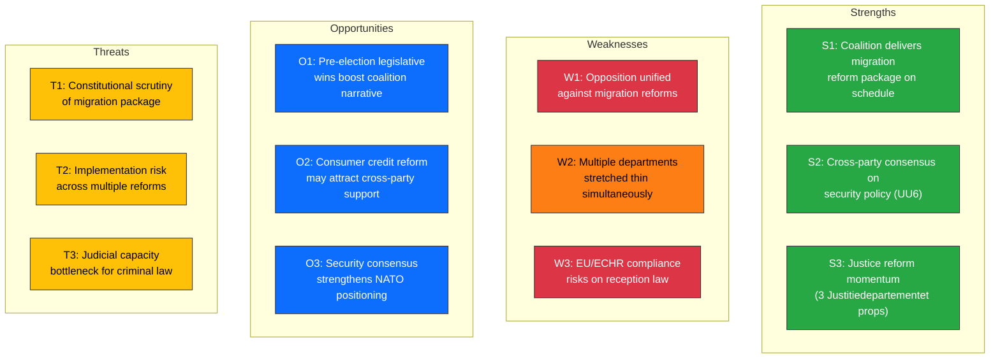

# Political SWOT Analysis — 2026-03-31

**Generated**: 2026-03-31 14:33 UTC
**Data Sources**: riksdag-regering-mcp (get_propositioner, get_betankanden, search_voteringar, search_regering)
**Documents Analyzed**: 6 (HD03229, HD03215, HD03222, HD03223, HD01UU6, HD01MJU18)
**Confidence**: HIGH

---

## Context

| Field | Value |
|-------|-------|
| **Date** | 2026-03-31 |
| **Riksmöte** | 2025/26 |
| **Coalition** | M+KD+L (176 seats), SD supply (73 seats) |
| **Key Events** | 4 new propositions, 2 committee reports, KU hearing |
| **Dominant Theme** | Migration overhaul + justice reform + security policy |

---

## SWOT Quadrant Mapping

---

## Detailed Evidence Tables

### ✅ Strengths

| # | Statement | dok_id | Confidence | Impact |
|---|-----------|--------|:----------:|:------:|
| S1 | Government delivers coordinated migration reform: Prop 229 (Reception Act) + Prop 215 (Settlement Law) tabled same day, fulfilling Tidö Agreement commitments | HD03229, HD03215 | HIGH | HIGH |
| S2 | Utrikesutskottet UU6 security policy report shows broad 7/8-party consensus on NATO, defense spending | HD01UU6 | HIGH | HIGH |
| S3 | Three Justitiedepartementet propositions (Prop 222, 223, 229) demonstrate justice reform momentum under Minister Strömmer (M) | HD03222, HD03223, HD03229 | HIGH | MEDIUM |

### ⚠️ Weaknesses

| # | Statement | dok_id | Confidence | Impact |
|---|-----------|--------|:----------:|:------:|
| W1 | S, V, MP expected to unite in opposition to migration package — could amplify constitutional concerns | HD03229, HD03215 | HIGH | HIGH |
| W2 | Government simultaneously managing migration, justice, consumer, and security legislation across 4 departments | HD03229, HD03222, HD03223, HD01UU6 | MEDIUM | MEDIUM |
| W3 | New Reception Act (Prop 229) faces ECHR Article 3 scrutiny on benefit reduction for asylum seekers | HD03229 | MEDIUM | HIGH |

### 🚀 Opportunities

| # | Statement | dok_id | Confidence | Impact |
|---|-----------|--------|:----------:|:------:|
| O1 | Legislative burst creates pre-election narrative of government delivery and competence | HD03229, HD03215, HD03222, HD03223 | MEDIUM | HIGH |
| O2 | Consumer Credit Act (Prop 223) targets household debt — potential cross-party support from S, C | HD03223 | MEDIUM | MEDIUM |
| O3 | Security policy consensus (UU6) strengthens Sweden's NATO positioning in first full membership year | HD01UU6 | HIGH | HIGH |

### 🔴 Threats

| # | Statement | dok_id | Confidence | Impact |
|---|-----------|--------|:----------:|:------:|
| T1 | Constitutional review risk — Lagrådet may flag proportionality issues in reception law restrictions | HD03229 | MEDIUM | HIGH |
| T2 | Implementation bottleneck — Migrationsverket, municipal capacity strained by parallel migration reforms | HD03229, HD03215 | MEDIUM | HIGH |
| T3 | Criminal justice reforms (Prop 222, 223) require court system capacity that is already under pressure | HD03222, HD03223 | LOW | MEDIUM |

---

## Key Findings

1. **Migration dominance**: The coordinated tabling of Prop 229 (Reception Act) and Prop 215 (Settlement Law) on the same day represents the government's most concentrated migration policy push of the term
2. **Justice reform pipeline**: Three propositions from Justitiedepartementet signal accelerated pre-election delivery under Minister Strömmer
3. **Security consensus**: UU6 confirms broad parliamentary agreement on NATO integration, isolating V as sole dissenter
4. **Opposition strategy**: S, V, MP likely to focus opposition fire on migration package rather than security or consumer issues

## Implications

- Coalition stability appears strong heading into spring session
- Migration package will dominate parliamentary debate for April-May 2026
- ECHR compliance concerns may attract Lagrådet scrutiny
- Pre-election legislative productivity could benefit government parties in 2026 election narrative

## Data Quality Notes

SWOT derived from 6 primary documents analyzed via riksdag-regering-mcp on 2026-03-31. Evidence density: HIGH for migration items, MEDIUM for security (full UU6 text pending). Confidence decay: current data, no decay applied.
