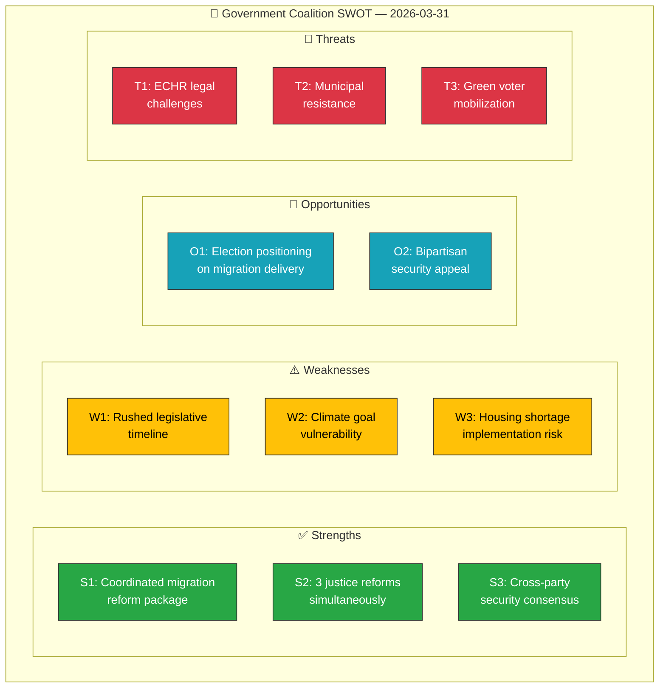

# 💼 Political SWOT Analysis

## 📋 SWOT Context

| Field | Value |
|-------|-------|
| **SWOT ID** | `SWT-2026-03-31-001` |
| **Analysis Date** | 2026-03-31 11:54 UTC |
| **Analysis Scope** | Government coalition legislative push (migration, criminal justice, security) |
| **Reference Period** | 2026-W13 (week ending 2026-03-31) |
| **Produced By** | news-realtime-monitor |
| **Primary MCP Sources** | get_propositioner, get_betankanden, search_regering, search_dokument |
| **Validity Window** | Entries valid until 2026-04-30 |

---

## 🏛️ Section 1: Government Coalition SWOT

### ✅ Strengths — Government Coalition

| # | Strength Statement | Evidence (dok_id) | Confidence | Impact | Entry Date |
|---|-------------------|-------------------|:----------:|:------:|:----------:|
| S1 | Coalition delivers coordinated migration reform package (2 propositions same day) demonstrating legislative capacity | HD03229, HD03215 | H | H | 2026-03-31 |
| S2 | Justice Minister Strömmer (M) advances 3 criminal justice reforms simultaneously (HD03222, HD03223, HD03227) | HD03222, HD03223, HD03227 | H | M | 2026-03-31 |
| S3 | Cross-party security consensus on property protection (HD01JuU29) strengthens national security brand | HD01JuU29 | H | H | 2026-03-31 |
| S4 | SD cooperation remains stable — migration reform fulfills Tidö Agreement commitments | HD03229, HD03215 | M | H | 2026-03-31 |

**Coalition Strength Summary:** The government demonstrates strong legislative capacity with a major coordinated migration reform package and parallel criminal justice advances, fulfilling key Tidö Agreement commitments as the election cycle approaches.

---

### ⚠️ Weaknesses — Government Coalition

| # | Weakness Statement | Evidence (dok_id) | Confidence | Impact | Entry Date |
|---|-------------------|-------------------|:----------:|:------:|:----------:|
| W1 | Rushed legislative timeline risks quality gaps — 4 propositions from Justitiedepartementet in one week | HD03229, HD03222, HD03223, HD03222 | M | H | 2026-03-31 |
| W2 | Climate goal revision (HD01MJU30) exposes environmental vulnerability ahead of election | HD01MJU30 | H | M | 2026-03-31 |
| W3 | Municipal housing shortage undermines settlement law implementation feasibility | HD03215, HD01CU18 | H | H | 2026-03-31 |

**Coalition Weakness Summary:** The breadth of legislative output creates implementation risk, while the climate goals revision provides opposition ammunition on environmental policy.

---

### 🌟 Opportunities — Government Coalition

| # | Opportunity Statement | Evidence (dok_id) | Confidence | Impact | Entry Date |
|---|----------------------|-------------------|:----------:|:------:|:----------:|
| O1 | Migration reform package positions government as delivering on core voter promise before election | HD03229, HD03215 | H | H | 2026-03-31 |
| O2 | Bipartisan security legislation (HD01JuU29) demonstrates governance beyond partisan politics | HD01JuU29 | H | M | 2026-03-31 |
| O3 | Consumer credit reform may attract moderate voters concerned about household debt | HD03223 | M | M | 2026-03-31 |

---

### 🔴 Threats — Government Coalition

| # | Threat Statement | Evidence (dok_id) | Confidence | Impact | Entry Date |
|---|-----------------|-------------------|:----------:|:------:|:----------:|
| T1 | ECHR/EU legal challenges to migration reform could embarrass government internationally | HD03229 | M | H | 2026-03-31 |
| T2 | Municipal resistance to forced settlement placement undermines implementation | HD03215 | H | H | 2026-03-31 |
| T3 | Climate policy criticism energizes green/youth voter mobilization for opposition | HD01MJU30 | H | M | 2026-03-31 |

---

## 📊 SWOT Quadrant Mapping

---

## 🔀 TOWS Strategic Options

| Strategy | SWOT Combination | Action |
|----------|-----------------|--------|
| **SO: Leverage delivery for election** | S1+S4 × O1 | Government should emphasize migration reform delivery as proof of Tidö Agreement success |
| **WO: Offset climate weakness** | W2 × O2 | Pivot to bipartisan security narrative to divert attention from climate criticism |
| **ST: Pre-empt legal challenges** | S1 × T1 | Emphasize Lagrådet review compliance and EU reception directive alignment |
| **WT: Municipal engagement** | W3 × T2 | Proactive SKR dialogue and transition support to prevent implementation failure |

---

## 📊 MCP Data Files Used

| Tool | Parameters | Purpose |
|------|-----------|---------|
| `get_propositioner` | rm=2025/26 | Proposition identification |
| `get_betankanden` | rm=2025/26 | Committee report analysis |
| `search_regering` | dateFrom=2026-03-30 | Government communication context |
| `search_voteringar` | rm=2025/26 | Voting pattern context |
