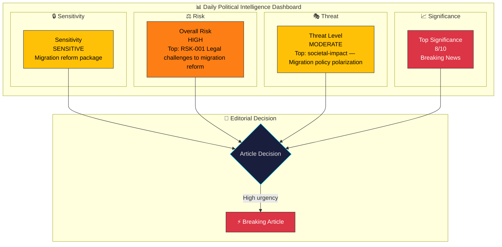
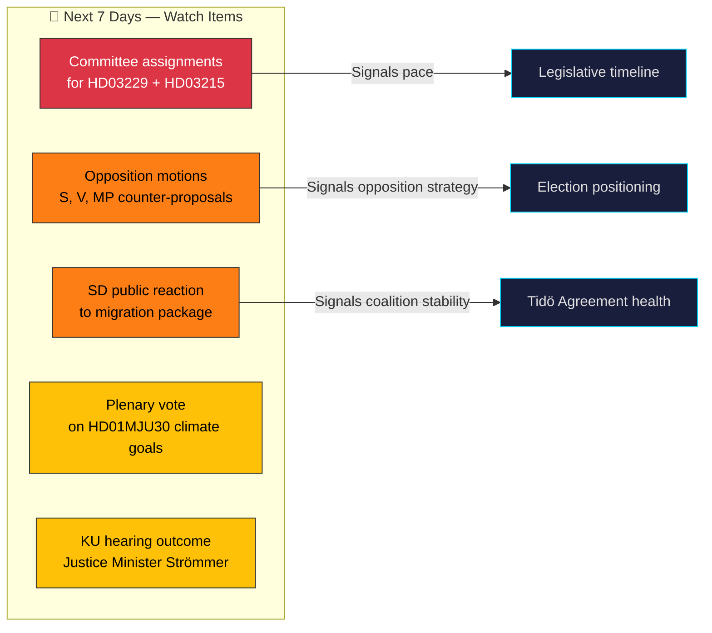

# 🧩 Political Intelligence Synthesis Summary

## 📋 Synthesis Context

| Field | Value |
|-------|-------|
| **Synthesis ID** | `SYN-2026-03-31-001` |
| **Analysis Date** | 2026-03-31 11:52 UTC |
| **Documents Analyzed** | 6 |
| **Analysis Period** | 2026-03-30 00:00 – 2026-03-31 12:00 UTC |
| **Produced By** | news-realtime-monitor |
| **Overall Confidence** | HIGH |

---

## 📊 Intelligence Dashboard

---

## 📋 Document Significance Ranking

| Rank | dok_id | Title | Significance | Rationale |
|:----:|--------|-------|:------------:|-----------|
| 1 | HD03229 | En ny mottagandelag | 8/10 | Major migration reform — new reception framework |
| 2 | HD03215 | Tidsbegränsat boende — ny bosättningslag | 7/10 | Companion migration reform — settlement law |
| 3 | HD01JuU29 | Stärkt säkerhetsskydd fastigheter | 6/10 | National security — anti-hostile acquisition |
| 4 | HD03222 | Ersättningsregler brottsoffret i fokus | 6/10 | Criminal justice reform — victim compensation |
| 5 | HD01MJU30 | Sveriges klimatmål 2030 | 5/10 | Climate policy — EU-adapted targets |
| 6 | HD03223 | En ny konsumentkreditlag | 5/10 | Consumer protection — credit regulation |

---

## 🔗 Cross-Document Pattern Analysis

### Theme 1: Migration Reform Package (HD03229 + HD03215)
The government has launched a **coordinated dual-proposition migration reform** — the most significant migration legislation of the parliamentary term. Prop. 2025/26:229 (new reception law) and Prop. 2025/26:215 (settlement law) together restructure how Sweden receives and settles asylum seekers. Both signed by Deputy PM Ebba Busch, signaling this is a top-tier government priority.

### Theme 2: Criminal Justice Strengthening (HD03222 + HD03227)
Justice Minister Gunnar Strömmer (M) advances multiple criminal justice reforms simultaneously: victim compensation (HD03222), youth crime investigation (HD03227), and consumer credit protection (HD03223). This breadth of legislative output from Justitiedepartementet signals an end-of-term legislative push.

### Theme 3: Security & Sovereignty (HD01JuU29)
The property security protection bill reflects post-NATO Sweden's enhanced focus on critical infrastructure protection. Cross-party consensus on national security measures contrasts with the polarized migration debate.

---

## 🔮 Aggregate Forward Intelligence

### Key Triggers to Monitor
1. **SfU committee scheduling** for migration propositions — fast-track indicates election urgency
2. **SKR (municipal association) response** to settlement law — implementation feasibility
3. **SD social media/press** — enthusiasm level validates cooperation health
4. **MJU30 plenary debate** — opposition intensity on climate targets signals election strategy

---

## 📊 MCP Data Files Used

| Tool | Query Parameters | Documents Retrieved |
|------|-----------------|---------------------|
| `get_propositioner` | rm=2025/26, limit=20 | 20 propositions (4 analyzed from today) |
| `get_betankanden` | rm=2025/26, limit=20 | 20 committee reports (2 analyzed) |
| `search_dokument` | from_date=2026-03-30, to_date=2026-03-31, limit=30 | 30 documents |
| `search_voteringar` | rm=2025/26, limit=20 | 20 vote records (latest: 2026-03-04) |
| `search_anforanden` | rm=2025/26, limit=20 | 20 speeches |
| `search_regering` | dateFrom=2026-03-30, dateTo=2026-03-31 | 16 government items |
