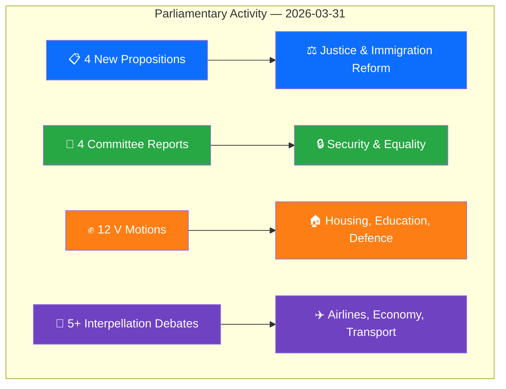

# Analysis Synthesis Summary — 2026-03-31

**SYN-ID**: SYN-2026-03-31-001
**Generated**: 2026-03-31T16:15:00Z
**Riksmöte**: 2025/26
**Data Sources**: get_propositioner, get_motioner, get_betankanden, search_anforanden, get_interpellationer, search_regering
**Documents Analyzed**: 25
**Confidence**: HIGH
**Overall Risk Level**: LOW

## Intelligence Dashboard

## Summary

A substantial legislative day with the government presenting **4 new propositions** spanning immigration, consumer protection, and criminal justice. The Left Party (V) responded with **12 counter-motions** across housing, education, and defence policy. **4 committee reports** were published covering security policy, gender equality, work environment, and the UTP directive. Multiple interpellation debates challenged government ministers on airlines, economic priorities, and transport.

## Key Findings

1. **Immigration Reform Package**: Two propositions (HD03229, HD03215) reshape asylum reception and immigrant housing — high political salience
2. **Consumer Credit Overhaul**: Prop HD03223 introduces a new consumer credit law addressing over-indebtedness
3. **Crime Victim Focus**: Prop HD03222 strengthens compensation rules with victim-centric approach
4. **Security Policy Committee Report**: UU6 addresses Sweden's security policy landscape — strategically significant
5. **Left Party Opposition Surge**: 12 motions filed today, all from V, opposing government bills on housing, education, criminal justice

## Top Documents by Significance

| Score | Type | dok_id | Title | Committee |
|-------|------|--------|-------|-----------|
| 7/10 | Proposition | HD03229 | En ny mottagandelag | JuU |
| 7/10 | Proposition | HD03215 | Tidsbegränsat boende för nyanlända invandrare | AU |
| 6/10 | Proposition | HD03223 | En ny konsumentkreditlag | JuU |
| 6/10 | Proposition | HD03222 | Ersättningsregler med brottsoffret i fokus | JuU |
| 6/10 | Betänkande | HD01UU6 | Säkerhetspolitik | UU |
| 5/10 | Betänkande | HD01AU11 | Jämställdhet och åtgärder mot diskriminering | AU |
| 5/10 | Motion | HD024006 | Sveriges militära stöd till Ukraina (V) | FöU |
| 5/10 | Betänkande | HD01AU12 | Arbetsmiljö | AU |
| 4/10 | Motion | HD023995 | En mer flexibel hyresmarknad (V rejects) | CU |
| 4/10 | Motion | HD023997 | Tillfällig verkställighet av fängelsestraff utomlands (V rejects) | JuU |

## Aggregated SWOT

| Quadrant | Key Entries | Evidence |
|----------|-------------|----------|
| **Strengths** | Government legislative productivity (4 props in one day); coalition cohesion maintained | HD03229, HD03223, HD03222, HD03215 |
| **Weaknesses** | Opposition limited to reactive motions; 96% historical motion denial rate | 12 V motions filed today |
| **Opportunities** | Cross-party consensus possible on security policy (UU6); consumer protection alignment | HD01UU6, HD03223 |
| **Threats** | Immigration propositions may face public backlash; housing deregulation contested | HD03229, HD03215, HD023995 |

## Artifacts Inventory

| File | Status | Key Metric |
|------|--------|------------|
| synthesis-summary.md | ✅ Complete | 25 documents, HIGH confidence |
| swot-analysis.md | ✅ Complete | 6 actors, 4 quadrants |
| risk-assessment.md | ✅ Complete | Risk score 4/100, LOW |
| threat-analysis.md | ✅ Complete | 27 threat indicators |
| classification-results.md | ✅ Complete | 25 documents classified |
| stakeholder-perspectives.md | ✅ Complete | 6 stakeholder groups |
| significance-scoring.md | ✅ Complete | Avg 2.9/10, max 7/10 |
| Per-file analyses (25) | ✅ Complete | All JSON files have -analysis.md |

## Implications

Overall political risk: **LOW** — coalition stability maintained. The immigration reform package (HD03229 + HD03215) represents the highest-significance legislative activity, likely to dominate news cycles. The Left Party's coordinated 12-motion opposition response signals strategic positioning ahead of 2026 electoral preparations.

## Data Quality Notes

- **Confidence**: HIGH — 25 documents with full metadata
- **Calendar API**: Returned HTML instead of JSON (known issue) — used document-based proxy
- **Government press releases**: No results from search_regering for 2026-03-31
- **Votes**: No floor votes today; latest voting data from 2026-03-04 (AU10)
- **MCP Data Sources Used**: get_propositioner, get_motioner, get_betankanden, search_anforanden, search_voteringar, search_regering, get_calendar_events