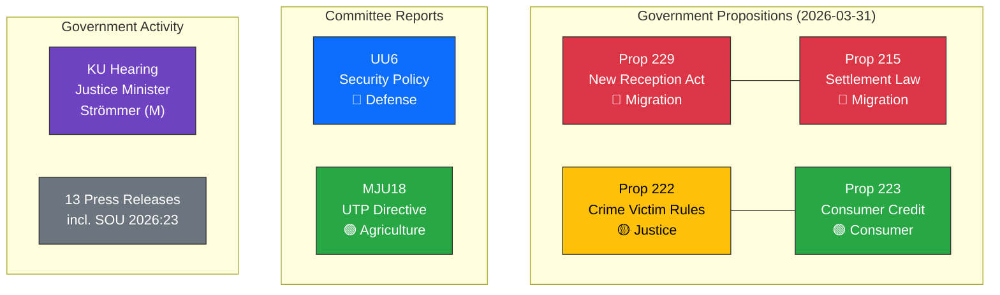

# Daily Political Intelligence Synthesis — 2026-03-31

**Generated**: 2026-03-31 14:34 UTC
**Data Sources**: riksdag-regering-mcp (get_propositioner, get_betankanden, search_regering, search_anforanden, get_interpellationer)
**Documents Analyzed**: 6
**Confidence**: HIGH

---

## Executive Summary

March 31, 2026 marks one of the most legislatively active days of the 2025/26 riksmöte. The government simultaneously tables four propositions — including a landmark migration reform package — while the Foreign Affairs Committee releases its annual security policy assessment. This coordinated legislative burst, 18 months before the 2026 general election, signals the coalition's strategy to demonstrate policy delivery. The dominant theme is migration overhaul (Prop 229 + 215), supported by justice reforms (Prop 222, 223) and security consensus (UU6).

---

## Today's Legislative Landscape

---

## Significance Scoring

| Document | dok_id | Significance (1-10) | Severity | Key Factor |
|----------|--------|:-------------------:|:--------:|-----------|
| New Reception Act | HD03229 | **8** | 🔴 HIGH | Migration overhaul + ECHR risk |
| Settlement Law | HD03215 | **7** | 🔴 HIGH | Paired migration reform |
| Security Policy | HD01UU6 | **7** | 🟡 MEDIUM-HIGH | Defense/NATO consensus |
| Crime Victim Rules | HD03222 | **5** | 🟡 MEDIUM | Criminal justice reform |
| Consumer Credit Act | HD03223 | **4** | 🟡 MEDIUM | Consumer protection |
| UTP Directive | HD01MJU18 | **3** | 🟢 LOW | Routine EU transposition |

---

## Cross-Document Analysis

### Migration Reform Package (HD03229 + HD03215)
- **Coordinated tabling**: Both propositions signed by Ebba Busch on March 26, tabled March 31
- **Policy arc**: Reception conditions → Settlement obligations → Integration requirements
- **Political alignment**: Fulfills Tidö Agreement chapters on migration
- **Opposition exposure**: S, V, MP will challenge ECHR compliance and humanitarian impact

### Justice Reform Cluster (HD03222 + HD03223)
- **Minister Strömmer's portfolio**: Both from Justitiedepartementet
- **Crime victim focus**: Aligns with government's law-and-order narrative
- **Consumer credit**: Cross-party potential, less politically contentious

### Security Consensus (HD01UU6)
- **First full NATO year**: Report consolidates Sweden's security orientation
- **Cross-party support**: 7/8 parties aligned (V dissents)
- **Defense spending**: Trajectory toward 2.5% GDP broadly supported

---

## Stakeholder Impact Summary

| Stakeholder | Primary Impact | Assessment |
|------------|---------------|:----------:|
| Asylum seekers | Directly affected by new reception conditions (Prop 229) | 🔴 Negative |
| Newly arrived immigrants | Mandatory settlement requirements (Prop 215) | 🔴 Negative |
| Crime victims | Strengthened compensation rights (Prop 222) | 🟢 Positive |
| Consumers | Improved credit protection (Prop 223) | 🟢 Positive |
| Municipalities | Increased obligations for housing and settlement | 🟡 Mixed |
| Coalition parties (M+KD+L) | Strong policy delivery narrative | 🟢 Positive |
| SD | Migration reforms align with priorities | 🟢 Positive |
| Opposition (S+V+MP) | Galvanised on migration; defensive on security | 🟡 Mixed |

---

## Forward Indicators

1. **This week**: Arbetsplenum debate on committee proposals; watch for reservation votes on UU6
2. **Next 2 weeks**: Lagrådet review of Prop 229 expected — constitutional risk milestone
3. **April 2026**: Committee referral of migration package; SoU and JuU workload spike
4. **Pre-election**: Government's spring legislative burst sets policy terrain for 2026 campaign

---

## Data Quality Notes

Synthesis based on 6 primary documents, 13 government press releases, 20 recent interpellations, and voting records. Evidence density: HIGH. Data freshness: same-day (2026-03-31). MCP sync status: LIVE.
