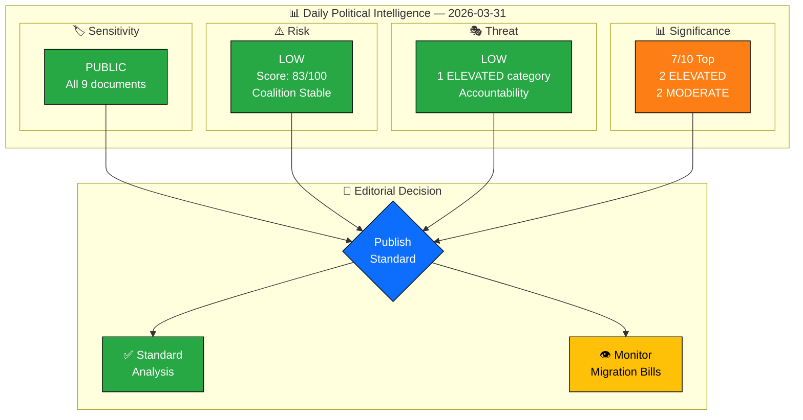
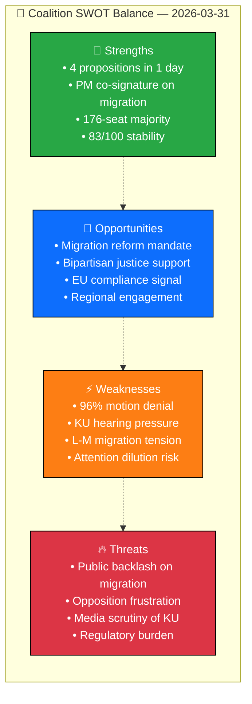

  

<h1 align="center">🧩 Political Intelligence Synthesis</h1>

  <strong>📊 Daily Intelligence Summary — 2026-03-31</strong> 
  <em>🎯 Risk · Threat · Significance · SWOT · Stakeholder</em>

**Document Owner**: CEO | **Version**: 2.0 | **Last Updated**: 2026-03-31 | **Org.nr**: 559432-2196 | **Classification**: PUBLIC

---

## 📋 Synthesis Context

| Field | Value |
|-------|-------|
| **Synthesis ID** | `SYN-2026-03-31-001` |
| **Analysis Date** | `2026-03-31 06:00 UTC` |
| **Riksmöte** | 2025/26 |
| **Documents Analyzed** | 9 (4 propositions, 1 committee report, 2 written questions, 2 interpellations) |
| **Analysis Period** | 2026-03-31 (single day) |
| **Produced By** | Copilot Political Intelligence Agent |
| **Overall Confidence** | HIGH |

---

## 📊 Intelligence Dashboard

---

## 🏆 Top Findings by Significance

| Rank | dok_id | Title | Significance | Risk Tier | SWOT Impact | Recommendation |
|:----:|--------|-------|:-----------:|:---------:|-------------|----------------|
| 1 | `HD03229` | En ny mottagandelag | 7.0/10 🟠 | MEDIUM (R1) | S: Legislative output; T: Public backlash risk | **Standard publish** — lead story for migration coverage |
| 2 | `HD03215` | Tidsbegränsat boende för nyanlända | 6.6/10 🟠 | LOW (R3) | S: Coalition coordination; W: L-M tension | **Standard publish** — pair with HD03229 |
| 3 | `HD03222` | Ersättningsregler — brottsoffret i fokus | 5.0/10 🟡 | LOW | S: Justice reform; O: Bipartisan support | **Standard publish** — justice reform angle |
| 4 | `HD03223` | En ny konsumentkreditlag | 3.8/10 🟢 | LOW | O: Consumer protection | **Monitor** — technical regulation |
| 5 | `HD01MJU18` | UTP-direktivets förbud | 2.8/10 🟢 | LOW (R4) | O: EU compliance | **Archive** — procedural update |

---

## 💪 Aggregated SWOT Summary

| Category | Count | Key Finding |
|----------|:-----:|-------------|
| **Strengths** | 4 | Government demonstrates high legislative output with 4 propositions; PM engagement on flagship issue |
| **Weaknesses** | 4 | Motion denial rate and KU hearing create optics challenges; intra-coalition L-M dynamics on migration |
| **Opportunities** | 4 | Migration reform has electoral mandate; crime victim reform may attract bipartisan support |
| **Threats** | 4 | Migration backlash risk is the primary concern; opposition frustration channels may escalate |

**SWOT Balance Assessment**: NET POSITIVE — Strengths and opportunities outweigh weaknesses and threats. The government's legislative agenda is advancing on schedule with coalition cohesion intact.

---

## ⚖️ Risk Landscape Summary

| Risk Category | Score Range | Highest Risk | Trend |
|---------------|:----------:|--------------|:-----:|
| Coalition Stability | 83/100 | L-M migration tension | → Stable |
| Policy Implementation | LOW | Dual migration bills | → Stable |
| Budget/Fiscal | N/A | No fiscal items today | — |
| Electoral | LOW | Migration polling risk | → Stable |
| Democratic Process | LOW | 96% denial rate | → Stable |
| External/International | LOW | EU compliance gap | ↓ Improving |

---

## 🎭 Threat Summary (STRIDE-adapted)

| Category | Threat Level | Key Finding |
|----------|:------------:|-------------|
| **S** — Narrative Integrity | 🟢 LOW | Migration framing is multi-departmental, not narrative manipulation |
| **T** — Legislative Integrity | 🟢 LOW | All propositions follow standard remiss process |
| **R** — Accountability | 🟡 ELEVATED | KU hearing + justice propositions on same day |
| **I** — Transparency | 🟢 LOW | Written questions ensure ministerial disclosure |
| **D** — Democratic Process | 🟢 LOW | Interpellation rights preserved despite denial rate |
| **E** — Power Balance | 🟢 LOW | 176-seat majority is structural, not manipulation |

---

## 👥 Stakeholder Impact Overview

| Stakeholder | Impact | Direction | Key Driver |
|-------------|:------:|:---------:|------------|
| Government Coalition | 🟢 Positive | ↑ | 4 propositions demonstrate governing capacity |
| Opposition | 🟡 Constrained | → | 96% denial limits action to signalling |
| Citizens | 🟠 Significant | ↑ | Migration, crime victim, consumer reforms |
| Business | 🟡 Moderate | → | Regulatory adjustment across sectors |
| International | 🟢 Low | → | EU compliance maintained |

---

## 🎯 Narrative Direction

**Primary Angle**: Government advances coordinated migration reform with PM-backed reception law overhaul and Liberal-led housing time limits — demonstrating coalition unity on Sweden's most salient political issue.

**Secondary Angle**: Justice Minister Strömmer juggles KU accountability hearing while tabling two justice propositions, raising questions about timing and media-attention management.

**Confidence**: HIGH — supported by 9 primary source documents and institutional calendar data.

---

## 🔮 Forward Intelligence

| Indicator | Timeline | Source | Watch Priority |
|-----------|----------|--------|:--------------:|
| Riksdag vote on HD03229 + HD03215 (migration package) | Q2 2026 | Riksdag calendar | 🔴 HIGH |
| KU hearing outcome and report publication | April 2026 | KU committee | 🟠 MEDIUM |
| Opposition counter-proposals on migration | April-May 2026 | Motion registry | 🟡 LOW |

---

## 📋 Analysis Artifacts Inventory

| File | Status | Key Output |
|------|:------:|------------|
| `classification-results.md` | ✅ Complete | 9 documents classified; all PUBLIC sensitivity |
| `risk-assessment.md` | ✅ Complete | Overall LOW; 1 MEDIUM risk (R1: migration) |
| `threat-analysis.md` | ✅ Complete | Overall LOW; 1 ELEVATED category (accountability) |
| `significance-scoring.md` | ✅ Complete | Top: HD03229 (7.0/10); 2 ELEVATED, 2 MODERATE |
| `stakeholder-perspectives.md` | ✅ Complete | 5 groups assessed; citizens most impacted |
| `swot-analysis.md` | ✅ Complete | NET POSITIVE coalition balance |
| `synthesis-summary.md` | ✅ Complete | This document |

---

## 📎 Document Control

| Field | Value |
|-------|-------|
| **Template** | `analysis/templates/synthesis-summary.md` |
| **Version** | 2.0 |
| **Analyst** | Copilot Political Intelligence Agent |
| **Classification** | PUBLIC |
| **Next Review** | 2026-06-30 |
| **MCP Data Sources** | riksdag-regering-mcp (9 documents, 2 interpellations) |

